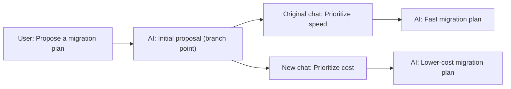

**Branch in new chat** lets you explore another direction from a selected AI reply. The new conversation keeps the history along the current branch up to and including that reply, together with the conversation state saved when it completed. The original conversation can continue in its own direction.

## When to use it

- **Compare approaches**: Explore cost-first and speed-first alternatives from the same initial proposal.
- **Change direction**: Return to a useful reply and introduce different requirements without explaining the background again.
- **Separate follow-up tasks**: Use a shared analysis as the starting point for several focused conversations that are easier to revisit.

## How to use it

1. Find the completed AI reply you want to use as a starting point.
2. Click the branch icon in the action bar below the reply. Its tooltip reads **Branch in new chat**. Hover over an older message to reveal its action bar.
3. Once the new conversation is ready, ChatKit opens it in the current window and focuses an empty composer.
4. Send a new message. The assistant continues from the context saved at the branch point.

The branch button is directly in the message action bar, so you do not need to open a “More” menu. Creating a branch does not request another AI reply or replay historical tool calls. New processing starts when you send your next message.

## Where the new conversation starts

Suppose you have discussed a migration plan and want to compare two directions from the initial proposal:



The new conversation includes the first user message and the selected initial proposal. The later messages about migration speed are excluded from its history. If the conversation already has other branches, only messages on the selected path are included.

| Content | Behavior after branching |
| --- | --- |
| Messages through the branch point | Copied into the new conversation, including the selected AI reply |
| Later messages and messages on other branches | Not copied |
| Assistant and project | The same assistant and project are used, subject to access checks |
| Saved conversation state | Continues from the selected reply's completed state, including transferable model context and tool state |
| Tool results and attachments | Saved results remain available for display; attachments remain subject to current access permissions |
| Tasks running in the original conversation | Stay in the original conversation; switching views does not automatically pause or cancel them |

The new conversation owns its message history. You can reopen it from history and branch again from an eligible AI reply. Copied MCP App history displays saved results without reconnecting to the original interactive app instance.

## Working files remain shared

<Warning>
**Conversation state can branch; working files retain their current shared state.** Branching follows the existing project or assistant workspace sharing rules. It does not restore historical file versions, and later changes to shared files may be visible in both conversations.
</Warning>

Save separate copies or use version control when comparing file versions. Branching also does not undo external actions that have already happened, such as submitted business records or sent notifications.

## Unavailable actions and failed requests

Branching requires a saved, recoverable completion state. Streaming, failed, paused, or approval-pending replies may be unavailable, as may older messages or intermediate replies without complete saved state. An unavailable button explains the reason in its tooltip. ChatKit does not silently fall back to copying text alone.

Creation may be rejected if the assistant workflow has changed, the saved state is unavailable, or access to the relevant project or files has been revoked. If creation or loading fails, ChatKit preserves the original conversation and composer draft so you can retry. If you navigate elsewhere while waiting, a late response does not take over your current view.

## Control the action in an embedded product

Interactive ChatKit views enable the action by default when the backend supports it. Hosts can control its visibility with `threadItemActions.branch`:

```ts
import type { ChatKitOptions } from '@xpert-ai/chatkit-types';

const threadItemActions: ChatKitOptions['threadItemActions'] = {
  branch: true,
};
```

Merge `threadItemActions` into your existing ChatKit options. Set `branch: false` to hide the action. Read-only views and older servers without branching capabilities do not expose a usable branch action. Enabling the frontend option does not grant additional permissions or replace backend state validation.

## Related features

- [Chat](../agent/conversation/conversation)
- [Projects and Project Types](./chatkit-projects)
- [MCP Apps](./chatkit-mcp-apps)
