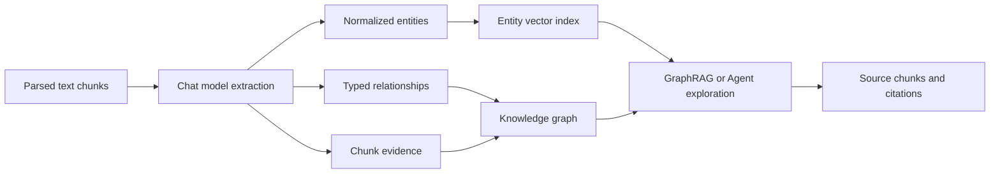

XpertAI Knowledge Graph turns parsed knowledge-base chunks into an evidence-backed network of entities and relationships. GraphRAG can use this network to find concepts that are semantically related to a question, follow their relationships, and return the source chunks that support those findings.

It is useful when a question depends on relationships rather than isolated keywords, for example:

- which supplier provides a particular pump-station component;
- which policy applies to a product, region, or project;
- how a failure, device, procedure, and corrective action are connected;
- which organizations, contracts, and deliverables appear together across project documents.

<Info>
  The knowledge graph does not replace source retrieval. Entities and
  relationships help locate relevant evidence; final answers should still use
  the original chunks and citations.
</Info>

## Capabilities at a glance

| Capability              | Product behavior                                                                                                      |
| ----------------------- | --------------------------------------------------------------------------------------------------------------------- |
| Automatic extraction    | Uses a chat model to extract entities, relationships, confidence, and supporting quotes from parsed text chunks.      |
| Evidence traceability   | Connects an entity or relationship to its source document, chunk, quote, and confidence.                              |
| Incremental indexing    | Processes newly completed documents through graph-index jobs and refreshes the entity vector index.                   |
| Visual graph explorer   | Searches and filters entities and relations, focuses a node, expands its neighborhood, and displays evidence.         |
| Human curation          | Creates, edits, hides, and reactivates entities and relationships without editing the original document.              |
| Graph retrieval         | Finds semantic seed entities, expands their neighborhood, and ranks the chunks mentioned by the graph.                |
| Hybrid retrieval        | Combines vector and graph scores, deduplicates chunks, and optionally applies the configured reranker.                |
| Agent graph exploration | Lets an Agent repeatedly search entities, follow relations, inspect bounded evidence, and then retrieve cited chunks. |
| Lifecycle visibility    | Reports graph revision, status, counts, per-document jobs, progress, and structured failures.                         |

## How the graph is built



The graph contains four main forms of information:

- **Entity**: a named object such as a company, device, policy, project, place, product, or procedure. It can include a type, aliases, description, confidence, and mention count.
- **Relationship**: a typed and directed connection between two entities, such as `SUPPLIES`, `APPLIES_TO`, `PART_OF`, or `REQUIRES`.
- **Evidence mention**: a source reference containing `documentId`, `chunkId`, an optional quote, and confidence. Evidence makes a graph result traceable to the document that produced it.
- **Entity vector**: a semantic representation of the entity name, type, aliases, and description or summary. It is used to find seed entities from natural-language questions.

Names and types are normalized before deduplication. For example, repeated spaces and letter case do not create separate copies of the same entity name and type.

### Origin and visibility

Every entity and relationship has an origin and visibility:

| Value       | Meaning                                                                          |
| ----------- | -------------------------------------------------------------------------------- |
| `extracted` | Created automatically from document chunks.                                      |
| `manual`    | Created directly by a user in the graph workspace.                               |
| `curated`   | An extracted item that has been edited or hidden by a user.                      |
| `active`    | Available to normal visualization and retrieval.                                 |
| `hidden`    | Kept for governance and future editing but excluded from active graph retrieval. |

Hiding an entity also hides its incident relationships. A relationship cannot be reactivated while either endpoint entity remains hidden.

## Requirements

Before enabling GraphRAG, make sure that:

1. The knowledge base uses locally managed documents rather than an external provider that does not expose graph capabilities.
2. Documents have completed parsing and contain non-empty text chunks.
3. The knowledge base has a valid embedding model; graph entities use a separate entity-vector collection based on that model.
4. A knowledge-base **Chat Model** is configured for structured graph extraction, or a Primary Copilot with an available chat model can be used as the fallback.
5. Background workers can process knowledge-graph index jobs.

PDF scans, complex tables, and layout-heavy manuals should first use an appropriate document converter. Graph quality cannot recover information that was lost during parsing. See [PDF Processing and Linked Analysis Preview](/en/ai/knowledge-base/pdf-processing-and-preview).

## Enable and build GraphRAG

1. Open the knowledge base and go to **Configuration > Retrieval Settings**.
2. Turn on **GraphRAG**.
3. Choose the default retrieval mode and configure Entity Top K, Neighbor Hops, and Graph Weight.
4. Select a suitable **Chat Model** for extraction, then save the knowledge-base configuration.
5. After GraphRAG is enabled for the first time, the status becomes **Rebuild required**. Click **Rebuild Graph**.
6. Wait until every graph job completes and the status becomes **Ready**.
7. Open **Graph** to inspect entities, relationships, and evidence before using the graph in production retrieval.

Turning GraphRAG on does not silently treat old documents as indexed. The explicit rebuild makes the graph revision and source coverage observable.

### Retrieval settings

| Setting              | Default                       | Effect                                                                                                                                |
| -------------------- | ----------------------------- | ------------------------------------------------------------------------------------------------------------------------------------- |
| Retrieval mode       | Vector                        | Selects Vector, Graph, or Hybrid as the default strategy.                                                                             |
| Entity Top K         | 8                             | Number of semantically related seed entities considered by graph retrieval. A larger value improves coverage but can add weak topics. |
| Neighbor Hops        | 1                             | Relationship depth expanded from the seed entities. The supported range is one to two hops.                                           |
| Graph Weight         | 0.35                          | Contribution of the graph score when Hybrid mode combines vector and graph results.                                                   |
| TopK                 | Knowledge-base recall setting | Maximum source chunks returned after retrieval and ranking.                                                                           |
| Similarity threshold | Optional                      | Removes results below the configured score threshold. Tune separately for each mode.                                                  |
| Rerank model         | Optional                      | Reorders merged Hybrid candidates after vector and graph scores are combined.                                                         |
| Chat Model           | Primary Copilot fallback      | Extracts structured entities, relationships, and evidence from chunks.                                                                |

Increasing Entity Top K and Neighbor Hops expands the candidate graph. Tune them together with final TopK to keep latency and context size predictable.

## Graph status and jobs

| Status           | Meaning                                                               | Recommended action                                                                            |
| ---------------- | --------------------------------------------------------------------- | --------------------------------------------------------------------------------------------- |
| Disabled         | GraphRAG is not enabled.                                              | Enable it in Retrieval Settings if graph features are required.                               |
| Rebuild required | GraphRAG was newly enabled or its current graph needs a full refresh. | Click **Rebuild Graph**.                                                                      |
| Indexing         | One or more document jobs are queued or running.                      | Monitor progress and wait before production testing.                                          |
| Ready            | No queued, running, or failed graph jobs remain.                      | Test and use the graph.                                                                       |
| Failed           | At least one job failed; the latest error is retained.                | Inspect the failed document/job, correct model or content problems, and rebuild or reprocess. |

The status response includes the graph revision, entity/relation/mention counts, queued/running/failed job counts, and recent jobs. Document management also shows graph-index progress for individual documents.

### Incremental updates and rebuilds

- Newly processed documents enqueue document-level graph jobs when GraphRAG is enabled.
- Reprocessing or removing a document clears its old mentions, refreshes relation evidence counts, and prunes automatically extracted orphan entities.
- A full rebuild increments the graph revision, clears extracted active graph data, and re-extracts all non-folder documents.
- Manually created and user-curated items are preserved across rebuilds. Their old extracted evidence is cleared and recalculated from current documents.
- Entity vectors are refreshed after graph changes. Rebuilding the graph does not regenerate document chunk embeddings.

## Use the graph workspace

Open the **Graph** tab of a graph-enabled knowledge base. The workspace supports:

- search by entity name or type;
- filters for entity type, relationship type, origin, and visibility;
- a focus entity, zero-to-two-hop depth, and result limit;
- zoom, fit-to-screen, reset layout, and center-selection controls;
- entity and relation counts, type legend, entity list, and relation list;
- an inspector showing descriptions, aliases, endpoints, related relationships, and source evidence;
- creation and editing of entities and relationships;
- hiding incorrect or retired graph items without physically deleting their governance record.

Select **Explore neighborhood** on an entity to focus the canvas on its connected objects. Evidence cards display the source document and the extracted quote when available.

### Curate entities and relationships

Use manual curation to correct critical business semantics that should not depend entirely on model extraction:

- add a missing entity with its name, type, aliases, and description;
- rename or reclassify an extracted entity;
- add or change a directed relationship and its weight;
- hide an incorrect entity or relationship;
- inspect the evidence before deciding whether an extracted connection is valid.

Editing an extracted item changes its origin to `curated`, so later rebuilds do not silently discard the human decision.

## Retrieval modes

### Vector

Vector mode searches document-chunk embeddings directly. It is the recommended mode for broad semantic Q&A, structured Knowledge Filters, and precise file or metadata boundaries. GraphRAG may still be enabled for visualization and Agent graph exploration while final retrieval remains Vector.

### Graph

Graph mode performs these steps:

1. Semantically search the entity-vector index for seed entities.
2. Keep active entities and expand their active relationships by the configured Neighbor Hops.
3. Resolve entity and relationship mentions back to document chunks.
4. Calculate graph relevance using entity similarity and evidence confidence.
5. Return the highest-ranked source chunks with matched entity and relationship metadata.

Graph mode works well for explicit relationship questions, but it depends on graph extraction coverage.

### Hybrid

Hybrid mode runs Vector and Graph retrieval, deduplicates results by chunk, and combines the two scores using Graph Weight. If a rerank model is configured, it reranks the merged candidates before final TopK selection.

Use Hybrid when both semantic wording and entity relationships matter. Start with the default Graph Weight of `0.35`, then compare representative questions in Recall Test.

<Warning>
  Knowledge Filter V2 conditions currently support final retrieval in **Vector**
  mode only. When fixed, request, or Agent-generated filters are configured,
  Graph and Hybrid modes return an explicit unsupported-mode error instead of
  ignoring the conditions.
</Warning>

## Let an Agent explore the graph

When a knowledge-base node is connected to an Agent and GraphRAG is enabled, XpertAI registers a read-only graph explorer alongside the Retriever. It uses a compact action-based interface:

| Action      | Input                                                   | Result                                                                       |
| ----------- | ------------------------------------------------------- | ---------------------------------------------------------------------------- |
| `search`    | Natural-language question or concept                    | Ranked seed entities with IDs and eligible evidence samples.                 |
| `neighbors` | Entity ID, optional original question, depth, and limit | In-scope neighboring entities, supported relationships, and retrieval hints. |
| `evidence`  | Entity ID and optional original question                | Source document/chunk references, quotes, and a suggested retrieval query.   |

The intended loop is:

```text
search → neighbors → evidence → repeat if needed
                                ↓
                     Retriever with suggestedRetrievalQuery
                                ↓
                       cited source chunks and answer
```

The Agent does not need to guess entity IDs; each ID comes from a previous tool result. It can continue exploring while names or relationships are ambiguous, then call the Retriever after it has found the most useful terminology.

Graph exploration and [live filter-option discovery](/en/ai/knowledge-base/intelligent-filtering#let-the-agent-discover-live-filter-values) complement each other:

- use filter options to discover current folders, file types, years, statuses, and metadata values;
- use graph exploration to discover entities, aliases, relationships, and evidence from document content;
- combine the discoveries in the final Vector Retriever query and dynamic filter.

### Boundary enforcement

Agent graph exploration applies tenant, organization, knowledge-base, enabled-content, and administrator fixed-filter boundaries before returning evidence. An entity or relationship is returned only when it has eligible chunk evidence inside that scope.

When a fixed filter is active, global entity descriptions, summaries, aliases, and aggregate counts are not exposed because they may have been aggregated from documents outside the binding. Missing fixed variables fail closed before graph exploration starts. Graph quotes are exploration clues; the Agent is instructed to use the Retriever for final chunks and citations.

## Test GraphRAG

Use **Recall Test** to switch between Vector, Graph, and Hybrid for the same question. A useful test set includes:

1. direct entity questions, such as “What is GOODSPRINGS?”;
2. relationship questions, such as “Which supplier provides the pump-station equipment?”;
3. multi-hop questions that require two related concepts;
4. negative cases whose entities are absent from the source documents;
5. documents with similar keywords but different relationships;
6. questions that compare Vector, Graph, and Hybrid ranking.

Inspect returned chunk content, graph score, matched entities, matched relationships, citations, and latency. Also verify graph results in the visual workspace before increasing Entity Top K or Neighbor Hops. See [Recall Test](/en/ai/knowledge-base/recall-test).

## Security and governance

- Knowledge-base permissions and tenant/organization boundaries continue to apply.
- Only active entities and relationships participate in normal GraphRAG retrieval.
- Evidence keeps the connection from graph claims to source documents and chunks.
- Hiding retains a curated governance record and prevents the item from being silently reintroduced as an active extracted item during rebuild.
- Agent graph exploration never exposes the administrator's fixed-filter expression.
- Normal end-user answers show source citations, not internal graph decisions, by default.

## Limitations and best practices

- Graph extraction is probabilistic. Review high-impact entities and relationships before using them in pricing, compliance, safety, or contractual decisions.
- Improve parsing quality before tuning graph parameters. Empty or malformed chunks cannot produce reliable entities or evidence.
- Use stable, specific entity types and relationship names. Merge spelling variants through aliases instead of creating duplicate nodes.
- Keep Neighbor Hops at one unless a representative test set shows that two-hop exploration adds useful evidence.
- Use manual or curated graph items for durable business semantics, but keep document evidence as the final answer source.
- Rebuild after enabling GraphRAG, after major extraction-model changes, or when source coverage is inconsistent.
- Monitor failed jobs, zero-result graph queries, entity duplication, weak evidence quotes, and Hybrid latency.
- Use Vector mode when structured Knowledge Filters are required; use the Agent graph explorer as a boundary-aware planning step.

Continue with [Intelligent Retrieval Filtering](/en/ai/knowledge-base/intelligent-filtering), [Recall Test](/en/ai/knowledge-base/recall-test), and [Knowledgebase Workbench](/en/ai/knowledge-base/knowledge-workbench).
