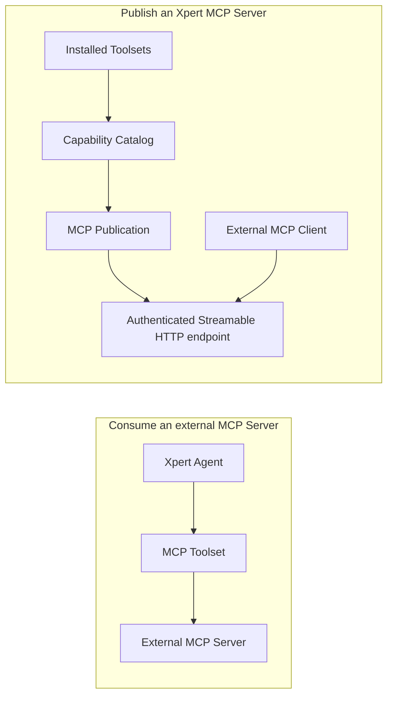

An **Xpert MCP Server** publishes capabilities that are already installed in Xpert through a managed, authenticated Streamable HTTP endpoint. External MCP clients connect to Xpert and call the selected capabilities under the identity, organization, policy, and audit controls configured for the service.

The product UI calls this an **MCP service**. Internally, its managed configuration is an **MCP Publication**. These terms describe the same externally reachable service; they do not represent a separate stdio process.

## Choose the correct MCP direction

| Requirement                                                    | Use                                                          |
| -------------------------------------------------------------- | ------------------------------------------------------------ |
| Let an Xpert Agent call an external MCP server                 | [MCP Toolset](../../agent/toolset/mcp-tools/index)           |
| Let an external MCP client call capabilities governed by Xpert | Xpert MCP Server                                             |
| Publish plugin business methods through the Xpert host         | [Host-Native MCP Tools](../../plugin/host-native-mcp-tools)  |
| Add an interactive App to a host-native business Tool          | [Host-Native MCP Tools and Apps](../../plugin/host-native-mcp-tools) |
| Ship a portable child-process server                          | [Plugin-managed MCP Server](../../plugin/mcp-tools-and-apps) |

The important distinction is who acts as the client:



## What the service manages

An MCP service combines several independently managed objects:

- **Toolset**: the installed source of executable capabilities.
- **Capability catalog**: the current protocol descriptors discovered from the Toolset.
- **Publication**: the service name, stable slug, status, authentication methods, and server instructions.
- **Organization access grant**: admission for one organization when a tenant/system plugin owns a tenant-scoped Publication.
- **Capability bindings**: the capabilities exposed by the Publication, their public names, enablement state, and policies.
- **Credential**: an API key or, when available, an OAuth 2.0/OIDC policy.
- **Protocol endpoint**: `POST /api/mcp/p/<service-slug>` over Streamable HTTP.
- **Audit records**: the caller, capability, request and trace IDs, outcome, duration, and a structural argument summary.

Changing one layer does not silently bypass the others. Installing a Toolset does not publish it, creating a Publication does not enable it, and possessing a credential does not override organization membership, scopes, or capability policy.

## Create an MCP service

There are two product flows.

### Enable a plugin-provided MCP Server

A plugin can declare business methods with `@XpertToolProvider()` and `@XpertTool()`. Xpert discovers the Provider at runtime and presents it in the plugin detail dialog.

1. Open **Plugins**.
2. Select **Initialize** on the installed plugin.
3. In the dialog's **MCP** section, select **Enable MCP server** for the Provider.
4. Use the protected Token reveal/copy action for the current administrator and organization.
5. Copy the endpoint or client configuration from the same panel.

This action is available only to super administrators and always controls access for the current organization. It creates or reuses the Provider's scope-owned Toolset, refreshes its catalog, creates or claims the host-derived Publication, binds its MCP Tools and Apps, creates a suitable API key when needed, and activates the required service or organization admission. Managed client keys require `tools:list` and `tools:call`; Providers publishing Apps also need `resources:list` and `resources:read`.

Publication ownership follows the plugin level. An `organization` plugin owns a Publication in each organization. A `system` or `tenant` plugin owns one tenant-scoped Publication per Provider and gives each organization an independent access grant and organization-bound API key. Organization A enabling access never makes the Provider usable in organization B; B must enable it separately. If both enable a tenant-owned Provider, they may use the same endpoint, but their credentials, principals, and business-data scope remain isolated. The tenant Publication's catalog, bindings, and capability policies are shared, while key scopes can impose additional per-credential restrictions.

One plugin may expose multiple decorated Providers. Each Provider is shown as a separate MCP card and becomes a separate managed service with its own Tool list, state, endpoint identity, and configuration.

### Create a custom MCP service

Super administrators can compose a Publication manually from capabilities installed in the current tenant or organization scope:

1. Open **MCP Management** and select **MCP services**.
2. Select **Create service** and enter a name, stable endpoint slug, and optional instructions.
3. Open **Capabilities**, refresh the catalog if necessary, and select capabilities from available Toolsets.
4. Give each capability a unique public name and configure its invocation policy.
5. Configure API key or available OAuth authentication.
6. Run the readiness test, then enable the service.

Only organization- or tenant-level Toolsets without a workspace binding can be published. A Publication must have at least one enabled capability and a current capability review before it can become active.

## Where plugin-provided services appear

Before first enablement, runtime-discovered Providers appear in the installed plugin's detail dialog. After a Provider has materialized a Publication, that service also appears in **MCP Management → MCP services**, alongside manually created services. Selecting its service card opens the Publication settings for capabilities, authentication, policy, instructions, audit, and testing.

The service list uses one card per Publication and shows status, capability and credential counts, OAuth state, and recent invocation/error information. Enabled services use the success status treatment. A multi-Provider plugin therefore appears as multiple service cards after its Providers are enabled.

Do not look for host-native Providers under **Runtime instances**. That tab is for child-process runtimes such as plugin-managed stdio servers; host-native services execute through the Xpert API process.

## Capabilities and public names

One Publication can expose capabilities from multiple Toolsets:

| Capability        | Protocol operations                                                    |
| ----------------- | ---------------------------------------------------------------------- |
| Tool              | `tools/list`, `tools/call`                                             |
| Resource          | `resources/list`, `resources/read`                                     |
| Resource template | `resources/templates/list`, `resources/read`; completion when declared |
| Prompt            | `prompts/list`, `prompts/get`; completion when declared                |
| MCP App           | A protected HTML MCP resource that a Tool can reference                |

### MCP Apps are resources, not additional Tools

An App adds a UI to an existing Tool result. The Tool stays in `tools/list` and advertises `_meta.ui.resourceUri`; the App appears in `resources/list`, and `resources/read` returns `text/html;profile=mcp-app`. The client loads the UI and forwards the original Tool's `structuredContent` through the MCP Apps bridge. No second Tool or server is needed.

For example, a Provider with **5 Tools and 2 Apps** has **7 capability entries**. A Tool count of 5 on the application page and a capability count of 7 in MCP Management are consistent. Verify types, bindings, and protocol metadata instead of expecting the two App names in `tools/list`. List results may also be filtered for the current credential. Clients without MCP Apps rendering can still use the original Tools and their text/DTO results.

The **capability key** remains the internal Toolset identity. The **public name** is what clients see. Renaming a public capability can break client prompts or automation, so treat public names and the service slug as stable API contracts.

Capabilities are also filtered at request time. A client sees only capabilities allowed by its scopes, the binding policy, declared visibility, and the context the endpoint can provide. A capability that requires workspace, project, conversation, Agent, store, or checkpoint context is not exposed by a tenant- or organization-level Publication.

## Authentication and organization isolation

Every protocol request requires an HTTP Bearer credential.

### API keys

API key secrets begin with `xpert_mcp_`. Ordinary Publication keys store only a hash and display the secret when created or rotated. Managed plugin client credentials also store an encrypted secret to support explicit repeatable reveal/copy by the current administrator within the current organization. List and connection-info responses never reveal that secret. Store credentials in the client's environment or secret store, never in App HTML.

Keys can be bound to a user or service account, limited by an expiry date, and granted coarse or capability-specific scopes. The management UI supports these common scopes:

- `tools:list` and `tools:call`
- `resources:list` and `resources:read`
- `prompts:list` and `prompts:get`

Adding an App does not expand existing tools-only keys. If Tool calls succeed but App reads fail, obtain a Resource-authorized managed credential through the Provider's authorized Token action, or create/rotate a suitable key in Publication management, and update the client. Reusing a key requires matching the requested scopes; old or unrelated keys are not silently revoked by capability synchronization.

The runtime also accepts `*` or a scope such as `tools:call:orders_update` for a specific public capability. Revoking or rotating a key invalidates existing access immediately.

For user-bound keys, Xpert rechecks that the user still exists and has active membership in the credential's organization. A credential created for one Publication access grant or organization cannot be used to cross into another organization, including when multiple organizations share a tenant-owned endpoint.

### OAuth 2.0 / OIDC

When MCP OAuth is available in the deployed Xpert edition, a Publication can validate JWT access tokens against an issuer and audience, require scopes, map token claims to an existing Xpert user, and optionally use token introspection. The endpoint publishes protected-resource metadata for compatible clients.

OAuth must be explicitly configured and enabled before it can be used by a Publication. Run the built-in discovery test before activation. Availability depends on the platform edition and deployment configuration.

## Capability policy

Each published capability can have an approval mode, timeout, and rate limit. Tool behavior declared by its provider establishes the safe default:

| Tool risk   | Default approval mode | Runtime behavior                                       |
| ----------- | --------------------- | ------------------------------------------------------ |
| `read`      | `allow`               | May run after authentication, scope, and policy checks |
| `write`     | `confirm`             | Requests interactive approval before execution         |
| `dangerous` | `deny`                | Not exposed for normal invocation                      |

Administrators can tighten these defaults. A dangerous Tool cannot be changed to unconditional `allow`. The `confirm` mode uses MCP elicitation and therefore requires a client that can return the requested approval input; clients without that interaction cannot complete the call.

The platform applies a server request limit and can apply a stricter per-capability requests/window policy. Capability timeouts cancel the execution signal passed to the Tool runtime.

## Capability refresh and review

Publication bindings keep a snapshot and hash of every capability descriptor. This makes schema, behavior, context, and provider changes reviewable rather than silently changing an external API.

- Compatible descriptor updates refresh the snapshot automatically.
- A missing Toolset, missing capability, or breaking descriptor change marks the Publication as **Review required**.
- Incompatible capabilities are withheld from the runtime until the bindings are reviewed.
- A Publication that requires review cannot be enabled again until the issue is resolved.

For an enabled, automatically managed plugin Publication, plugin refresh synchronizes added, removed, and changed Tools and Apps atomically. Entries with the same capability type and key retain their public names, enablement state, and administrator policy overrides; new entries are bound and enabled. A failed synchronization leaves the last valid catalog and bindings in place.

To update a real Tool definition or App bundle:

1. Rebuild and validate the plugin and App assets, then deploy/refresh the plugin. Source changes alone do not update the installed runtime copy.
2. Restart the API if deployment reports `restartRequired`. Provider registration and application bootstrap reconcile enabled auto-managed Publications. Check synchronization errors rather than recreating an existing service.
3. For manually composed Publications, open **Capabilities → Refresh available capabilities**, select the intended Tool/App entries, then **Save**. Refresh discovers the available catalog; Save updates the published bindings. This is also a manual recovery path once the current runtime definitions are confirmed.
4. Reconnect or refresh the client. Verify `tools/list`, the Tool's App URI, `resources/list/read`, and the needed credential scopes. A successful list/read is protocol evidence; rendering must also be checked in an MCP Apps-capable client.

## Service lifecycle

| Status     | Meaning                                                                       |
| ---------- | ----------------------------------------------------------------------------- |
| `draft`    | The Publication can be configured but is not callable                         |
| `active`   | The endpoint accepts authenticated MCP requests                               |
| `disabled` | Protocol access is closed while configuration, keys, and audit history remain |

For an organization-owned Publication, disabling a plugin MCP Server disables that Publication. For a tenant-owned Publication, disabling from an organization removes only that organization's access grant; the shared Publication may remain active for other admitted organizations. Existing organization keys are retained for a later re-enable but cannot call while their grant is disabled. Explicitly disabling or uninstalling the plugin disables its associated automatically managed Publications; a normal plugin version refresh preserves desired state and synchronizes capabilities.

## Connect an MCP client

The service detail page displays the exact endpoint and client-neutral connection information. A typical JSON client configuration is:

```json
{
  "mcpServers": {
    "xpert-business-tools": {
      "type": "streamableHttp",
      "url": "https://<xpert-host>/api/mcp/p/<service-slug>",
      "headers": {
        "Authorization": "Bearer ${XPERT_MCP_API_KEY}"
      }
    }
  }
}
```

Set `XPERT_MCP_API_KEY` in the client's environment or secret store. Environment-variable interpolation differs between clients, so use the syntax required by your client and never paste a real secret into source control or shared documentation.

The current server advertises MCP protocol version `2026-07-28`. A basic connection test should complete:

1. `initialize`
2. the appropriate list operation, such as `tools/list`
3. one read-only call, such as `tools/call`

Provider-declared Tools can additionally opt into asynchronous MCP Tasks. Compatible clients can create work, poll or update it through `tasks/get`, `tasks/update`, and `tasks/cancel`, and listen for task or capability-change events. These extensions appear only when the published capability and client both support them.

## Instructions, results, and audit

Server instructions are assembled in this order: platform safety instructions, administrator Publication instructions, then lower-priority provider guidance. Provider text cannot override platform or administrator policy.

Tools may return both concise text `content` and typed `structuredContent`. Clients should prefer `structuredContent` when present and use text as a compatibility fallback.

Every capability invocation creates an audit record containing the Publication, capability, authenticated subject, client or key prefix, request ID, trace ID, status, and duration. Arguments are summarized by shape and byte size rather than persisted as full values. Use the **Audit** section to investigate successes, failures, denials, and latency without exposing complete business payloads.

## Troubleshooting

| Symptom                                        | Check                                                                                                                              |
| ---------------------------------------------- | ---------------------------------------------------------------------------------------------------------------------------------- |
| Endpoint returns not found                     | Confirm the slug and that the Publication is `active`                                                                              |
| `401 Unauthorized`                             | Check the Bearer header, expiry, revocation, and configured authentication method                                                  |
| `403 Forbidden`                                | Check organization membership, credential scopes, and capability approval policy                                                   |
| `429 Too Many Requests`                        | Wait for the rate-limit window or review the capability policy                                                                     |
| A capability is missing from a list            | Check binding enablement, public-name conflicts, scopes, required context, risk policy, and review status                          |
| Added Apps do not increase the Tool count      | Expected when existing Tools are unchanged: check App entries in `resources/list` and the original Tools' `_meta.ui.resourceUri`     |
| Tool calls work but App reads fail             | Check App binding/review state, `resources:list` / `resources:read` scopes, and the deployed HTML bundle                             |
| Catalog shows a new item but the service does not | For a manual Publication, select the item and Save; refreshing the catalog alone does not bind it                               |
| A plugin Provider is missing from MCP services | Enable it once from the installed plugin detail dialog, confirm the current organization access state, then refresh MCP Management |
| A write call requests input                    | Approve through a client that supports MCP elicitation, or keep the Tool unavailable in that client                                |
| Readiness test fails                           | Refresh the catalog, resolve review-required bindings, configure authentication, and select at least one capability                |

The **Runtime instances** tab in MCP Management monitors child-process runtimes such as plugin-managed stdio servers. A host-native MCP Publication is a logical HTTP service in the Xpert API and does not have a separate process to start or stop.

## Related documentation

- [Host-Native MCP Tools for Plugins](../../plugin/host-native-mcp-tools)
- [MCP Tools and MCP Apps](../../plugin/mcp-tools-and-apps)
- [MCP Toolsets for Agents](../../agent/toolset/mcp-tools/index)
