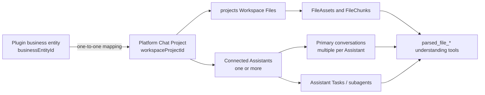

The Assistant Workspace Catalog determines which set of files an Assistant run is using. If a plugin persists business records without binding conversations, files, and Agent runs to the same workspace scope, the Primary Agent, subagents, or other collaborating Assistants may see different file sets.

This page is the product-design overview for workspace catalogs. It currently defines the `projects` catalog in full. Product semantics, lifecycles, and permission boundaries for additional catalogs will be added here later.

## Workspace Catalog Index

| Catalog | Current purpose | Specification status |
| --- | --- | --- |
| `projects` | One isolated file space per platform Project, connectable to one or more Assistants and able to contain multiple Project conversations | Defined on this page |
| `xperts` | Shared files scoped to an Assistant/Xpert and retained as the compatibility behavior when no Project context exists | Full product specification pending |
| `users` | User-scoped file space | Pending |
| `knowledges` | Knowledgebase-scoped file space | Pending |
| `skills` | Skill-scoped file space | Pending |

<Note>
A catalog name identifies a storage scope type, not a business entity type. A plugin project, case, due-diligence engagement, or customer delivery can all bind to the `projects` catalog through this design.
</Note>

## When To Use `projects`

Prefer `projects` when a plugin business entity has these characteristics:

- it owns an isolated set of input files, parsed results, and exports;
- its Primary Agent and specialist subagents must read the same files;
- multiple Assistants explicitly connected to the same platform Project must share those files;
- it can have multiple conversations while remaining isolated from other business entities;
- users need to see, enter, archive, and restore the space from the platform Projects surface;
- the plugin expects Agent file-understanding tools to search every file in the current Project by default.

Use `xperts` only when files inherently belong to the entire Assistant and may be shared across business instances. Do not place data that requires Project isolation in the Assistant-wide folder merely to avoid Project provisioning and synchronization.

## Two File-Sharing Layers

The `projects` catalog supports two sharing layers without merging all Assistant state:

| Layer | Shared through the platform Project | Remains isolated |
| --- | --- | --- |
| Within one Assistant | The Primary Agent, workflow coordinator, specialist subagents, retries, and sandbox runs use the same Project files | Agent capability and role boundaries still apply |
| Across connected Assistants | Workspace Files, FileAssets, FileChunks, file search, preview, and exported files | Conversation history, prompts, tools, memory, and Assistant-specific configuration |

A shared platform Project is not a shared conversation or capability graph. Conversations remain scoped by `xpertId + projectId`. Two Assistants can read the same Project file while retaining separate histories and different least-privilege tool sets.

## Product Objects And Identity Model

The plugin business entity and the platform Chat Project are separate objects. They have a one-to-one mapping but must use two distinct identifiers:

| Object | Identity | Responsibility |
| --- | --- | --- |
| Plugin business entity | `businessEntityId` | Business state, workflow versions, review, domain permissions, and audit |
| Platform Chat Project | `workspaceProjectId` | Workspace Files scope, Assistant connections, Project conversations, and platform visibility |

Business APIs, View selection, and domain relations continue to use `businessEntityId`. Workspace Files, FileAssets, conversations, and Agent runs use `workspaceProjectId`. Never let one field alternate between these meanings across interfaces.



Persist the following fields on the business entity:

```ts
type WorkspaceSyncStatus = 'provisioning' | 'ready' | 'failed'

type PluginBusinessEntity = {
  id: string
  workspaceProjectId: string
  workspaceSyncStatus: WorkspaceSyncStatus
  workspaceSyncError: string | null
}
```

Add a tenant-scoped unique constraint for `workspaceProjectId`. A DTO may expose it to the frontend for navigation, but business mutations must still submit the business entity identifier.

## Provisioning And Synchronization Lifecycle

When creating a business entity, generate two distinct stable UUIDs and persist the mapping before provisioning the platform Project:

1. Generate `businessEntityId` and `workspaceProjectId`.
2. Save the business entity with status `provisioning`.
3. Call `platform.project.provisioning.ensure(...)`.
4. Let the platform create or reconcile the Project with the caller-supplied `workspaceProjectId` and connect the intended Assistants.
5. Set the entity to `ready` after all required connections succeed; set it to `failed` and save a displayable error after a failure.
6. Allow uploads and file-dependent workflows only in the `ready` state.

The platform Project is created in the Assistant workspace and owned by the currently authorized creating user. A plugin cannot replace that user context through Agent arguments.

`ensure` accepts the desired state, so retries with the same identifier do not create duplicate Projects:

```ts
const projects = runtimeCapabilities.require(ProjectProvisioningRuntimeCapability)

for (const assistantId of connectedAssistantIds) {
  await projects.ensure({
    projectId: entity.workspaceProjectId,
    workspaceId,
    xpertId: assistantId,
    name: entity.name,
    status: entity.archivedAt ? 'archived' : 'active'
  })
}
```

Every connected Assistant must belong to the requested workspace. `ensure` preserves existing Assistant connections and adds the requested `xpertId`; it does not replace the complete connection set. If the product supports removing an Assistant, use a separate authorized Project membership operation.

The business entity is authoritative for name and archive state. Run `ensure` again after rename, archive, or restore. A synchronization failure does not roll back an accepted business operation; retain the `failed` state and provide an explicit retry.

Define deletion as a separate product policy. Archive does not delete files. Before supporting permanent deletion, document retention for business data, Workspace Files, FileAssets, conversations, and audit records.

## File Layout And Portable References

Use a stable plugin-owned namespace inside the platform Project:

```text
files/<plugin-key>/
├── sources/<source-id>/...
├── generated/...
├── previews/...
└── exports/...
```

Write source and exported files to the same `projects` scope. Persist only a Workspace Files portable reference and necessary business metadata. Do not persist host absolute paths, `/workspace/...` sandbox paths, raw Buffers, or Base64 content.

```ts
const uploaded = await workspaceFiles.uploadBuffer({
  catalog: 'projects',
  scopeId: entity.workspaceProjectId,
  projectId: entity.workspaceProjectId,
  buffer,
  originalName,
  mimeType,
  folder: `files/${pluginKey}/sources/${sourceId}`
})
```

A portable reference identifies at least the source, catalog, Project scope, and relative file path:

```ts
{
  source: 'platform.workspace.files',
  catalog: 'projects',
  scopeId: workspaceProjectId,
  projectId: workspaceProjectId,
  filePath: uploaded.filePath,
  workspacePath: uploaded.workspacePath,
  originalName,
  mimeType,
  size
}
```

Resolve downloads, previews, background jobs, and retries from this reference. A signed URL is a short-lived access credential and must not be persisted as business data.

## File Parsing And Agent File Understanding

After upload, await `understandFile(...)` until it returns the FileAsset, then persist the source version. Platform parsing may remain asynchronous with `runInline: false`; the requirement is to await durable FileAsset creation rather than detach the registration call.

```ts
const understood = await workspaceFiles.understandFile({
  ...portableReference,
  purpose: 'workspace',
  parseMode: 'deep',
  runInline: false
})

await sourceVersionRepository.save({
  fileReference: portableReference,
  fileAssetId: understood.fileAssetId
})
```

A plugin may retain its own domain parser for structured requirements, evidence, tables, or business versions. Platform File Understanding provides general full-text search, bounded chunk reads, and preview. These responsibilities are distinct. Do not build a second vector index containing the same source text solely for domain evidence. Domain evidence can reference the existing FileAsset and FileChunk and use Workspace Files capabilities to search or validate those chunks.

## Conversation And Agent Run Binding

Declare the Project workspace policy on every participating Assistant:

```yaml
team:
  options:
    workspaceScope:
      mode: project-required
```

`project-required` rejects file-dependent execution without a trusted `projectId` and does not fall back to `xperts`. Use `project-preferred` only when compatibility fallback is intentional. The policy alone does not grant Project access; the Assistant must also be explicitly connected to the platform Project.

Pass the same `workspaceProjectId` through every execution entry point:

- new or restored Primary conversations for every connected Assistant;
- Assistant Tasks started by the plugin;
- specialist subagents in workflows;
- cross-Assistant handoffs, retries, and manual reruns;
- sandbox and runtime Workspace Files operations.

Persist `projectId` when creating a conversation. Never rebind an existing conversation to another Project. Reject execution when the route, request, and persisted conversation Project do not agree.

For a cross-Assistant handoff, create or select a conversation for the target `xpertId + projectId`; do not reuse the source Assistant conversation. Passing the same trusted `workspaceProjectId` lets the target Assistant read the shared files while retaining its own conversation and execution history.

In Project mode, file-understanding tools resolve one visibility set:

1. every FileAsset in the current Project;
2. explicit attachments linked to the current conversation;
3. duplicates removed.

`parsed_file_list`, `parsed_file_search`, `parsed_file_search_all`, `parsed_file_read`, and preview must use the same set. The model cannot select another Project. A cross-Project FileAsset identifier must return a uniform inaccessible or invisible result without disclosing whether the file exists.

## Workbench Navigation And Conversation Restore

When a plugin View enters a ready business entity, ask the host to open the platform Project for the current Assistant:

```ts
await invokeClientCommand('workbench.navigation.open', {
  target: 'assistant.project',
  projectId: entity.workspaceProjectId
})
```

The host owns Project routing, filters conversations by `xpertId + projectId`, and restores the most recent Primary conversation or creates one when no history exists. Do not construct host routes inside the plugin or confuse a business entity identifier with the platform Project identifier.

One platform Project can connect multiple Assistants, and each Assistant can own multiple Primary conversations. History, recent conversations, and new conversations must remain filtered by the combined Assistant and Project boundary; shared files do not merge conversations.

## Permission And Trust Boundaries

- Catalog, tenant, organization, user, platform Project, and Assistant identities must come from trusted runtime context or a server-side business mapping, never from model-selected arguments.
- Keep `tenantId`, `catalog`, `scopeId`, `projectId`, and `xpertId` out of Agent-visible tool parameters.
- Revalidate plugin-domain access, user Project membership, and the current Assistant's explicit Project connection on every read, write, parse, search, preview, and download.
- Platform Project permission does not replace plugin-domain permission. The plugin still verifies that the current user may access the corresponding business entity.
- Keep the business `scopeKey` isolated by Assistant/Xpert. A runtime Project identifier selects only the workspace scope and must not replace the Assistant isolation key for plugin business data.
- Do not distinguish “exists in another Project” from “does not exist” in error messages.

## Failure States And User Experience

| Status | View behavior | Recovery action |
| --- | --- | --- |
| `provisioning` | Show that Project space is being prepared; disable upload and workflow actions | Wait or refresh status |
| `ready` | Allow files, conversations, and Agent runs | Normal operation |
| `failed` | Show a concise reason while retaining the business entity | Retry Project synchronization |

When Project synchronization succeeds but File Understanding is still running, show file parsing status separately. Do not report it as a Project provisioning failure.

## Rollout And Migration

Do not silently reinterpret existing `xperts` references as Project references or fall back to the Assistant-wide folder after Project synchronization fails. Choose an explicit rollout policy: perform an auditable file and record migration, keep old records read-only, or allow only newly created business entities to use Project space. In every case, let users identify the scope of legacy data and verify that files cannot leak across Projects.

## Acceptance Checklist

- One business entity maps to one stable `workspaceProjectId`, and retries do not create duplicate platform Projects.
- The Project appears in the platform Projects surface and connects every intended Assistant.
- Two connected Assistants can search, read, and preview the same FileAsset without copying it.
- An unconnected Assistant cannot access files even when given the Project or FileAsset identifier.
- Connected Assistants share Project files but retain separate `xpertId + projectId` conversation histories.
- Business rename, archive, and restore synchronize to the platform Project.
- Uploaded files, portable references, FileAssets, and exports all belong to the mapped Project.
- Primary, interpretation, planning, and authoring Agents can search the same Project files.
- A FileAsset from another Project cannot be read and does not leak its existence.
- A conversation's Project binding is immutable.
- A `project-required` Assistant rejects file-dependent execution without a Project.
- Assistants that do not use Projects retain existing conversation or `xperts` behavior.

## Template For Future Catalog Sections

When adding another workspace catalog to this page, answer at least these questions:

1. **Scope identity**: Which stable identifier locates the catalog? Is `scopeId` also required?
2. **Ownership**: Is it owned by a user, Assistant, organization, knowledgebase, or another product object?
3. **Lifecycle**: Who drives create, rename, archive, restore, and delete?
4. **Sharing model**: Which conversations, Agents, Assistants, users, or plugins can see the same file set?
5. **Runtime selection**: How is the catalog selected from trusted context? Is fallback allowed when it is absent?
6. **File Understanding**: What are the FileAsset visibility, attachment merge, and deduplication rules?
7. **Permission boundary**: How do tenant, organization, user, and domain permissions combine?
8. **Path convention**: How do plugins allocate directories, and which references may be persisted?
9. **Retention and migration**: How are old catalog files migrated, deleted, and governed?
10. **Acceptance matrix**: How are same-scope sharing, cross-scope isolation, idempotent retries, and regression behavior verified?

