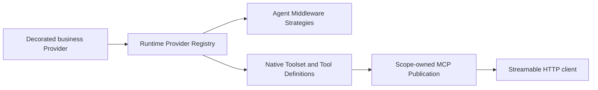

Host-native MCP tools let a plugin implement a business method once and let Xpert adapt it into an Agent Middleware Tool, an MCP Tool, or both. The plugin does not create a stdio MCP server. Xpert owns discovery, Streamable HTTP, authentication, policy, audit, and enablement through a managed [MCP Server](../middleware/mcp-server/index).

## When to use it

| Requirement                                                                   | Recommended surface                                             |
| ----------------------------------------------------------------------------- | --------------------------------------------------------------- |
| Publish an existing plugin service with Xpert-managed identity and governance | Host-native MCP Tool Provider                                   |
| Reuse one business method from Agent Middleware and external MCP clients      | Host-native MCP Tool Provider                                   |
| Run the MCP server outside Xpert or reuse it across MCP hosts                 | [Plugin-managed MCP server](./mcp-tools-and-apps)               |
| Add an interactive MCP App to an existing host-native Tool                   | Provider `apps` plus Tool `mcp.app`, described below            |

One `@XpertToolProvider()` class represents one independently managed MCP service. A plugin may register multiple Provider classes; each Provider has its own Tool set, enablement state, Publication, endpoint, and client configuration. Split capabilities when they have different security boundaries, lifecycles, or purposes. Middleware groups declared inside one Provider do not create additional MCP services.

## How it works



The plugin loader registers the business class once. The host reads class and method metadata, validates names, schemas, behavior, and context requirements, then derives:

- one native Toolset Provider;
- one Agent Middleware Strategy for each declared group in use;
- one MCP Tool definition for each MCP-enabled method;
- one Resource-backed MCP App definition for each declared App;
- one runtime-discovered virtual `TOOLSET` plugin component.

The runtime decorator descriptor is authoritative for execution. You do not repeat the Toolset execution definition in `.xpertai-plugin/plugin.json`.

The host owns public endpoint identity. It derives a stable Publication slug from the plugin artifact namespace, Provider key, and owning scope. Do not put a client product name into the Provider key, display name, documentation, or endpoint. The legacy `slug` option is only a deprecated display hint and must not be used as an endpoint contract.

## Prerequisites

Use compatible versions of `@xpert-ai/plugin-sdk` and `@xpert-ai/contracts` that expose the APIs used here. In particular, verify `defineMcpApp`, `XpertToolProviderOptions.apps`, and `XpertMcpToolOptions.app` in the installed SDK and support in the host adapter. Support for earlier hand-written native definitions does not imply support for decorator App bindings. A locally built SDK/tarball is not proof that the same API has been released to npm.

Inputs and outputs must use strict `zod/v3` object schemas. Every MCP Tool requires both `inputSchema` and `outputSchema`.

## Define a business Tool Provider

This Provider exposes the same read operation through Agent Middleware and MCP, with an optional interactive App for its results. `OrderService` is the existing typed domain service; adding the App does not change its business handler:

```ts
import { z } from "zod/v3";
import type { TAgentMiddlewareMeta } from "@xpert-ai/contracts";
import {
  defineMcpApp,
  XpertTool,
  XpertToolProvider,
  type XpertBusinessToolContext,
} from "@xpert-ai/plugin-sdk";

const coordinationMeta: TAgentMiddlewareMeta = {
  name: "OrderCoordinationMiddleware",
  label: { en_US: "Order coordination", zh_Hans: "订单协调" },
  description: { en_US: "Search governed orders.", zh_Hans: "搜索受控订单。" },
  configSchema: { type: "object", properties: {}, required: [] },
};

const searchOrdersInputSchema = z
  .object({
    query: z.string().trim().min(1).max(120).optional(),
    cursor: z.string().trim().max(200).optional(),
    limit: z.number().int().min(1).max(50).default(20),
  })
  .strict();

const orderSummarySchema = z
  .object({
    id: z.string().uuid(),
    number: z.string().max(80),
    status: z.string().max(40),
  })
  .strict();

const searchOrdersOutputSchema = z
  .object({
    items: z.array(orderSummarySchema).max(50),
    nextCursor: z.string().max(200).nullable(),
  })
  .strict();

const ordersApp = defineMcpApp({
  key: "orders_search_app",
  entry: "dist/mcp-apps/orders/index.html",
  title: "Order search",
  description: "Interactive results from the governed order search Tool.",
  csp: { connectDomains: [], resourceDomains: [] },
});

@XpertToolProvider({
  provider: "order_ops",
  componentKey: "order-operations",
  name: "Order Operations",
  description: "Organization-scoped order operations.",
  instructions: "Search before updating an order.",
  apps: [ordersApp],
  defaultMiddleware: "OrderCoordinationMiddleware",
  middlewares: [
    { provider: "OrderCoordinationMiddleware", meta: coordinationMeta },
  ],
})
export class OrderOperationsTools {
  constructor(private readonly service: OrderService) {}

  @XpertTool({
    name: "orders_search",
    title: "Search orders",
    description: "Search orders in the authenticated organization.",
    inputSchema: searchOrdersInputSchema,
    outputSchema: searchOrdersOutputSchema,
    middleware: true,
    mcp: {
      behavior: { risk: "read", sideEffect: "none", idempotency: "safe" },
      requiredContext: ["tenant", "organization", "principal", "execution"],
      visibility: ["model", "app"],
      app: { resourceKey: ordersApp.key },
    },
  })
  async search(
    input: z.infer<typeof searchOrdersInputSchema>,
    context: XpertBusinessToolContext,
  ) {
    if (!context.organizationId) {
      throw new Error("An organization context is required.");
    }
    return this.service.search(
      {
        tenantId: context.tenantId,
        organizationId: context.organizationId,
        principalId: context.principal.id,
      },
      input,
    );
  }
}
```

### Exposure combinations

| Configuration                             | Result                                          |
| ----------------------------------------- | ----------------------------------------------- |
| `middleware: true` plus `mcp`             | Use the class default Middleware and expose MCP |
| `middleware: 'SomeMiddleware'` plus `mcp` | Use the named Middleware and expose MCP         |
| `middleware: false` plus `mcp`            | MCP only                                        |
| Configure `middleware` and omit `mcp`     | Agent Middleware only                           |

MCP is explicit opt-in. The host does not infer protocol schemas, risk, or visibility from TypeScript types or method names.

## Add an MCP App to an existing Tool

The example still declares **one Tool**, `orders_search`. `orders_search_app` is an **App resource**, not a second callable Tool. The App supplies a UI for the existing Tool's validated DTO; it does not need another business method, Provider, or stdio server.

| Declaration | Responsibility |
| --- | --- |
| `defineMcpApp({ key, entry, title, description, csp, permissions })` | Describe a static HTML App bundle |
| `@XpertToolProvider({ apps: [ordersApp] })` | Publish the App with the owning Provider |
| `@XpertTool({ mcp: { app: { resourceKey }, ... } })` | Associate an existing Tool with that Provider's App |
| Tool `_meta.ui` | Host-generated `resourceUri` and Tool visibility |
| Resource `_meta.ui` | App display metadata, CSP, and requested permissions |

The App key must be unique within the Provider, and the Tool must reference an App declared by that Provider. Use explicit `visibility: ["model", "app"]` for a shared entry Tool. This is also the default for an App-bound Tool when visibility is omitted; explicitly excluding `app` is invalid. Use `["app"]` only for genuine iframe-only Tools.

### Build and serve the App

Keep frontend code separate from business handlers:

```text
src/mcp-apps/orders/{index.html,main.ts,styles.css}
scripts/build-mcp-apps.mjs
dist/mcp-apps/orders/index.html
```

Bundle JS and CSS into the HTML when possible. `entry` is relative to the installed plugin root and must be included in the packed artifact. The native reader serves the declared HTML, not an arbitrary static directory. It validates plugin ownership, real-path containment (including symlinks), and a 2 MiB HTML limit. Do not use absolute paths, path traversal, or source-only entries. Run the App build as part of the plugin build, and make `verify:dist` reject stale or missing assets.

Xpert generates the `ui://` URI and publishes the App through `resources/list` and `resources/read` with MIME type `text/html;profile=mcp-app`. Do not hardcode a Publication ID or implement another resource HTTP route.

The MCP Apps client loads the resource, initializes the standard bridge, and delivers the existing Tool's `structuredContent` through `ui/notifications/tool-result`. The App can use permitted app-visible Tools for further interaction. Follow the [shared bridge, i18n, and theme rules](./mcp-tools-and-apps); never inject an API key or call Xpert business APIs directly from the iframe. Clients without MCP Apps rendering can still consume the Tool's text/DTO fallback.

### Tool count versus capability count

Apps do not increase the number of callable Tools. For example, **5 Tools + 2 Apps = 7 Publication capabilities**, while `tools/list` can correctly return 5 entries and `resources/list` 2. The application page's Tool count and MCP Management's capability count measure different things; inspect the explicit capability type, not the `_app` suffix. Credential scopes, visibility, policy, and required context may further reduce protocol list results. An unchanged Tool count alone is not evidence of a failed update.

## Register the Provider in the plugin module

`@XpertToolProvider()` marks the class as injectable, but the class must still be present in the plugin Nest module's `providers`:

```ts
import { XpertServerPlugin } from "@xpert-ai/plugin-sdk";

@XpertServerPlugin({
  providers: [OrderService, OrderOperationsTools],
  exports: [OrderOperationsTools],
})
export class OrderOperationsPlugin {}
```

Do not create a second Middleware class, Toolset aggregator, or stdio entrypoint for the same methods.

## Marketplace presentation

Runtime discovery does not require manifest `toolsets`. To show the capability in plugin details, add a descriptive Marketplace contribution whose `name` matches `componentKey` and whose Provider key also matches:

```ts
{
  type: 'mcp',
  name: 'order-operations',
  displayName: { en_US: 'Order Operations MCP', zh_Hans: '订单运营 MCP' },
  description: {
    en_US: 'Governed order tools published by Xpert.',
    zh_Hans: '由 Xpert 发布的受控订单工具。'
  },
  metadata: { protocol: 'native', provider: 'order_ops' }
}
```

This contribution is presentation-only. Runtime Provider metadata remains authoritative for Tool schemas, handlers, behavior, and count. If a plugin registers multiple Providers, declare one contribution per Provider and keep each contribution's `name`, `componentKey`, and `provider` aligned.

## Context, results, and business boundaries

Xpert creates a new `XpertBusinessToolContext` for every invocation. It can carry the surface, tenant, organization, principal, workspace, project, conversation, Agent, execution, request, and abort signal.

- Never store the context on a singleton Provider.
- Do not accept tenant, organization, user, or credentials from model input.
- Recheck tenant, organization, and principal scope in the domain service.
- Return allowlisted DTOs instead of ORM entities or provider responses.
- MCP puts the DTO in `structuredContent` and adds a short text fallback.
- Give writes explicit retry semantics with `operationId`, revision/CAS, and compact receipts.

Optional `getMiddlewareExtensions()` hooks are for Agent lifecycle behavior such as `wrapToolCall`. Direct MCP execution does not automatically run the Agent `wrapToolCall`, so authorization, validation, persistence, idempotency, and audit must not live only in that hook.

## Enable the Provider in the product

Only super administrators can enable or disable a plugin MCP Provider:

1. Open **Plugins**.
2. Select **Initialize** on the installed plugin card.
3. Find the Provider in the plugin detail dialog's **MCP** section.
4. Select **Enable MCP server**.
5. Use the protected Token reveal/copy action and store the credential in the client's secret store.
6. Copy the Streamable HTTP configuration shown in the panel.

The plugin card does not expose a separate “Manage MCP” action. Its detail dialog lists each Provider independently with Tool count, transport, current-organization state, enable/disable, endpoint, protected Token reveal/copy, and client-neutral configuration. When an **Advanced settings** action is available, it opens the matching Publication in MCP Management; policy, key rotation, readiness, test, and audit remain Publication concerns.

Application contributions remain separate from MCP Providers. **View details** opens the application's catalog detail page, whose MCP section can reuse the same Provider controls inside an Accordion. Both surfaces manage the same Publication, not duplicate endpoints.

### Organization scope

Provider access is always controlled for the current organization, but Publication ownership follows the plugin level:

| Plugin level         | Publication ownership                                        | Organization behavior                                                                                                                                                             |
| -------------------- | ------------------------------------------------------------ | --------------------------------------------------------------------------------------------------------------------------------------------------------------------------------- |
| `system` or `tenant` | One tenant-scoped Toolset and Publication per Provider       | Each organization receives an independent access grant and organization-bound API key. The shared endpoint may remain active while one organization disables only its own access. |
| `organization`       | One organization-scoped Toolset and Publication per Provider | Enabling or disabling changes that organization's Publication directly.                                                                                                           |

Therefore, enabling a Provider in organization A never makes it usable in organization B. Organization B must enable it independently. For a tenant/system plugin, A and B may use the same tenant-owned endpoint after both enable access, but their grants, credentials, authenticated principals, and data scope remain isolated. The tenant Publication's catalog, bindings, and capability policies are shared; organization-bound key scopes can further restrict a caller. An API key created for A cannot be used as B.

### What enablement creates

One idempotent enable operation:

1. creates or reuses the Toolset in the Provider's owning scope;
2. refreshes the MCP capability catalog;
3. creates or claims the host-derived stable-slug MCP Publication;
4. binds all MCP Tools and Apps from the Provider;
5. creates a suitable API key when no reusable key exists: `tools:list` / `tools:call`, plus `resources:list` / `resources:read` for Providers publishing Apps;
6. enables the Publication.

Managed plugin client credentials support explicit repeatable reveal/copy for the current administrator and organization while the Provider is active. Their secrets are encrypted at rest and are not returned by ordinary list or connection-info responses. Ordinary hash-only Publication keys remain one-time secrets. An old tools-only key is not silently expanded when Apps are added: obtain a suitable managed credential through the authorized Provider action, or create/rotate a key in Publication management, then update the client.

## Generic client configuration

Xpert displays client-neutral Streamable HTTP configuration rather than coupling the plugin to a particular MCP client:

```json
{
  "mcpServers": {
    "order_ops": {
      "type": "streamableHttp",
      "url": "https://<xpert-host>/api/mcp/p/order-operations-mcp",
      "headers": {
        "Authorization": "Bearer ${XPERT_MCP_API_KEY}"
      }
    }
  }
}
```

Put `XPERT_MCP_API_KEY` in the client's environment or secret store. The product's authorized configuration-copy action can insert the current Token into the copied JSON; treat that clipboard content as a secret. Examples and previews use a placeholder. Never commit a real secret to source control, documentation, or chat, and never pass it into the App iframe.

## Refresh, disablement, and policy

- Refreshing the running plugin synchronizes added, removed, and changed Tools and Apps into enabled auto-managed Publications.
- Entries with the same capability type and key retain public names, enabled states, and administrator policy overrides; new entries are bound and enabled.
- Default policy is read=`allow`, write=`confirm`, and dangerous=`deny`.
- A failed synchronization leaves the last valid bindings in place.
- Disabling closes an organization-owned Publication or the current organization's access grant to a tenant-owned Publication. It does not delete history, keys, or audit.
- Explicit plugin disablement or uninstall closes associated Publications; a normal version refresh retains desired state.

### Updating Tools or App bundles

1. Build the plugin and App assets, run package checks and `verify:dist`, then deploy/refresh the plugin at its declared scope. Editing source alone does not replace the installed runtime copy.
2. Restart the API when deployment returns `restartRequired`. The host reconciles enabled Providers on registration and after application bootstrap; inspect synchronization errors if the last valid configuration remains.
3. For a manually composed Publication, open **MCP Management → service → Capabilities → Refresh available capabilities**, select the intended Tools **and** Apps, then **Save**. Refresh only updates the available catalog; Save changes the published bindings. This is also a manual recovery path after confirming the loaded definitions are current.
4. Refresh/reconnect the client and verify Tool metadata plus the Resource operations. Keep the endpoint stable; do not recreate the service or disable other organizations to refresh it.

## Verification checklist

- Provider, component, Middleware, and Tool keys are stable and conflict-free; multiple Providers from one plugin remain independently discoverable and manageable.
- Every MCP Tool has strict input/output schemas, behavior, required context, and visibility.
- Unknown fields, invalid IDs, oversized arrays, and invalid revisions are rejected.
- Execution uses the call-time principal and organization, and cross-organization credentials are rejected even when a tenant-owned endpoint is shared.
- The DTO appears in `structuredContent` without internal paths, scope, or full entities.
- Plugin build, `verify:dist`, package dry-run, and lifecycle loading pass.
- After enablement, `initialize`, `tools/list`, and at least one read-only `tools/call` pass.
- For Apps, the Tool's `_meta.ui.resourceUri` matches a published `resources/list` entry; `resources/read` returns the expected HTML MIME, safe metadata, and current bundle using a Resource-authorized credential.
- Adding Apps to existing Tools leaves the Tool name set unchanged. Test duplicate App keys, unknown references, invalid entries, scope failures, and synchronization that preserves existing policy overrides.
- Test rendering, Tool result delivery, permitted interactions, resizing, locale/theme, and text fallback in the appropriate clients. Protocol-only success does not prove visual rendering support.
- The protocol call appears in Publication audit.

## Related documentation

- [MCP Server](../middleware/mcp-server/index)
- [MCP Tools and MCP Apps](./mcp-tools-and-apps)
- [Develop plugins](./develop)
- [MCP tools](../agent/toolset/mcp-tools/index)
