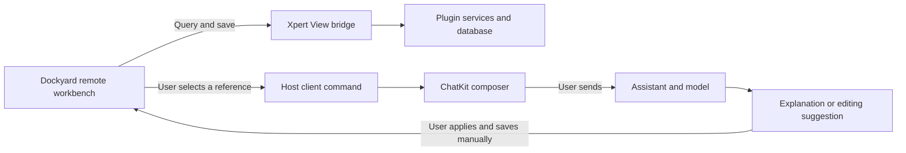

This tutorial uses Dockyard to show how to integrate an existing Web workbench with Xpert. You will retain its multi-panel interface, persist workbench data through a plugin, provide an assistant template, and pass selected content to a chat assistant for explanations or editing suggestions.

The tutorial focuses on responsibilities, implementation steps, and validation. See [Dockyard demo PR #627](https://github.com/xpert-ai/xpert-plugins/pull/627) for the complete implementation and development materials. The example is pinned to [commit 9b9c3354](https://github.com/yurongk/xpert-plugins/tree/9b9c33545411c66bc4b84c495abc0fda1e4951a8/community/apps/dockyard). The PR includes code changes, validation records, and six supporting documents. Use the pinned commit to reproduce the example without waiting for the PR to merge. This is a development case study, not a published npm plugin.

<Warning>
This tutorial describes Dockyard plugin 0.3.0. Context-menu references require the host command `assistant.composer.append_references`, implemented in [Xpert PR #1025](https://github.com/xpert-ai/xpert/pull/1025). Confirm that your deployment includes this capability before reproducing the reference flow. Installing the plugin alone does not establish support on an unmodified Xpert main checkout. The command is not presented here as a stable capability available in every version.
</Warning>

## User experience and boundaries

Users open a text file, select a passage, and choose **Explain this** or **Help me edit** from its context menu. The file tree offers the same actions for the entire text. Once ChatKit displays the reference, users enter and send their request. The model returns an explanation or editing suggestion, which users apply and save manually.

The file tree is virtual: file contents are stored in plugin database records. A whole-file reference is still a text snapshot, not a native workspace file attachment or a direct reference to a file on the developer's computer. Download locations are controlled by browser settings.

Earlier iterations explored AI layout and content-collaboration panels before narrowing the interface to two context-menu actions. This tutorial covers only the functionality retained in 0.3.0; it does not require recreating the removed panels, draft-application flow, or undo tools.



## Step 1: Prepare independent repositories and a test environment

Read [Plugin development](/en/ai/plugin/develop) and [Develop a custom Agentic App](/en/ai/tutorial/develop-custom-agentic-app) to understand the relationship between plugins, services, Workbench views, and assistant templates.

Create a dedicated directory for the plugin repository and test host. Fork the official plugin repository on GitHub, then clone your fork:

```bash
# Run in a new development directory; replace YOUR_ACCOUNT.
git clone https://github.com/YOUR_ACCOUNT/xpert-plugins.git
cd xpert-plugins
git remote add upstream https://github.com/xpert-ai/xpert-plugins.git
git fetch upstream main
git switch -c feature/my-workbench upstream/main
```

To run the pinned example first, clone the example fork into a separate directory:

```bash
git clone https://github.com/yurongk/xpert-plugins.git dockyard-example
cd dockyard-example
git checkout 9b9c33545411c66bc4b84c495abc0fda1e4951a8
```

This checkout is for reproduction. Use your own feature branch when developing a plugin. Record the plugin, host, and upstream UI commit SHAs instead of recording only “latest.” This example uses Node 22, pnpm 8.15.8 for the plugin, and SDK/contracts 3.18.4. Select the host package manager version from its own package.json.

Use separate databases, Redis, ports, and log directories for the test host. Read credentials from test environment configuration; do not include them in plugin files, documentation, or commits. Allow only the plugin workspace paths required by the test instance.

## Step 2: Reuse the UI behind a clear adapter boundary

The Dockyard library provides layout capabilities, while the complete sample supplies workbench menus, panels, and editors. Identify what the library and sample each provide before assuming that installing the library reproduces the application.

This example preserves pinned upstream files and their MIT license, verifies them against a hash manifest, and keeps custom changes in the build adapter. The main directories are:

```text
community/apps/dockyard/
├── src/index.ts                 # Plugin metadata and registration
├── src/dockyard-assistant.yaml  # Assistant template DSL
├── src/lib/
│   ├── workspace-view.provider.ts
│   ├── workspace.service.ts
│   ├── workspace.entity.ts
│   └── remote/                 # UI adapter, bridge, save queue, context menus
├── scripts/                    # Sample adaptation, build, and verification
├── tests/
└── vendor/                     # Original Dockyard, licenses, and provenance
```

`adapt-sample.mjs` handles the sample integration points. Check the match count for each replacement anchor and fail when the upstream structure changes. Otherwise a build can succeed while silently omitting persistence or initialization wiring. Prefer upstream extension APIs for new products; use checked build adaptations when the sample lacks an appropriate extension point.

## Step 3: Register the plugin, view, and assistant template

The plugin entry must declare both runtime capabilities and discoverable user entry points. This example installs at tenant scope, with matching installation levels and artifact namespaces in package.json and runtime metadata. Follow the target host and SDK contracts for installation scope and entity naming rather than copying another example's settings blindly.

Check these connections in order:

1. `src/index.ts` exports the plugin object and registers the server module.
2. The server module registers entities, persistence services, middleware, and the View Provider.
3. The View manifest declares `remote_component`, `esm`, and `iframe`, along with data queries and three save actions.
4. Middleware provides the feature required by the View's `requiredFeatures`.
5. The template contribution loads the DSL, and marketplace metadata explicitly lists `assistant-template`.
6. The app's `appConfig` references a template key from the same plugin; template, app, and capability declarations agree.

A YAML file alone does not make a template visible. Check the template content, plugin contribution manifest, and app association together.

For this ESM package, the host resolves the entry before loading the module. Preserve the following export shape so the host can locate the entry:

```json
{
  "type": "module",
  "exports": {
    ".": {
      "types": "./dist/index.d.ts",
      "import": "./dist/index.js",
      "default": "./dist/index.js"
    }
  }
}
```

`default` points to the same ESM file; it does not imply a separate CommonJS build. Verify the actual loading path with a plugin lifecycle test.

## Step 4: Persist data through the View bridge

The remote component runs in an isolated iframe and should not retain the sample's localStorage persistence. Send durable data through View queries and actions to the server. The iframe does not hold a platform token.

This example maintains three independent revisions:

| Data | View action | Why revisions are separate |
| --- | --- | --- |
| Layout, theme, and preset | `save_workspace` | Panel changes do not overwrite file contents |
| File contents | `save_buffers` | Detect editing conflicts and preserve unsaved content |
| Scratchpad | `save_scratchpad` | Notes save independently of layouts and files |

The server derives tenant, organization, workspace, user, and assistant scope from trusted host context. Do not authorize requests using identity fields supplied by the iframe. Save requests include `expectedRevision`; reject stale writes when it differs from the server revision, and ask the user to resolve the conflict.

Test two easily missed save-queue cases:

- Display “Saved” only after confirmation. Preserve dirty state and user content when a request fails.
- If an edit arrives after a save completes but before its Promise is cleared, do not reuse the completed Promise and lose the new value.

Also test initial data loading failures: a default empty workbench must not overwrite server records. Restoring dynamic documents requires rebuilding content factories, themes, and data-source bindings as well as panel positions.

## Step 5: Add selected content as a chat reference

Declare the allowed command in the View manifest's `clientCommands`, then invoke it through an initialized bridge. This is the business payload sent by the example bridge, not a complete standalone bridge implementation:

```ts
{
  type: 'invokeClientCommand',
  commandKey: 'assistant.composer.append_references',
  payload: {
    references: [{
      type: 'code',
      label: 'Explain this',
      path: 'example.js',
      text: 'return amount * 0.2;',
      startLine: 2,
      endLine: 2
    }]
  }
}
```

The complete message also needs a protocol channel, version, instance ID, and request ID. Validate the message source, instance, and response type, and handle timeouts and disposal so a response from another instance cannot complete this request. See `src/lib/remote/bridge.ts` in the pinned example.

Capture the selection as a snapshot when the user invokes the menu, including the filename, text, and line range. File-tree actions read the selected file's current text buffer. Use explicit content types instead of inferring them from names; ask the user to choose a text file when no referenceable text is available.

The host validates references, appends them to the composer, and focuses it while preserving the existing draft and leaving sending to the user. It must also check that the ChatKit element is mounted: a controller object alone does not establish that the composer is usable. Do not show success after a failed receipt.

If the target host lacks the command, document the gap and disable the entry point. Do not bypass the interface by accessing host DOM or simulating paste from the plugin.

## Step 6: Build and validate the final HTML

This example embeds ESM scripts and styles into HTML. In addition to TypeScript compilation and output consistency, verify that the final embedded script parses.

One real failure came from passing the bundle directly as the replacement string to `String.replace`. Sequences such as `$&` were interpreted as replacement patterns, injecting original HTML into the generated script and leaving the page stuck on Loading.

Use a callback to preserve the replacement's literal contents:

```js
html = html.replace(scriptPlaceholder, () => inlineScript)
```

Handle script closing tags as well, then extract the module script from the final HTML and check its syntax. Showing that the output matches the build algorithm does not establish that the algorithm generates valid JavaScript.

Run these commands from the example repository root:

```bash
corepack pnpm@8.15.8 --dir community/apps/dockyard install --ignore-workspace --frozen-lockfile
corepack pnpm@8.15.8 --dir community/apps/dockyard test
corepack pnpm@8.15.8 --dir community/apps/dockyard typecheck
```

Independent installation is appropriate here because this example includes its own lockfile. Do not treat `--ignore-workspace` as a universal installation setting for monorepo packages.

Prepare the harness dependencies and build according to `plugin-dev-harness/README.md`, then run:

```bash
node plugin-dev-harness/dist/index.js \
  --workspace ./community/apps/dockyard \
  --plugin @community/apps-dockyard
```

For example version 0.3.0, the build, 56 upstream tests, 11 plugin tests, typecheck, and dist-first lifecycle check passed. The harness uses built-in mocks; this does not establish real database or UI workflow acceptance.

## Step 7: Deploy and initialize the assistant

Configure `PLUGIN_WORKSPACE_ROOTS` in the test host to allow the plugin directory. Use an absolute path accessible to the API process. For a containerized host, verify the container path and volume mount.

From the test host root, inspect the deployment command for that version, then provide the actual plugin path and test API address:

```bash
pnpm plugin:deploy:local --help
pnpm plugin:deploy:local \
  --plugin-dir /absolute/path/to/xpert-plugins/community/apps/dockyard \
  --scope tenant \
  --api-url http://127.0.0.1:43100 \
  --no-keychain
```

The port is an example. Supply deployment authentication from the test environment as required by the target CLI version, and configure model credentials in the platform.

Validate deployment in this order:

1. Read the installation receipt and distinguish `staged` from `loaded`.
2. If it reports `restartRequired`, restart the target test API and check the plugin version and loading errors.
3. Find the Dockyard assistant template. On first use, create the assistant and configure an available model.
4. For an existing assistant, use the template update flow, check model settings, and publish rather than creating a duplicate.
5. Open the workbench, verify that runtime HTML matches the new dist, and confirm initial data loads.
6. Submit a real reference question, manually apply a suggestion, save, and refresh to confirm persistence.

Installation, template visibility, assistant publication, and a working business flow are separate outcomes. Verify each one.

## Use the plugin: From template to AI conversation

After installation, users can follow these steps without reading the plugin code. The screenshots were supplied by the example user and show the actual interface. Creation, configuration, and publication are described in text; no illustrative screenshots are provided for those steps. The screenshots show the Chinese UI.

### 1. Create an expert from the template

Open the platform's template entry, find **Dockyard Content Assistant** (Dockyard 内容助手), and use it to create a digital expert (assistant). You are creating an instance from the template supplied by the plugin, not authoring a new template from scratch.

If the template is missing, confirm that the plugin loaded and check its template contribution metadata. For an existing Dockyard expert, use the template update flow instead of creating another instance.

### 2. Configure the model and publish

Open the expert's configuration or orchestration page, select a model available to the current organization, and confirm that model credentials are configured. Check the Dockyard middleware and workbench association supplied by the template, save the configuration, and publish.

**Help me edit** and **Explain this** are workbench context-menu actions, not two additional Agent tool nodes to add to the orchestration canvas. They prepare references in the expert's ChatKit composer, and responses use the expert's configured model.

### 3. Open the Dockyard workbench

Enter the published expert's conversation page and open **Dockyard Workbench**. Explorer on the left lists files, the center holds document editors, and the chat area on the right is where you ask the Dockyard Content Assistant questions.


<Note>
This screenshot shows the workbench and an assistant response, but its bottom status bar also reports that saving failed and edited content was retained. It demonstrates the interface and response, not a successful save. Keep the current edits, retry as prompted, and confirm that saving succeeds before refreshing or leaving.
</Note>

### 4. Explain selected text

1. Open a text file in Explorer, such as `theme.css`.
2. Select the passage to discuss, then right-click and choose **Explain this** (解释一下).
3. Check the referenced file, text, and line range in ChatKit on the right.
4. Enter a specific question, such as “Explain what each of these theme color variables controls,” then send it.


The menu action prepares a reference without sending a message. Select only the relevant passage when discussing a small part of a file.

### 5. Ask for file edits

1. Right-click the target text file in Explorer and choose **Help me edit** (帮我改) to reference its current full text. For a smaller change, use the same action on an editor selection.
2. Check the reference in ChatKit and describe the change, for example: “Rewrite this README as three usage steps, keeping the installation commands.”
3. Send the request and review the suggestion. Continue the conversation if it needs adjustments.
4. Manually place the accepted content in the editor, click **Save buffer**, confirm success, and then refresh to check persistence.


**Explain this** in the file menu also references the full text. The entry points differ in scope: an editor selection references a passage, while the file tree references the whole text. **Help me edit does not overwrite the file automatically**, and a code block in a model response does not mean the content has been saved to the workbench.

## Step 8: Complete acceptance beyond automated tests

| Layer | What to verify | What it does not replace |
| --- | --- | --- |
| Unit tests and build | Save races, revision conflicts, scope isolation, manifests, final scripts | Real mouse interaction |
| Lifecycle | Entry resolution from dist, initialization, shutdown | Real platform deployment |
| UI integration | Selection, file references, draft preservation, errors, menu cleanup | Real model processing |
| Platform workflow | Questions, real answers, manual adoption, save/restore, failure recovery | Quality evaluation for other business scenarios |

Use synthetic code for a minimal check: select `return amount * 0.2` in `tax(amount)`, ask the assistant to explain `tax(100)`, and confirm the answer is 20. Request a specific change, apply it manually, save, and refresh. Also demonstrate recovery from a save conflict or a reference attempted before the composer is ready.

The example has API-to-model explanation evidence. User-provided screenshots now show the workbench and both context menus; the complete UI workflow for manual adoption, save/restore, and failure recovery still needs final acceptance. Do not label API receipts or upstream screenshots as browser acceptance for this plugin.

## Troubleshooting

| Symptom | Check first | Resolution direction |
| --- | --- | --- |
| Wrong pnpm version | The version actually running | Select the plugin and host versions explicitly |
| Plugin fails to load | dist, exports, host entry resolution | Run the dist-first harness against the same package |
| Assistant template missing | Template contributions and marketplace metadata | Check the template key and appConfig association |
| Page remains on Loading | Final module syntax, bridge initialization, data requests | Locate the first failing boundary instead of repeatedly refreshing |
| Saved content disappears on refresh | Save receipts, queue races, revision conflicts | Preserve dirty state and add a focused regression |
| Reference action has no effect | Host command support, manifest, ChatKit mounting | Return an understandable error and allow retry |
| Old page remains after update | staged/restartRequired, runtime version, HTML hash | Complete the target API restart and assistant template update |

## Further reading

- [Demo PR #627: complete implementation and supporting documents](https://github.com/xpert-ai/xpert-plugins/pull/627)
- [Workbench remote components](/en/ai/plugin/plugin-sdk/remote-component)
- [Plugin publishing and usage](/en/ai/plugin/install)
- [Pinned example and six development documents](https://github.com/yurongk/xpert-plugins/tree/9b9c33545411c66bc4b84c495abc0fda1e4951a8/community/apps/dockyard/docs/interview)
- [Upstream Dockyard repository](https://github.com/wieslawsoltes/Dockyard)
