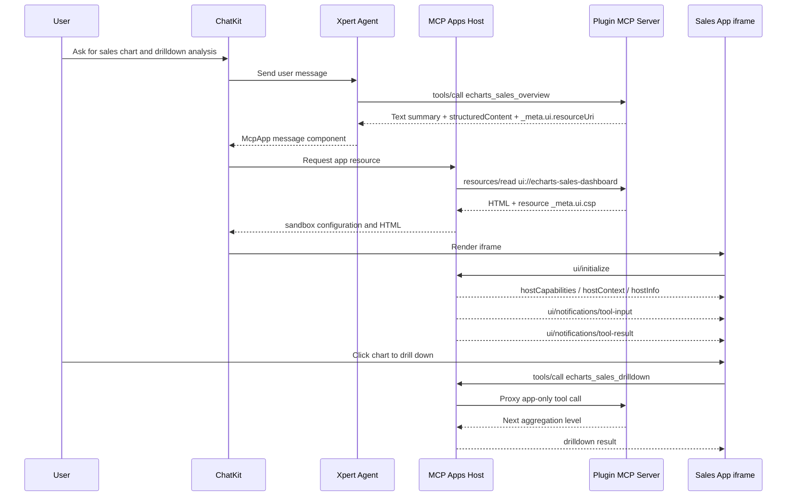

<Info>
This tutorial uses `@xpert-ai/plugin-echarts-mcp-app` to explain MCP Apps from basic concepts to a realistic plugin implementation. The goal is to move beyond a chart demo and design an interactive sales performance app that runs inside ChatKit.
</Info>

## Goal

We are not building a static chart. We are building an inline sales performance command center:

- The user asks ChatKit to show 2026 revenue by region with drilldown analysis.
- The Agent calls the model-visible tool `echarts_sales_overview`.
- The tool returns a text summary, structured analysis data, and `_meta.ui.resourceUri`.
- ChatKit renders `ui://echarts-sales-dashboard` as an inline iframe.
- The user switches metric, year, and grouping, then clicks the chart to drill down.
- The iframe calls the app-only tool `echarts_sales_drilldown` through the MCP Apps bridge.
- The model does not see app-only tools, but the App can call them safely through the Xpert host.

This pattern works well for operating dashboards, metric diagnostics, customer segmentation, supply-chain analysis, incident triage, approval forms, and map-based workflows. The model understands intent and starts the work; the MCP App carries the high-density interactive result.

## Basic Concepts

MCP Apps combine three pieces:

1. **MCP Tool**: A callable tool. A model-visible tool usually opens the App and returns initial state.
2. **MCP Resource**: An HTML resource served by the MCP server. MCP App resources normally use a `ui://...` URI and must return `text/html;profile=mcp-app`.
3. **MCP Apps Host**: In Xpert + ChatKit, the host reads the resource, creates a sandboxed iframe, injects initialization context, and proxies `tools/call` / `resources/read`.

The tool and the App communicate through the standard JSON-RPC bridge. Common methods include:

- `ui/initialize`: the App initializes with the host and receives host capabilities and context
- `ui/notifications/tool-input`: the host sends the triggering tool input
- `ui/notifications/tool-result`: the host sends the initial tool result
- `tools/call`: the App calls an allowed tool on the same MCP server
- `resources/read`: the App reads an allowed MCP resource
- `ui/notifications/size-changed`: the App asks ChatKit to resize the iframe

For the plugin-side MCP server, tool, and resource conventions, see [MCP Tools and MCP Apps](../plugin/mcp-tools-and-apps). For ChatKit rendering and host security, see [ChatKit MCP Apps](../chatkit/chatkit-mcp-apps).

Official protocol references:

- [MCP Apps Overview](https://modelcontextprotocol.io/extensions/apps/overview)
- [Build an MCP App](https://modelcontextprotocol.io/extensions/apps/build)
- [MCP Apps API](https://apps.extensions.modelcontextprotocol.io/api/)
- [MCP Apps compatibility in ChatGPT](https://developers.openai.com/apps-sdk/mcp-apps-in-chatgpt)

## Runtime Flow



The key point is that ChatKit does not persist arbitrary HTML in conversation history. It stores safe metadata such as `resourceUri`, `toolName`, `toolsetId`, and `serverName`. When the page refreshes, the backend can read the `ui://` resource again and revive the App instance.

## Real Business Modeling

To make the sample plugin realistic, model it as a sales performance analysis capability instead of a drawing utility.

| Layer | Example capability | Plugin implementation |
| --- | --- | --- |
| Business question | Which region leads revenue? Is margin dropping? Are orders concentrated in one product? | Tool description and summary |
| Metrics | Revenue, gross margin, order count, margin rate | `SalesMetric`, `totals`, `points` |
| Dimensions | Region, product, month | `SalesGroupBy`, `filters`, `nextGroupBy` |
| First screen | Show 2026 revenue by region | `echarts_sales_overview` |
| Interaction | Click West, drill into product, then month trend | `echarts_sales_drilldown` |
| Visualization | Bar chart, line chart, stat cards, breadcrumbs | `src/app/main.ts` + ECharts |
| Security boundary | Model sees overview; iframe sees drilldown | `_meta.ui.visibility` |

In production, the mock dataset can be replaced with CRM, ERP, warehouse, metric platform, or semantic model queries. Do not let the browser talk directly to sensitive databases. The iframe should call controlled MCP tools, and the backend should enforce authentication, tenant isolation, row-level permissions, and audit logging.

## Plugin Layout

`@xpert-ai/plugin-echarts-mcp-app` uses this structure:

```text
tools/echarts-mcp-app/
├── .xpertai-plugin/
│   └── plugin.json
├── package.json
├── project.json
├── scripts/
│   └── build-app.mjs
├── src/
│   ├── index.ts
│   ├── mcp-server.ts
│   ├── app/
│   │   ├── index.html
│   │   ├── main.ts
│   │   └── styles.css
│   └── lib/
│       ├── app-html.ts
│       ├── mcp-tools.ts
│       └── sales-data.ts
└── tsconfig.lib.json
```

This layout separates the MCP server, business aggregation logic, and browser App. `src/app` is a normal Vanilla TypeScript frontend. The build writes `dist/app/index.html`; `src/lib/app-html.ts` only reads the built asset and returns it as an MCP resource.

## Declare the Plugin-Managed MCP Server

The plugin declares its MCP server in `.xpertai-plugin/plugin.json`:

```json
{
  "mcpServers": {
    "echarts-drilldown": {
      "type": "stdio",
      "command": "node",
      "args": ["${PLUGIN_ROOT}/dist/mcp-server.js"],
      "policy": {
        "enabled": true,
        "defaultToolsApprovalMode": "approve",
        "enabledTools": ["echarts_sales_overview", "echarts_sales_drilldown"]
      }
    }
  }
}
```

`"${PLUGIN_ROOT}"` matters. The installed runtime path changes whenever the plugin is installed or refreshed. Do not persist local development paths or a specific `@runtime__...` folder in the manifest or database.

## Design Tool Visibility

Real MCP Apps usually have at least two types of tools:

- **Model-visible tools**: tools the Agent can choose, such as `echarts_sales_overview`
- **App-only tools**: tools only the iframe can call for refresh, drilldown, pagination, or export preflight, such as `echarts_sales_drilldown`

In this sales analysis plugin, the overview tool is visible to both the model and the App:

```ts
export const OVERVIEW_TOOL_META = {
  ui: {
    resourceUri: 'ui://echarts-sales-dashboard',
    visibility: ['model', 'app']
  },
  'openai/outputTemplate': 'ui://echarts-sales-dashboard'
}
```

The drilldown tool is App-only:

```ts
export const DRILLDOWN_TOOL_META = {
  ui: {
    visibility: ['app']
  }
}
```

This keeps the model tool list focused and hides UI implementation details from the LLM. The iframe is still governed by the Xpert MCP Apps Host, which rejects disabled tools, cross-toolset calls, and tools that are not app-visible.

## Return Structured Business Results

The MCP App should not parse natural language summaries. Tool results should provide:

- `content`: text for the model and non-UI clients
- `structuredContent`: stable JSON for the App
- `_meta.ui.resourceUri`: the App resource ChatKit should render

The sample plugin returns both an analysis object and chart-friendly fields:

```ts
function buildStructuredContent(analysis: SalesAnalysis) {
  return {
    kind: analysis.kind,
    analysis,
    chart: {
      title: `${analysis.metric} by ${analysis.groupBy}`,
      labels: analysis.points.map((point) => point.label),
      values: analysis.points.map((point) => point.value),
      metric: analysis.metric,
      groupBy: analysis.groupBy,
      year: analysis.year,
      filters: analysis.filters
    }
  }
}
```

For production apps, add a versioned kind such as `sales-performance-analysis.v1` and keep the App compatible with at least one previous version. That prevents old conversation messages from breaking when backend analysis evolves.

## Register the MCP App Resource

The App HTML is returned by an MCP resource. Security and rendering metadata belongs on the resource, not the tool:

```ts
registerAppResource(
  server,
  'echarts-sales-dashboard',
  'ui://echarts-sales-dashboard',
  {
    title: 'ECharts Sales Dashboard',
    description: 'Interactive ECharts dashboard for sales drilldown analysis.',
    mimeType: RESOURCE_MIME_TYPE,
    _meta: {
      ui: {
        csp: {
          resourceDomains: ['https://cdn.jsdelivr.net'],
          connectDomains: [],
          frameDomains: [],
          baseUriDomains: []
        },
        prefersBorder: true
      }
    }
  },
  () => buildDashboardResource(RESOURCE_MIME_TYPE)
)
```

If the App loads ECharts from a CDN, include `https://cdn.jsdelivr.net` in the resource CSP. Avoid broad `*` domains. If a production App can bundle third-party libraries offline, do that; the CSP becomes simpler and more predictable.

## Author the App as Frontend Source

Do not maintain production App HTML as a huge TypeScript template string. Keep it as normal frontend source:

```text
src/app/
├── index.html
├── main.ts
└── styles.css
```

`scripts/build-app.mjs` uses esbuild to bundle browser TypeScript and inline CSS and JS into one HTML file:

```json
{
  "scripts": {
    "build:app": "node scripts/build-app.mjs"
  }
}
```

The MCP resource reads `dist/app/index.html`. This lets frontend developers maintain DOM, styles, state, and interactions in a familiar way. Tests can also inspect the built asset for bridge calls such as `ui/initialize` and `tools/call`.

## App Bridge Lifecycle

When the App starts, initialize with the host and then wait for the host to send the initial tool input and result:

```ts
request('ui/initialize', {
  protocolVersion: '2026-01-26',
  appInfo: {
    name: 'xpert-echarts-sales-dashboard',
    version: '0.0.1'
  },
  appCapabilities: {
    availableDisplayModes: ['inline']
  }
})
```

When the App receives `ui/notifications/tool-result`, it extracts `structuredContent.analysis` and renders the chart. When the user clicks the chart, it calls the app-only tool:

```ts
request('tools/call', {
  name: 'echarts_sales_drilldown',
  arguments: {
    metric: state.metric,
    year: state.year,
    groupBy: state.groupBy,
    filters: state.filters
  }
})
```

After chart redraws, error-state changes, or responsive layout changes, send `ui/notifications/size-changed` so ChatKit can keep the iframe height aligned with the content.

## Build and Validate

Build the App asset first, then compile the plugin server:

```bash
pnpm -C tools/echarts-mcp-app run build:app
pnpm -C tools/echarts-mcp-app exec tsc --build tsconfig.lib.json
```

If you build through Nx, ensure `nx build @xpert-ai/plugin-echarts-mcp-app` runs both the server build and the App build.

Before shipping, verify:

- the stdio MCP server starts without writing normal logs to stdout
- `tools/list` includes the model-visible `echarts_sales_overview`
- the app-only `echarts_sales_drilldown` is not exposed to the model
- the overview tool result includes `_meta.ui.resourceUri`
- the resource returns `text/html;profile=mcp-app`
- the resource metadata includes a minimal CSP
- the iframe receives initial tool input and tool result
- chart clicks call `tools/call` and return drilldown data
- refresh recovery does not persist or leak raw HTML

## From Example to Production

Use these upgrades when turning the demo into a real business App:

| Area | Production recommendation |
| --- | --- |
| Data source | Replace mock data with metric platform, warehouse, CRM, or semantic model queries |
| Permissions | Enforce tenant, organization, user, row-level, and column-level permissions in the MCP server |
| Metric governance | Use stable metric IDs instead of UI labels |
| Performance | Cache aggregate queries, limit drilldown depth, and cap returned points |
| Explanation | Add an app-only `explain_variance` tool for YoY, MoM, and anomaly explanation |
| Action loop | Add approval-gated tools such as `create_followup_task` or `export_snapshot` |
| Model context | Use `ui/update-model-context` to send the current filters into the next user turn |
| Observability | Log app-only tool calls, denials, and resource-read failures |

A mature MCP App plugin is more than HTML plus charts. It should design business semantics, tool permissions, interaction state, auditability, and fallback behavior together.

## FAQ

**Why not use ChatKit Widgets?**

Widgets are best for controlled declarative UI. MCP Apps are better when the plugin owns a full HTML app with complex state, third-party visualization libraries, chart interactions, or repeated app-only tool calls.

**Why not use extension views?**

Extension views are platform surfaces for persistent workbench pages, configuration screens, and integration detail pages. MCP Apps are tool-call results whose lifecycle follows the conversation.

**Why should the model not see every drilldown tool?**

Drilldown, pagination, and refresh tools are UI implementation details. Making them app-only keeps the model tool list smaller and reduces accidental calls.

**Is HTML stored in conversation history?**

No. Xpert stores safe metadata only. The HTML is read again by the MCP Apps Host at render time.

## Next Step

Start from `@xpert-ai/plugin-echarts-mcp-app`, replace the sample sales data with your own business query, and evolve the ECharts view into the analysis surface your users actually need. As long as the boundaries between MCP tools, MCP resources, and the standard bridge stay clear, the same plugin can deliver a rich business application directly inside ChatKit.
