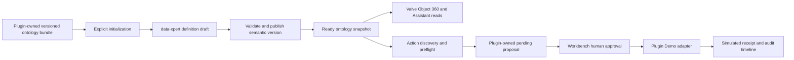

The Valve Business Workbench is a reference pattern for using ontology in an Xpert plugin. The plugin does not reduce ontology to a prompt attachment. It ships a versioned domain model, publishes it through the data-xpert lifecycle, reads exact objects from a ready snapshot, and maps ontology Action definitions to plugin-owned, governed execution adapters.

The result is an operational engineering surface with Object 360, semantic evidence, Action discovery, preflight, human approval, Demo execution, and audit.

## Responsibility split



| Layer | Owns |
| --- | --- |
| data-xpert ontology | Entity and relationship semantics, instances, evidence, constraints, Action definitions, snapshot and graph versions |
| Valve plugin service | Scoped reads, proposal records, preflight orchestration, Action-to-adapter mapping, Demo execution receipts, audit events |
| Workbench UI | Object selection, Object 360, proposal review, human approval or rejection, explicit Demo start |
| Assistant middleware | Read, search, Action discovery, preflight, and explicitly requested `pending_review` proposal creation |

Normal Workbench and Assistant operations are read-only toward ontology data. The only ontology write path is the explicit initializer or version upgrade. Proposals and execution audit records stay in the plugin namespace; they are not written back as ontology facts.

## Package a versioned ontology bundle

The plugin ships a code-owned bundle with stable resource ID `valve-engineering-ontology`. Version `1.0.0` contains neutral product-demo content:

| Content | Count | Domain meaning |
| --- | ---: | --- |
| Entity types | 5 | `valve`, `valve_component`, `actuator`, `material`, `standard` |
| Relationship types | 4 | Parts, materials, actuator, and standards |
| Action types | 7 | Maintenance, inspection, quality, spare parts, replacement, isolation simulation, and engineering review |
| Demo instances | 7 | One valve and its related engineering objects |
| Demo relationships | 6 | A connected one-hop engineering Object 360 |

The bundle has no customer production records or external data bindings. This makes initialization deterministic and safe for a product demonstration while preserving the same published ontology contract a production integration would use.

### Why the bundle stays server-side

The iframe never supplies the resource ID, semantic version, definition content, tenant, organization, or data-xpert endpoint. Those values come from plugin code, configuration, and the host runtime. This prevents a browser caller from changing the ontology scope or importing an arbitrary definition through the Workbench bridge.

## Initialize through the definition lifecycle

Connecting data-xpert does not write the ontology. A Workbench user must select **Initialize ontology** and confirm.

<Steps>
  <Step title="Check the fixed resource and version">
    The plugin checks whether `valve-engineering-ontology` exists and whether the code-owned semantic version is already published.
  </Step>
  <Step title="Create or replace the draft">
    If no definition exists, the plugin creates it. If an unpublished draft exists, the user must explicitly confirm that the code-owned bundle will overwrite that draft.
  </Step>
  <Step title="Validate in data-xpert">
    The complete draft is sent through the ontology-definition API and validated against the same entity, relationship, Action, instance, and relation rules used by Ontology Studio.
  </Step>
  <Step title="Publish the semantic version">
    data-xpert creates an immutable version and a published snapshot, then updates runtime projections.
  </Step>
  <Step title="Refresh ready resources">
    The plugin reloads resources and only exposes objects from an active, `ready` resource containing the exact root entity type code `valve`.
  </Step>
</Steps>

Initialization is idempotent: if the exact semantic version is already published, it returns `already_current` and creates no duplicate version. To upgrade, change the code-owned model, increment its semantic version, redeploy, and let the Workbench offer **Update ontology**. Never rewrite an already-published semantic version.

## Build Object 360 from a published neighborhood

After initialization, the Workbench uses the current user's short-lived Actor Token on the server to call data-xpert Agent Tools. It revalidates the organization, active resource, ready status, optional resource allowlist, optional definition filter, and exact `valve` root type.

For a selected valve, the plugin combines the current entity with its one-hop neighborhood to show:

- stable identity and typed properties;
- components, materials, actuator, and applicable standards;
- relationship direction and related object details;
- evidence and source summaries;
- structured constraints and warnings;
- Action definitions available for the current type;
- snapshot ID and graph version used by the view.

The Assistant receives the same bounded Workbench context. Its skill instructs it to separate ontology facts, evidence gaps, and Agent judgment, so a recommendation is not presented as a source-system fact.

## Turn ontology Actions into governed operations

The ontology defines the business meaning of an Action: stable code, target type, risk, approval requirement, input contract, preconditions, discovery mode, and expected effects. The plugin maps that stable `actionTypeCode` to an execution adapter.

The Valve example includes:

| Action code | Risk | Demo outcome |
| --- | --- | --- |
| `create_maintenance_work_order` | HIGH | `WO-DEMO-*` maintenance order receipt |
| `schedule_valve_inspection` | MEDIUM | `INS-DEMO-*` inspection task |
| `raise_quality_deviation` | HIGH | `NCR-DEMO-*` quality deviation |
| `request_spare_part` | MEDIUM | `PR-DEMO-*` spare-part request |
| `request_valve_replacement` | HIGH | `ENG-DEMO-*` engineering review |
| `isolate_valve` | CRITICAL | `SIM-DEMO-*` simulation-only isolation receipt |
| `request_engineering_review` | LOW | `ENG-DEMO-*` internal review |

When configured for a customer Demo, the plugin may expose clearly labelled fallback Actions that are missing from the current ontology. Disable fallback when every visible Action must come from data-xpert.

## Preflight before proposal creation

Before creating an `ontology_action` proposal, the Assistant or Workbench runs `valve_preflight_action`. Preflight is read-only and checks:

- whether the Action applies to the current entity type;
- whether the Demo adapter is enabled;
- required input and numeric ranges;
- whether the proposal's graph version is stale;
- duplicate open work, such as another pending or approved maintenance proposal;
- ontology constraints and simulation-only warnings.

Normalized input and the preflight summary are persisted with the proposal so an approver can review the exact contract that passed validation.

## Keep approval and execution human-controlled

The Assistant middleware provides strict tools for ready-resource discovery, schema inspection, object search, Object 360, Action discovery, preflight, proposal listing, proposal creation, and audit retrieval. Its only mutation is idempotent creation of a `pending_review` proposal.

It deliberately has no approve, reject, or execute tool.

```text
ontology Action
  → read current object and graph version
  → discover and preflight
  → create pending_review proposal after explicit user intent
  → Workbench user approves or rejects
  → user explicitly starts the Demo adapter
  → append execution events and simulated receipt
```

Only an approved proposal can run. A successful path records:

```text
proposal_created
  → proposal_approved
  → execution_queued
  → execution_started
  → execution_completed
```

A failure records `execution_failed` instead of inventing a success receipt. The CRITICAL valve-isolation path is labelled `simulation_only` and never claims to send a DCS or SIS command.

## Security and scope pattern

The Valve plugin demonstrates several reusable rules:

- keep Actor Tokens and tenant identity on the server side of the view bridge;
- obtain identity from the current host request instead of browser configuration;
- require active organization scope for every data-xpert call;
- allowlist resources only after the plugin-owned ontology is initialized;
- validate stable entity type codes instead of guessing from display names or properties;
- pin snapshot and graph version during preflight;
- separate semantic Action definition from execution credentials and adapter code;
- keep initialization, managed Assistant provisioning, and normal Workbench operation as separate lifecycle steps;
- make consequential transitions visible, authenticated, idempotent, and auditable.

## Reusable plugin blueprint

To apply this pattern to another domain:

1. define stable entity, relationship, property, and Action codes;
2. decide whether the plugin ships a neutral ontology bundle, binds customer resources, or does both;
3. publish through data-xpert rather than maintaining a private graph format;
4. require explicit confirmation for initialization and semantic-version upgrades;
5. discover objects from `ready` snapshots and validate an exact root entity type;
6. build compact domain DTOs from entity neighborhoods, evidence, constraints, and Actions;
7. map Action codes to plugin-owned adapters without putting credentials in the ontology;
8. require preflight and graph-version checks before creating a proposal;
9. reserve approval and execution for an authenticated user surface when risk requires it;
10. persist proposal, execution receipt, and append-only audit separately from ontology facts.

This separation lets the ontology remain a reusable semantic contract while each plugin supplies the UI, integration adapter, and governance workflow appropriate to its domain.
