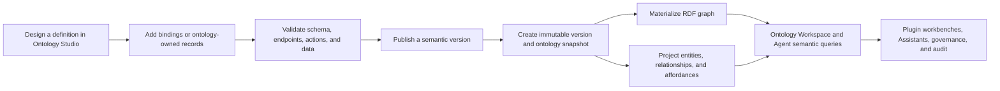

Ontology in UOSE is a product layer for defining, publishing, exploring, and using business semantics. It gives every important object a stable type and identity, connects objects through explicit relationships, describes the actions that can apply to them, and preserves the version and evidence used by people and Agents.

It is not only a schema diagram or a vocabulary. A published ontology becomes a governed runtime contract that supports entity search, graph exploration, action discovery, Assistant context, plugin experiences, and audit.

<CardGroup cols={2}>
  <Card title="Ontology Studio" icon="pen-ruler" href="./ontology-studio">
    Design entity types, relationships, properties, actions, bindings, and ontology-owned data; validate and publish immutable versions.
  </Card>
  <Card title="Ontology Workspace" icon="circle-nodes" href="./ontology-workspace">
    Browse published business objects, search entities, inspect instance graphs, compare snapshots, and work with the ontology Assistant.
  </Card>
  <Card title="Runtime semantics" icon="database">
    Materialize snapshots into RDF and runtime projections for fast search, neighborhood queries, affordance discovery, and traceability.
  </Card>
  <Card title="Plugin scenarios" icon="puzzle-piece" href="./cases/plugin-scenarios">
    Package domain ontologies with plugins and turn published objects and Actions into focused business workbenches.
  </Card>
</CardGroup>

## Core semantic model

| Element | Purpose | Example |
| --- | --- | --- |
| Entity type | Defines a class of business object and its properties | `valve`, `supplier`, `purchase_order` |
| Entity instance | Identifies a concrete object with an external key | Valve `V-1001` |
| Relationship type | Defines valid source, target, cardinality, and relationship properties | Valve **uses material** |
| Relationship instance | Connects two concrete objects | `V-1001` uses `CF8M` |
| Action definition | Describes what may be done, to which types, with which input, risk, approval, and expected effects | `create_maintenance_work_order` |
| Constraint and policy | Limits legal use and controls consequential operations | A CRITICAL Action requires approval |
| Data binding | Maps ontology properties to an external UOSE resource | `valve.code` → source field `VALVE_ID` |
| Provenance | Records where a definition or fact came from | Manifest, source schema, source instance, or derived result |

These elements form a stable semantic contract. Agents can reason over readable names and relationships, while services continue to validate stable codes, types, schemas, versions, policies, and actor scope.

## From design to runtime

### 1. Author

Ontology Studio stores an editable draft with a revision number. The draft can contain schema, Action definitions, external data bindings, representative instances, instance relationships, and canvas layout. A user can start from a blank ontology, a template, or an RDF/XML import.

### 2. Validate and compile

Validation checks schema integrity, relationship endpoints, property types, Action targets and contracts, instance attributes, and instance relationships. Preview compiles the draft into the exact `MetaManifest` and publish request that will enter the runtime pipeline.

### 3. Publish and version

Publishing validates again, assigns a semantic version, creates an immutable version record, publishes a business ontology snapshot, and returns its snapshot ID, graph version, and ontology ID. Published history is retained even when an earlier version is restored as a new draft.

### 4. Materialize and project

The canonical ontology intermediate representation contains schema, instances, relationships, constraints, affordances, aliases, and provenance. UOSE can materialize it into named RDF graphs and projects its runtime objects into entity, relationship, and action tables. See [Snapshot, RDF, and Instance Projection](./snapshot-and-projection).

### 5. Explore and operate

Ontology Workspace groups definitions, ontology-owned data, and connected business objects. Users can monitor health, search across active entities, inspect current and historical graphs, and pass exact object and snapshot context to the ontology Assistant. Plugins can use the same published context to build domain-specific Object 360 and governed Action flows.

## Two ways data enters an ontology

### Ontology-owned data

Create representative or domain-owned instances and relationships directly in Ontology Studio. These records share the ontology draft lifecycle and become published entities when the definition is released. This is useful for reference objects, neutral demonstration data, small curated vocabularies, and exceptions that do not belong to another source system.

### Connected resource data

Bind entity types and properties to external UOSE resources, or let a resource adapter publish its own canonical ontology. Database, SAP OData, semantic-model, knowledge, and plugin-owned resources can all produce versioned snapshots while their real data remains governed by the source adapter.

<Info>
The ontology graph is the semantic and governance layer. It does not copy every source-system fact or bypass the source adapter for live operations.
</Info>

## Runtime capabilities

Once published, the ontology layer supports:

- exact entity lookup and bounded cross-resource search by label, external key, alias, or entity type;
- one-hop neighborhood reads with related objects, constraints, evidence, and available Actions;
- schema summaries and semantic path exploration;
- Action discovery and plan validation against target types, parameters, constraints, risk, and approval requirements;
- snapshot and graph-version pinning for reproducible Agent and plugin decisions;
- RDF/SPARQL-backed or local-projection query backends;
- resource and partition isolation across tenant and organization scope;
- audit references that explain which object, snapshot, graph version, and evidence supported an operation.

## Governance boundary

Ontology makes an Action discoverable; it does not automatically authorize or execute it. A complete operational path can include policy evaluation, preflight validation, human approval, idempotency, an execution adapter, and append-only audit. The domain plugin case study shows how these responsibilities stay separated in practice.

## Continue

1. Use [Ontology Studio](./ontology-studio) to create and publish a definition.
2. Use [Ontology Workspace](./ontology-workspace) to inspect the published snapshot and business objects.
3. Read [Ontology in Plugin Scenarios](./cases/plugin-scenarios) to see how a plugin packages and consumes a domain ontology.
