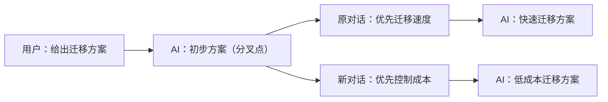

**在新对话中分叉（Branch in new chat）** 让你从某条 AI 回复继续另一条思路。新对话保留当前分支从开头到所选回复的历史，以及该回复完成时保存的对话状态；原对话可以沿原来的方向继续。

## 适用场景

- **比较方案**：在同一份初步方案上，分别探索成本优先、速度优先等不同选择。
- **调整思路**：回到一次关键回复，从那里提出新的条件，不必重新说明前情。
- **拆分后续任务**：以共同的分析结果为起点，分别深入不同问题，让每条对话更容易回顾。

## 如何使用

1. 找到希望作为起点的、已完成的 AI 回复。
2. 在回复下方的操作栏中点击分叉图标。悬停图标会显示 **在新对话中分叉**；历史回复的操作栏可在悬停消息时显示。
3. 创建成功后，当前窗口切换到新对话，输入框为空并获得焦点。
4. 输入新的问题并发送，数字专家会从分叉点保存的上下文继续回答。

分叉按钮直接位于消息操作栏中，无需打开“更多”菜单。创建分叉本身不会请求新的 AI 回复，也不会重新执行历史工具调用；发送下一条用户消息后才开始新的处理。

## 新对话从哪里开始

例如，你已经讨论了一个迁移方案，希望从“初步方案”开始比较两种方向：



新对话包含第一条用户消息和所选的“初步方案”回复。原对话随后关于迁移速度的消息不会进入新对话的历史。如果当前对话已有其他分支，也只保留当前所选路径上的消息。

| 内容 | 分叉后的行为 |
| --- | --- |
| 分叉点及之前的消息 | 复制到新对话，包含所选 AI 回复 |
| 分叉点之后的消息、其他分支的消息 | 不复制 |
| 数字专家与项目 | 继续使用原来的数字专家及所属项目，并校验访问权限 |
| 已保存的对话状态 | 从所选回复完成时的状态继续，包括可迁移的模型上下文与工具状态 |
| 工具结果与附件 | 保留可展示的历史结果；附件仍受当前访问权限约束 |
| 原对话正在执行的任务 | 继续留在原对话中，不会因切换页面而自动暂停或取消 |

新对话有自己的消息历史，可以从历史列表重新打开，也可以在符合条件的 AI 回复处再次分叉。复制的 MCP App 工具历史展示已保存的结果，不会重新连接原对话的交互实例。

## 工作文件的边界

<Warning>
**历史对话状态可分叉，工作文件保持共享当前状态。** 分叉沿用项目或数字专家已有的工作目录共享规则，不会把文件恢复到历史版本。两条对话后续对共享文件的修改可能相互可见。
</Warning>

如果要比较不同文件版本，请先另存副本或使用版本管理。分叉也不会撤销已经发生的外部操作，例如已提交的业务记录或已发送的通知。

## 按钮不可用或创建失败

分叉需要一个已保存、可恢复的完成状态。正在输出、失败、暂停、等待审批的回复，以及没有完整状态的旧消息或中途回复，可能无法分叉。按钮不可用时，可通过提示了解原因；系统不会自动改为仅复制文本。

如果数字专家工作流已发生变化、保存的状态不可用，或你已失去对相关项目或文件的访问权限，创建可能被拒绝。创建或加载失败时，ChatKit 会保留原对话和输入草稿，便于重新尝试。如果等待期间已经切换到其他页面，迟到的响应不会强行切换当前页面。

## 嵌入产品中的开关

支持该能力的可交互 ChatKit 视图默认启用分叉入口。宿主可通过 `threadItemActions.branch` 控制显示：

```ts
import type { ChatKitOptions } from '@xpert-ai/chatkit-types';

const threadItemActions: ChatKitOptions['threadItemActions'] = {
  branch: true,
};
```

将 `threadItemActions` 合并到已有 ChatKit options 中；设置 `branch: false` 可隐藏入口。只读视图及未提供分叉能力的旧服务端不会显示可用的分叉操作。开启前端选项不会授予额外权限，也不能替代后端对状态是否可恢复的校验。

## 相关功能

- [对话](../agent/conversation/conversation)
- [项目与项目类型选择](./chatkit-projects)
- [MCP Apps](./chatkit-mcp-apps)
