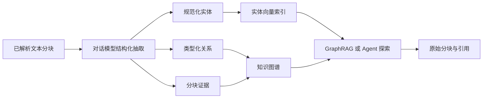

XpertAI 知识图谱将知识库中已经解析的分块转换为带来源证据的实体关系网络。GraphRAG 可以根据问题寻找语义相关实体，沿关系扩展，并召回支持这些实体与关系的原始知识分块。

它特别适合回答依赖“关系”而不只是孤立关键词的问题，例如：

- 哪个供应商提供某类泵站设备；
- 哪项政策适用于某个产品、地区或项目；
- 故障、设备、操作规程和纠正措施之间有什么联系；
- 哪些组织、合同和交付物在多个项目文档中共同出现。

<Info>
  知识图谱不替代原始资料检索。实体和关系用于定位更有价值的证据，最终回答仍应使用原始分块和引用。
</Info>

## 能力概览

| 能力             | 产品行为                                                             |
| ---------------- | -------------------------------------------------------------------- |
| 自动抽取         | 使用对话模型从文本分块中抽取实体、关系、置信度和支持引文。           |
| 证据追溯         | 将实体或关系连接到来源文档、分块、引文和置信度。                     |
| 增量索引         | 通过图谱索引作业处理新完成的文档，并刷新实体向量索引。               |
| 可视化图谱工作区 | 搜索和过滤实体/关系、聚焦节点、展开邻域并查看证据。                  |
| 人工治理         | 新建、编辑、隐藏和重新启用实体与关系，不需要修改原文档。             |
| 图谱检索         | 语义寻找种子实体、扩展邻域，并按图谱证据召回知识分块。               |
| 混合检索         | 合并向量分数与图谱分数、去重分块，并可继续使用已配置的 Rerank 模型。 |
| Agent 图谱探索   | Agent 可多次寻找实体、沿关系扩展、检查边界内证据，再检索带引用分块。 |
| 生命周期可观测   | 展示图谱版本、状态、数量、逐文档作业、处理进度和结构化错误。         |

## 图谱如何构建



图谱包含四类主要信息：

- **实体（Entity）**：可命名的业务对象，例如公司、设备、政策、项目、地点、产品或操作规程。实体可包含类型、别名、说明、置信度和被提及次数。
- **关系（Relationship）**：两个实体之间带方向和类型的连接，例如 `SUPPLIES`、`APPLIES_TO`、`PART_OF` 或 `REQUIRES`。
- **证据提及（Evidence mention）**：包含 `documentId`、`chunkId`、可选引文和置信度的来源记录，使图谱结果可以回溯到产生它的文档。
- **实体向量（Entity vector）**：由实体名称、类型、别名、说明或摘要形成的语义表示，用于根据自然语言问题寻找种子实体。

系统会在去重前规范化实体名称和类型。例如，大小写或多余空格不会让相同名称与类型产生多个节点。

### 来源与可见性

每个实体和关系都有来源和可见性：

| 值          | 含义                                               |
| ----------- | -------------------------------------------------- |
| `extracted` | 从文档分块中自动抽取。                             |
| `manual`    | 用户在图谱工作区中直接创建。                       |
| `curated`   | 被用户编辑或隐藏过的抽取项。                       |
| `active`    | 可用于常规图谱展示和检索。                         |
| `hidden`    | 保留治理记录和后续编辑能力，但不参与活动图谱检索。 |

隐藏一个实体时，与它连接的关系也会隐藏。当任一端实体仍处于隐藏状态时，对应关系不能重新启用。

## 启用条件

启用 GraphRAG 前，请确认：

1. 知识库使用平台管理的文档，而不是未开放图谱能力的外部知识库提供商。
2. 文档已经完成解析，并包含非空文本分块。
3. 知识库已配置有效的 Embedding 模型；图谱实体会基于该模型使用独立的实体向量集合。
4. 已为知识库配置用于结构化抽取的**对话模型**，或者可以回退到带可用对话模型的 Primary Copilot。
5. 后台 Worker 可以正常处理知识图谱索引作业。

扫描 PDF、复杂表格和版式密集型手册应先选择合适的文档转换器。图谱无法恢复解析阶段已经丢失的信息。参阅[PDF 处理与解析联动预览](/zh-Hans/ai/knowledge-base/pdf-processing-and-preview)。

## 启用并构建 GraphRAG

1. 打开知识库，进入**配置 > 检索设置**。
2. 开启 **GraphRAG**。
3. 选择默认检索模式，并配置“实体 Top K”“邻域跳数”和“图谱权重”。
4. 选择适合抽取任务的**对话模型**，保存知识库配置。
5. 首次启用 GraphRAG 后，状态会变为“**需要重建**”。点击“**重建图谱**”。
6. 等待所有图谱作业完成，状态变为“**已就绪**”。
7. 打开“**图谱**”页面，在正式使用前检查实体、关系和来源证据。

开启 GraphRAG 不会静默地把历史文档当成已经完成图谱索引。显式重建可以让图谱版本和文档覆盖情况保持可观察。

### 检索配置

| 配置        | 默认值                   | 作用                                                                         |
| ----------- | ------------------------ | ---------------------------------------------------------------------------- |
| 检索模式    | Vector                   | 选择 Vector、Graph 或 Hybrid 作为默认检索策略。                              |
| 实体 Top K  | 8                        | 图谱检索考虑的语义相关种子实体数量。较大值提高覆盖率，也可能引入弱相关主题。 |
| 邻域跳数    | 1                        | 从种子实体向外扩展的关系深度，当前支持一到两跳。                             |
| 图谱权重    | 0.35                     | Hybrid 模式合并向量和图谱结果时，图谱分数所占比例。                          |
| TopK        | 知识库召回配置           | 检索和排序后最多返回的原始分块数量。                                         |
| 相似度阈值  | 可选                     | 移除低于阈值的结果，应针对不同模式分别测试。                                 |
| Rerank 模型 | 可选                     | Vector 与 Graph 候选合并后，对 Hybrid 结果重新排序。                         |
| 对话模型    | 默认回退 Primary Copilot | 从分块中抽取结构化实体、关系和证据。                                         |

提高“实体 Top K”和“邻域跳数”都会扩大图谱候选范围。建议同时调整最终 TopK，使延迟和上下文大小保持可预测。

## 图谱状态与索引作业

| 状态     | 含义                                          | 建议操作                                                |
| -------- | --------------------------------------------- | ------------------------------------------------------- |
| 已禁用   | 知识库没有启用 GraphRAG。                     | 需要图谱能力时在检索设置中开启。                        |
| 需要重建 | GraphRAG 刚刚启用，或者当前图谱需要完整刷新。 | 点击“重建图谱”。                                        |
| 索引中   | 至少一个文档作业正在排队或运行。              | 观察进度，完成后再进行正式测试。                        |
| 已就绪   | 没有排队、运行中或失败的图谱作业。            | 可以测试并使用图谱。                                    |
| 失败     | 至少一个作业失败，并保留了最近错误。          | 检查失败文档/作业，修复模型或内容问题后重建或重新处理。 |

状态信息还包括图谱版本、实体/关系/证据数量、排队/运行/失败作业数和最近作业。文档管理页面也会显示逐文档的图谱索引进度。

### 增量更新与完整重建

- GraphRAG 开启后，新完成处理的文档会产生文档级图谱索引作业。
- 重新处理或移除文档时，系统会清理旧证据、刷新关系证据数，并删除已经没有来源和关系的自动抽取孤立实体。
- 完整重建会递增图谱版本，清理活动的自动抽取图数据，并重新抽取所有非文件夹文档。
- 人工创建和经过人工治理的实体/关系会在重建时保留；其旧抽取证据会清理，并根据当前文档重新计算。
- 图谱变化后会刷新实体向量。重建图谱不会重新生成文档分块的 Embedding。

## 使用图谱工作区

打开已启用 GraphRAG 的知识库“**图谱**”页面，可以使用：

- 按实体名称或类型搜索；
- 按实体类型、关系类型、来源和可见性过滤；
- 设置焦点实体、零到两跳的深度以及返回数量；
- 放大、缩小、适应画布、重置布局和居中选中项；
- 查看实体/关系数量、类型图例、实体列表和关系列表；
- 在检查器中查看说明、别名、关系端点、相关关系和来源证据；
- 新建和编辑实体与关系；
- 隐藏错误或已停用的图谱项，同时保留治理记录。

在实体上点击“**探索邻域**”，可以围绕该实体查看连接对象。证据卡片会在可用时展示来源文档和抽取引文。

### 人工维护实体与关系

对于不能完全依赖模型抽取的关键业务语义，可以进行人工治理：

- 添加缺失实体及其名称、类型、别名和说明；
- 修改抽取实体的名称或类型；
- 添加或修改有方向的关系及其权重；
- 隐藏错误实体或关系；
- 在确认抽取关系前检查对应证据。

编辑自动抽取项后，其来源会变为 `curated`，后续重建不会静默丢弃这次人工决策。

## 检索模式

### Vector

Vector 模式直接检索文档分块向量，适合通用语义问答、结构化 Knowledge Filters，以及精确的文件或 metadata 边界。GraphRAG 仍可同时用于可视化和 Agent 图谱探索，但最终召回保持 Vector。

### Graph

Graph 模式按以下步骤执行：

1. 在实体向量索引中语义查找种子实体。
2. 在有上限的候选范围内渐进扫描，只保留在当前 Knowledge Filter 有效范围内存在合格证据的活动实体。
3. 只扩展在同一范围内存在合格证据的活动关系，并受“邻域跳数”和图谱安全上限约束。
4. 将合格实体和关系的 mention 解析为同时满足同一文档/分块过滤表达式的启用分块。
5. 根据实体语义相关度和证据置信度计算图谱相关度，返回带匹配实体和关系信息的高分原始分块。

Graph 适合明确的关系型问题，但检索效果依赖图谱抽取覆盖率。

### Hybrid

Hybrid 同时执行 Vector 和 Graph 检索，按分块去重，并根据“图谱权重”合并两类分数。如果配置了 Rerank 模型，系统会在最终 TopK 之前对合并候选重新排序。

当问题同时依赖语义表达和实体关系时，可使用 Hybrid。建议从默认图谱权重 `0.35` 开始，在召回测试中对比代表性问题。

### Graph 与 Hybrid 中的 Knowledge Filters

Knowledge Filter V2 同时支持 Vector、Graph 和 Hybrid。最终有效边界始终是租户、组织、知识库、内容启用状态、固定条件、调用方条件和合法 Agent 动态条件通过 `AND` 合并后的结果。

- **Graph** 在种子实体资格、关系扩展和最终证据分块三个阶段应用同一边界。
- **Hybrid** 在去重和分数融合之前，分别约束 Vector 与 Graph 两个分支。
- 固定变量缺失或类型错误时，会在图谱种子检索之前失败关闭，绝不忽略固定条件。
- Agent 动态条件非法时整组舍弃，Graph 或 Hybrid 使用固定条件与调用方条件继续检索，并记录 `invalid_dynamic_filter`。
- 合法动态条件零命中时不会自动放宽，由 Agent 决定是否不带动态条件再次调用。
- Graph 分支错误时，Graph 模式明确失败；Hybrid 只能回退到已经过滤的 Vector 分支，并记录图谱回退原因。

图谱路径通过参数化 PostgreSQL 在 mention、文档和分块之间联接过滤。混合文档/分块字段的 `AND` 或 `OR` 会针对同一条证据记录计算，禁用文档或分块也不能通过关系扩展重新进入结果。

## 让 Agent 自主探索图谱

知识库节点连接到 Agent 且知识库启用 GraphRAG 后，XpertAI 会在 Retriever 旁注册一个只读的图谱探索工具。它采用简单的动作式接口：

| 动作        | 输入                            | 返回                                                     |
| ----------- | ------------------------------- | -------------------------------------------------------- |
| `search`    | 自然语言问题或概念              | 按相关度排序的种子实体、实体 ID 和当前范围内的证据样本。 |
| `neighbors` | 实体 ID、可选原问题、深度和数量 | 范围内的相邻实体、有证据的关系和下一步检索提示。         |
| `evidence`  | 实体 ID 和可选原问题            | 来源文档/分块、引文和建议检索词。                        |

推荐调用闭环为：

```text
search → neighbors → evidence → 必要时继续探索
                                ↓
                    使用 suggestedRetrievalQuery 调用 Retriever
                                ↓
                         带引用原始分块与回答
```

Agent 不需要猜测实体 ID，每个 ID 都由上一步工具调用返回。名称或关系仍不清楚时可以继续探索，找到最有用的术语后再调用 Retriever。

图谱探索和[实时过滤选项查询](/zh-Hans/ai/knowledge-base/intelligent-filtering#让-agent-查询实时过滤选项)可以配合使用：

- 使用过滤选项工具发现当前目录、文件类型、年份、状态和 metadata 值；
- 使用图谱探索工具发现文档内容中的实体、别名、关系和证据；
- 将两类结果组合成最终 Retriever 的检索词和可选动态条件；绑定可以使用 Vector、Graph 或 Hybrid。

### 边界保护

Agent 图谱探索会先应用租户、组织、知识库、启用状态和管理员固定条件边界，再返回证据。实体或关系只有在当前范围内存在合格分块证据时才会返回。

固定条件生效时，系统不会暴露可能由范围外文档聚合得到的全局实体说明、摘要、别名和统计数。固定变量缺失时，会在图谱探索开始前失败关闭。开启 Agent 自动过滤后，图谱探索工具也可增加只包含 literal 的动态条件；非法动态条件会回退到固定边界并记录原因。图谱引文只作为探索线索；Agent 会继续使用 Retriever 获取最终分块和引用。

## 测试 GraphRAG

在“**召回测试**”中，可以对同一个问题切换 Vector、Graph 和 Hybrid。建议测试集至少包含：

1. 直接实体问题，例如“GOODSPRINGS 是什么”；
2. 关系问题，例如“哪个供应商提供泵站设备”；
3. 需要两个相关概念的多跳问题；
4. 来源文档中不存在对应实体的负例；
5. 关键词相似但关系不同的文档；
6. 用于比较 Vector、Graph 和 Hybrid 排序的问题。

检查命中分块、图谱分数、匹配实体、匹配关系、引用和耗时。过滤诊断还会展示全局实体候选数、扫描轮次与上限、合格种子实体/关系/mention、候选分块、分支命中数、图谱各阶段耗时、是否截断以及 Hybrid 图谱回退原因。提高“实体 Top K”或“邻域跳数”之前，也应先在图谱工作区确认图数据是否正确。参阅[召回测试](/zh-Hans/ai/knowledge-base/recall-test)。

## 安全与治理

- 知识库权限以及租户/组织边界继续生效。
- 只有活动实体和关系参与常规 GraphRAG 检索。
- 证据保留图谱结论到原始文档和分块的连接。
- 隐藏操作保留人工治理记录，并阻止该项在重建时被静默恢复为活动抽取项。
- Agent 图谱探索不会向 Agent 暴露管理员固定条件表达式。
- 普通最终回答默认展示来源引用，不展示内部图谱决策过程。

## 限制与最佳实践

- 图谱抽取具有概率性。涉及报价、合规、安全或合同决策的关键实体和关系，应先人工检查。
- 调整图谱参数前先改善文档解析质量；空分块或错误分块无法产生可靠实体和证据。
- 使用稳定、明确的实体类型和关系名称。拼写变体优先通过别名合并，不要创建重复节点。
- 默认使用一跳邻域；只有代表性测试证明两跳能带来有效证据时再增加。
- 使用人工或 `curated` 图谱项维护长期业务语义，但最终回答仍以文档证据为准。
- 首次启用、抽取模型发生重大变化，或发现来源覆盖不一致时执行完整重建。
- 监控失败作业、图谱零命中、重复实体、弱证据引文和 Hybrid 延迟。
- 实体向量仍属于知识库级全局索引。带过滤的 Graph 会在硬上限内渐进扫描全局候选，再按有效证据做范围门控。返回的实体、关系和分块不会越界，但排在扫描上限之外的范围内种子实体可能漏召回。诊断中会标记截断；出现此问题时可谨慎提高“实体 Top K”或使用 Hybrid。
- 当最佳实体名称或关系尚不明确时，可将图谱探索工具作为受边界约束的 Agent 检索规划步骤。

接下来可阅读[智能过滤检索](/zh-Hans/ai/knowledge-base/intelligent-filtering)、[召回测试](/zh-Hans/ai/knowledge-base/recall-test)和[知识库 Workbench](/zh-Hans/ai/knowledge-base/knowledge-workbench)。
