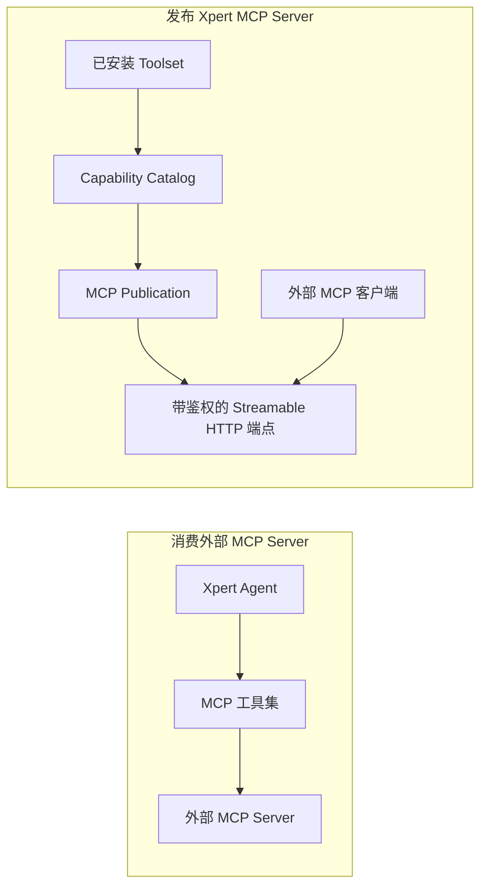

**Xpert MCP Server** 将已经安装到 Xpert 的能力，通过平台托管、受鉴权的 Streamable HTTP 端点发布给外部 MCP 客户端。客户端以配置好的身份和组织上下文连接 Xpert，并在服务策略与审计约束下调用选定能力。

产品界面把它称为 **MCP 服务**，平台内部的受管配置对象叫 **MCP Publication**。这两个名称指向同一个可对外连接的服务，并不代表额外启动了一个 stdio 进程。

## 先确认 MCP 的连接方向

| 需求                                       | 应使用的能力                                             |
| ------------------------------------------ | -------------------------------------------------------- |
| 让 Xpert Agent 调用外部 MCP Server         | [MCP 工具集](../../agent/toolset/mcp-tools/mcp-tools)    |
| 让外部 MCP 客户端调用 Xpert 治理的能力     | Xpert MCP Server                                         |
| 将插件业务方法通过 Xpert 宿主发布          | [插件原生 MCP 工具](../../plugin/host-native-mcp-tools)  |
| 为宿主原生业务 Tool 增加交互式 App         | [插件原生 MCP 工具与 Apps](../../plugin/host-native-mcp-tools) |
| 交付可移植的子进程 Server                 | [插件托管的 MCP Server](../../plugin/mcp-tools-and-apps) |

关键区别是谁充当客户端：



## MCP 服务管理了什么

一个 MCP 服务由多个独立受管对象组合而成：

- **Toolset**：提供真实可执行能力的已安装资源；
- **Capability catalog**：从 Toolset 发现的当前协议描述；
- **Publication**：服务名称、稳定 slug、状态、鉴权方式和服务级 instructions；
- **组织访问授权**：当 tenant/system 插件拥有租户级 Publication 时，允许某个组织使用该服务的 admission grant；
- **Capability bindings**：Publication 暴露的能力、public name、启用状态和策略；
- **Credential**：API Key，或平台支持时配置的 OAuth 2.0/OIDC 策略；
- **协议端点**：通过 Streamable HTTP 提供的 `POST /api/mcp/p/<service-slug>`；
- **审计记录**：调用主体、能力、request/trace ID、结果、耗时和参数结构摘要。

各层生命周期互相独立。安装 Toolset 不等于将其发布，创建 Publication 不等于启用服务，持有凭证也不能绕过组织成员关系、scope 或能力策略。

## 创建 MCP 服务

产品中有两条创建路径。

### 启用插件提供的 MCP Server

插件可以用 `@XpertToolProvider()` 和 `@XpertTool()` 声明业务方法。Xpert 在运行时发现 Provider，并在插件详情 dialog 中展示它。

1. 打开 **插件**。
2. 在已安装插件上选择 **初始化**。
3. 在 dialog 的 **MCP** 区域，为目标 Provider 选择 **启用 MCP Server**。
4. 使用当前管理员、当前组织受保护的 Token 展示/复制操作。
5. 在同一区域复制端点或客户端配置。

该操作仅超级管理员可执行，并且始终控制当前组织的访问。启用时，平台会创建或复用 Provider 归属作用域的 Toolset、刷新能力目录、创建或认领宿主派生的 Publication、绑定 MCP Tools 与 Apps、按需创建合适的 API Key，并启用所需服务或组织 admission。受管客户端 Key 需要 `tools:list` 和 `tools:call`；发布 App 的 Provider 还需要 `resources:list` 和 `resources:read`。

Publication 的归属跟随插件级别。`organization` 插件在每个组织拥有独立 Publication；`system` 或 `tenant` 插件的每个 Provider 拥有一个租户级 Publication，并为每个组织维护独立 access grant 和绑定该组织的 API Key。组织 A 启用后不会让组织 B 自动可用，B 必须独立启用。如果 A 与 B 都启用了同一个租户级 Provider，它们可能使用同一个端点，但凭证、principal 和业务数据作用域仍然隔离。租户级 Publication 的 catalog、binding 与能力策略由这些组织共享，而 Key scope 可以对单个凭证施加更严格限制。

一个插件可以暴露多个装饰器 Provider。每个 Provider 在插件详情中显示为独立 MCP 卡片，并成为拥有独立 Tool 列表、状态、端点身份和配置的受管服务。

### 手动创建自定义 MCP 服务

超级管理员可以从当前租户或组织范围内已安装的能力，自行组合一个 Publication：

1. 打开 **MCP 管理**，进入 **MCP 服务**。
2. 选择 **创建服务**，填写名称、稳定的端点 slug 和可选 instructions。
3. 打开 **能力**，按需刷新 capability catalog，并从可用 Toolset 中选择能力。
4. 为每个能力设置唯一 public name 和调用策略。
5. 配置 API Key，或配置当前部署可用的 OAuth 鉴权。
6. 运行就绪测试，然后启用服务。

只有未绑定工作空间的组织级或租户级 Toolset 可以被发布。Publication 至少要有一个已启用能力，并且能力审查状态为最新，才能进入 active 状态。

## 插件服务出现在哪里

首次启用之前，运行时发现的 Provider 显示在已安装插件的详情 dialog 中。Provider 第一次物化 Publication 后，对应服务也会出现在 **MCP 管理 → MCP 服务**，与手动创建的服务并列。选择服务卡片后，可以管理 Publication 的能力、鉴权、策略、instructions、审计和测试。

服务列表中的每张卡片对应一个 Publication，并展示状态、能力与凭证数量、OAuth 状态，以及最近调用/错误信息；已启用服务使用成功状态样式。因此，一个多 Provider 插件在相应 Provider 启用后会显示为多张服务卡片。

不要在 **运行实例** 中查找宿主原生 Provider。该 tab 用于插件托管的 stdio Server 等子进程 runtime；宿主原生服务由 Xpert API 进程执行。

## 能力与 public name

一个 Publication 可以组合多个 Toolset 的能力：

| 能力类型          | 协议操作                                                              |
| ----------------- | --------------------------------------------------------------------- |
| Tool              | `tools/list`、`tools/call`                                            |
| Resource          | `resources/list`、`resources/read`                                    |
| Resource template | `resources/templates/list`、`resources/read`；声明后可支持 completion |
| Prompt            | `prompts/list`、`prompts/get`；声明后可支持 completion                |
| MCP App           | 受保护的 HTML MCP Resource，可供 Tool 引用                            |

### MCP App 是资源，不是额外的 Tool

App 为已有 Tool 的结果增加界面。Tool 仍在 `tools/list` 中，通过 `_meta.ui.resourceUri` 声明关联；App 则出现在 `resources/list` 中，`resources/read` 返回 `text/html;profile=mcp-app`。客户端加载界面，再通过 MCP Apps bridge 传递原有 Tool 的 `structuredContent`，不需要第二个 Tool 或 Server。

例如一个 Provider 包含 **5 个 Tool 和 2 个 App**，就是 **7 项能力**。应用页显示 5 个工具、MCP 管理页显示 7 项能力并不矛盾。应检查类型、绑定和协议元数据，不要期待两个 App 名称出现在 `tools/list` 中；协议列表还可能按当前凭证过滤。不支持 MCP Apps 渲染的客户端仍能调用原有 Tool，使用其文本/DTO 结果。

**capability key** 是 Toolset 内部的稳定身份；**public name** 是客户端实际看到的名称。修改 public name 可能破坏客户端提示词或自动化，因此 public name 与服务 slug 都应被视为稳定 API 契约。

每次请求还会动态过滤能力。客户端只能看到其 scope、binding 策略、声明可见性和端点可提供上下文共同允许的能力。租户级或组织级 Publication 无法提供 workspace、project、conversation、Agent、store 或 checkpoint 上下文，因此要求这些上下文的能力不会出现在列表中。

## 鉴权与组织隔离

每个协议请求都必须携带 HTTP Bearer 凭证。

### API Key

API Key secret 以 `xpert_mcp_` 开头。普通 Publication Key 只保存 hash，在创建或轮换时展示 secret；插件受管客户端凭证还会加密保存 secret，支持当前管理员在当前组织内显式重复展示/复制。列表和 connection-info 响应不会返回该 secret。凭证应保存在客户端环境变量或安全密钥存储中，不能进入 App HTML。

Key 可绑定到用户或服务账号，可设置过期时间，并可授予粗粒度或能力级 scope。管理界面支持以下常用 scope：

- `tools:list` 与 `tools:call`
- `resources:list` 与 `resources:read`
- `prompts:list` 与 `prompts:get`

新增 App 不会扩大既有 tools-only Key 的权限。如果 Tool 调用成功但 App 读取失败，请通过 Provider 已授权的 Token 操作取得有 Resource 权限的受管凭证，或在 MCP 管理中创建/轮换合适的 Key，并更新客户端。复用 Key 要匹配请求的 scope；能力同步不会静默吊销旧 Key 或无关 Key。

运行时也接受 `*`，或 `tools:call:orders_update` 这类绑定到具体 public capability 的 scope。吊销或轮换 Key 会立即使原有访问失效。

对于用户身份 Key，Xpert 会在请求时重新检查用户是否仍存在、是否仍是凭证所属组织的有效成员。某个 Publication access grant 或组织创建的凭证不能跨组织调用，包括多个组织共享租户级端点的情况。

### OAuth 2.0 / OIDC

当部署的 Xpert 版本支持 MCP OAuth 时，Publication 可以按 issuer 和 audience 校验 JWT access token、要求指定 scope、把 token claim 映射到现有 Xpert 用户，并可选启用 token introspection。端点会为兼容客户端发布 protected-resource metadata。

OAuth 必须显式配置并启用，Publication 才能使用。建议在激活服务前运行内置 discovery 测试。该能力是否可用取决于平台版本和部署配置。

## 能力策略

每个已发布能力都可以设置 approval mode、超时和限流。Tool Provider 声明的行为决定安全默认值：

| Tool 风险   | 默认 approval mode | 运行时行为                           |
| ----------- | ------------------ | ------------------------------------ |
| `read`      | `allow`            | 通过鉴权、scope 和策略检查后可以执行 |
| `write`     | `confirm`          | 执行前请求交互式批准                 |
| `dangerous` | `deny`             | 默认不对普通调用暴露                 |

管理员可以进一步收紧默认策略。危险 Tool 不能改成无条件 `allow`。`confirm` 使用 MCP elicitation，因此客户端必须能返回服务请求的批准输入；不支持该交互的客户端无法完成调用。

平台会应用服务级请求限流，也可以为单个能力设置更严格的请求数/时间窗口策略。能力超时会触发传递给 Tool runtime 的取消信号。

## 能力刷新与审查

Publication binding 会保存每个能力 descriptor 的快照和 hash，使 schema、行为、上下文及 Provider 变化可以被审查，而不是静默修改对外 API。

- 兼容的 descriptor 更新会自动刷新快照；
- Toolset 缺失、能力缺失或 descriptor 发生破坏性变更时，Publication 会标记为 **需要审查**；
- 不兼容的能力在完成审查前不会进入运行时；
- 需要审查的 Publication 不能重新启用，必须先解决 binding 问题。

对于已经启用、由插件自动管理的 Publication，插件刷新会原子同步新增、删除和变化的 Tool 与 App。capability type 与 key 相同的条目会保留 public name、启用状态和管理员策略覆盖；新增条目会绑定并启用。同步失败时保留最后一套有效 catalog 与 binding。

实际更新 Tool 定义或 App bundle 时：

1. 重新构建并验证插件与 App 资源，再部署/刷新插件。只修改源码不会更新已安装的运行时副本。
2. 部署返回 `restartRequired` 时重启 API。Provider 注册和应用 bootstrap 会协调已启用的自动管理 Publication；遇到旧配置应检查同步错误，不要重建已有服务。
3. 手动组合的 Publication：进入 **能力 → 刷新可用能力**，选中需要的 Tool/App，再点击 **保存**。刷新只发现可用目录，保存才更新发布绑定；这也是确认运行时定义已更新后的手动恢复路径。
4. 重连或刷新客户端，验证 `tools/list`、Tool 的 App URI、`resources/list/read` 与凭证 scope。列表/读取成功是协议证据，界面渲染还需在支持 MCP Apps 的客户端中验证。

## 服务生命周期

| 状态       | 含义                                     |
| ---------- | ---------------------------------------- |
| `draft`    | 可继续配置，但外部客户端不能调用         |
| `active`   | 端点接受通过鉴权的 MCP 请求              |
| `disabled` | 关闭协议访问，但保留配置、Key 和审计历史 |

对于组织级 Publication，停用插件 MCP Server 会停用该 Publication。对于租户级 Publication，从某个组织停用只会关闭该组织的 access grant，共享 Publication 仍可继续服务其他已授权组织。现有组织 Key 会保留以供之后重新启用，但在 grant 关闭期间不能调用。显式禁用或卸载插件会停用其自动管理 Publication；普通插件版本刷新会保留期望状态并同步能力。

## 连接 MCP 客户端

服务详情会展示精确端点和客户端无关的连接信息。常见 JSON 客户端配置如下：

```json
{
  "mcpServers": {
    "xpert-business-tools": {
      "type": "streamableHttp",
      "url": "https://<xpert-host>/api/mcp/p/<service-slug>",
      "headers": {
        "Authorization": "Bearer ${XPERT_MCP_API_KEY}"
      }
    }
  }
}
```

将 `XPERT_MCP_API_KEY` 放入客户端环境变量或安全密钥存储。不同客户端的环境变量插值语法可能不同，请按所用客户端格式调整，不要把真实 secret 写入源代码、共享文档或聊天记录。

当前服务声明的 MCP 协议版本为 `2026-07-28`。最小连接验收应依次完成：

1. `initialize`
2. 对应的列表操作，例如 `tools/list`
3. 一次只读调用，例如 `tools/call`

Provider 声明的 Tool 还可以选择支持异步 MCP Task。兼容客户端可创建任务，通过 `tasks/get`、`tasks/update` 和 `tasks/cancel` 查询、补充输入或取消，并监听任务或能力目录变化事件。只有能力与客户端都声明支持时，这些扩展才会出现。

## Instructions、结果与审计

服务 instructions 按以下优先级组合：平台安全 instructions、管理员配置的 Publication instructions、低优先级 Provider guidance。Provider 文本不能覆盖平台或管理员策略。

Tool 可以同时返回简短文本 `content` 和类型化 `structuredContent`。客户端应在存在时优先使用 `structuredContent`，并把文本作为兼容性降级内容。

每次能力调用都会创建审计记录，包括 Publication、能力、已鉴权主体、客户端或 Key prefix、request ID、trace ID、状态与耗时。参数只按字段结构和字节数记录摘要，不保存完整业务值。可在 **审计** 区域排查成功、失败、拒绝和延迟问题，同时避免泄露完整业务载荷。

## 故障排查

| 现象                        | 检查项                                                                               |
| --------------------------- | ------------------------------------------------------------------------------------ |
| 端点返回未找到              | 检查 slug 是否正确、Publication 是否为 `active`                                      |
| `401 Unauthorized`          | 检查 Bearer header、过期时间、吊销状态和已配置鉴权方式                               |
| `403 Forbidden`             | 检查组织成员关系、凭证 scope 和能力 approval policy                                  |
| `429 Too Many Requests`     | 等待限流窗口结束，或检查能力策略                                                     |
| 列表中缺少某个能力          | 检查 binding 启用状态、public name 冲突、scope、required context、风险策略和审查状态 |
| 新增 App 后 Tool 数量没增加 | 若业务 Tool 没变，这是正常现象；检查 `resources/list` 的 App 与原 Tool 的 `_meta.ui.resourceUri` |
| Tool 可调用但 App 读取失败  | 检查 App 绑定/审查状态、`resources:list` / `resources:read` scope 和已部署的 HTML bundle |
| 目录有新条目但服务未发布    | 手动 Publication 需选中并保存；只刷新目录不等于建立发布绑定 |
| MCP 服务中缺少插件 Provider | 先在已安装插件详情中启用一次，确认当前组织 access 状态，再刷新 MCP 管理              |
| 写调用要求补充输入          | 在支持 MCP elicitation 的客户端中批准；不支持时应保持该 Tool 不可用                  |
| 就绪测试失败                | 刷新 catalog、解决需要审查的 binding、配置鉴权，并至少选择一个能力                   |

**MCP 管理**中的 **运行实例** tab 用于监控插件托管的 stdio Server 等子进程 runtime。宿主原生 MCP Publication 是 Xpert API 内的逻辑 HTTP 服务，没有需要单独启动或停止的进程。

## 相关文档

- [插件原生 MCP 工具](../../plugin/host-native-mcp-tools)
- [MCP Tools 和 MCP Apps](../../plugin/mcp-tools-and-apps)
- [Agent MCP 工具集](../../agent/toolset/mcp-tools/mcp-tools)
