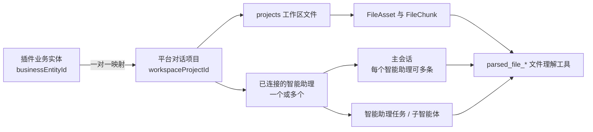

智能助理工作区目录（Assistant Workspace Catalog）决定一次智能助理运行“正在使用哪一组文件”。插件如果只保存业务记录，却没有把会话、文件和智能体运行绑定到同一个工作区作用域，主智能体、子智能体或其他协作智能助理就可能看到不同的文件集合。

本文是工作区目录的产品设计总览。当前完整说明 `projects` 目录；后续其他目录的产品语义、生命周期和权限边界也在本文中继续补充。

## 工作区目录索引

| 目录 | 当前定位 | 详细说明状态 |
| --- | --- | --- |
| `projects` | 一个平台项目一套独立文件空间，可连接一个或多个智能助理，并容纳多条项目会话 | 本文已定义 |
| `xperts` | 以智能助理/Xpert 为范围的共享文件空间，是没有项目上下文时的兼容行为 | 待补充完整产品说明 |
| `users` | 用户范围的文件空间 | 待补充 |
| `knowledges` | 知识库范围的文件空间 | 待补充 |
| `skills` | 技能范围的文件空间 | 待补充 |

<Note>
目录名称只是存储作用域的类型，不是业务实体类型。插件中的“项目”“案件”“尽调任务”或“客户交付”都可以按本页模式绑定到 `projects` 目录。
</Note>

## 什么时候使用 `projects`

当一个插件业务实体同时满足以下特征时，应优先使用 `projects`：

- 该实体拥有独立的一组输入文件、解析结果和导出文件；
- 主智能体与多个子智能体需要读取同一组文件；
- 多个显式连接到同一平台项目的智能助理需要共享这些文件；
- 同一实体可以拥有多条会话，但不同实体之间必须隔离；
- 用户需要在平台项目列表中看到、进入、归档和恢复这个空间；
- 插件希望智能体的文件理解工具默认搜索当前实体的全部项目文件。

如果文件天然属于整个智能助理，并且不同业务实例之间允许共享，才考虑 `xperts` 范围。不要为了省去平台项目创建与同步而把本应隔离的数据放进智能助理公共文件夹。

## 两层文件共享模型

`projects` 目录支持两层共享，但不会把所有智能助理状态混在一起：

| 层级 | 通过平台项目共享 | 仍然隔离 |
| --- | --- | --- |
| 单个智能助理内部 | 主智能体、工作流协调智能体、专业子智能体、重试任务和沙箱运行读取相同项目文件 | 各智能体的能力和角色边界仍然有效 |
| 多个已连接智能助理之间 | 工作区文件、`FileAsset` 文件资产、`FileChunk` 文件分块、文件搜索、预览和导出文件 | 会话历史、提示词、工具、记忆和智能助理专属配置 |

共享平台项目不等于共享会话或共享能力图。会话仍然按 `xpertId + projectId` 隔离；两个智能助理可以读取同一个项目文件，同时保留各自的会话历史和最小权限工具集。

## 产品对象与身份模型

插件业务实体和平台对话项目（Chat Project）是两个对象。二者一对一映射，但必须使用两个独立标识符：

| 对象 | 身份 | 负责内容 |
| --- | --- | --- |
| 插件业务实体 | `businessEntityId` | 业务状态、流程版本、审核、领域权限和审计 |
| 平台对话项目 | `workspaceProjectId` | 工作区文件作用域、智能助理连接、项目会话和平台可见性 |

业务接口、页面选择和领域数据关联继续使用 `businessEntityId`；工作区文件、文件资产、会话和智能体运行使用 `workspaceProjectId`。不要让一个字段在不同接口中交替表达这两个概念。



推荐在业务实体中保存：

```ts
type WorkspaceSyncStatus = 'provisioning' | 'ready' | 'failed'

type PluginBusinessEntity = {
  id: string
  workspaceProjectId: string
  workspaceSyncStatus: WorkspaceSyncStatus
  workspaceSyncError: string | null
}
```

`workspaceProjectId` 应有租户范围内的唯一约束。数据传输对象（DTO）可以向前端返回它用于导航，但所有业务修改接口仍然提交业务实体标识符。

## 创建与同步生命周期

创建业务实体时，应先生成两个不同且稳定的 UUID，并先保存映射，再幂等创建平台项目：

1. 生成 `businessEntityId` 和 `workspaceProjectId`。
2. 保存业务实体，状态为 `provisioning`。
3. 调用 `platform.project.provisioning.ensure(...)`。
4. 平台以调用方提供的 `workspaceProjectId` 创建或校正平台项目，并连接预期的智能助理。
5. 所有必要连接成功后置为 `ready`；失败后置为 `failed` 并保存可展示的错误。
6. 只有 `ready` 状态允许上传文件或启动依赖文件的工作流。

平台项目创建在智能助理所属工作区中，并使用当前经过授权的创建用户作为产品所有者；插件不能通过智能体参数替换该用户上下文。

`ensure` 接收期望状态，因此同一个标识符的创建重试不会产生重复项目：

```ts
const projects = runtimeCapabilities.require(ProjectProvisioningRuntimeCapability)

for (const assistantId of connectedAssistantIds) {
  await projects.ensure({
    projectId: entity.workspaceProjectId,
    workspaceId,
    xpertId: assistantId,
    name: entity.name,
    status: entity.archivedAt ? 'archived' : 'active'
  })
}
```

每个待连接的智能助理都必须属于所请求的工作区。`ensure` 会保留既有智能助理连接并追加当前 `xpertId`，它不是完整连接集合的替换操作。若产品支持移除智能助理，应使用独立的授权项目成员操作。

业务实体是名称和归档状态的来源。改名、归档和恢复后再次执行 `ensure`；同步失败不回滚已经确认的业务操作，而是保留 `failed` 状态并提供显式重试。

删除需要单独定义产品策略。归档并不等于删除文件；如果支持永久删除，插件必须先说明业务数据、工作区文件、文件资产、会话和审计记录各自的保留规则。

## 文件目录与可移植引用

插件在平台项目内使用自己的稳定目录命名空间：

```text
files/<plugin-key>/
├── sources/<source-id>/...
├── generated/...
├── previews/...
└── exports/...
```

源文件和导出文件都写入同一个 `projects` 作用域。插件数据库只保存工作区文件可移植引用和必要的业务元数据，不保存宿主绝对路径、`/workspace/...` 沙箱路径、原始 `Buffer` 或 Base64 内容。

```ts
const uploaded = await workspaceFiles.uploadBuffer({
  catalog: 'projects',
  scopeId: entity.workspaceProjectId,
  projectId: entity.workspaceProjectId,
  buffer,
  originalName,
  mimeType,
  folder: `files/${pluginKey}/sources/${sourceId}`
})
```

可移植引用至少标识来源、工作区目录、项目作用域和相对文件路径：

```ts
{
  source: 'platform.workspace.files',
  catalog: 'projects',
  scopeId: workspaceProjectId,
  projectId: workspaceProjectId,
  filePath: uploaded.filePath,
  workspacePath: uploaded.workspacePath,
  originalName,
  mimeType,
  size
}
```

下载、预览、后台任务和重试都从该引用解析文件。签名链接是短期访问凭证，不得作为业务数据长期保存。

## 文件解析与智能体文件理解

上传完成后，插件应等待 `understandFile(...)` 返回 `FileAsset` 文件资产，再保存源文件版本。平台解析仍可异步运行，例如使用 `runInline: false`；这里要求等待的是“文件资产已创建并返回”，而不是在调用后不等待结果。

```ts
const understood = await workspaceFiles.understandFile({
  ...portableReference,
  purpose: 'workspace',
  parseMode: 'deep',
  runInline: false
})

await sourceVersionRepository.save({
  fileReference: portableReference,
  fileAssetId: understood.fileAssetId
})
```

插件可以保留自己的领域解析器，用于生成结构化要求、证据、表格或业务版本；平台文件理解负责通用全文搜索、分块读取和预览。二者职责不同，不应为领域证据再复制一套相同原文的向量索引。需要建立领域证据时，可引用现有的文件资产与文件分块，并通过工作区文件能力检索或校验这些分块。

## 会话与智能体运行绑定

智能助理应声明项目工作区策略：

```yaml
team:
  options:
    workspaceScope:
      mode: project-required
```

`project-required` 表示没有可信 `projectId` 时拒绝启动需要文件的运行，不回退到 `xperts`。`project-preferred` 仅用于确实允许兼容回退的智能助理。声明策略本身不会授予项目访问权；智能助理还必须显式连接到该平台项目。

以下所有执行入口必须传入同一个 `workspaceProjectId`：

- 每个已连接智能助理的新建或恢复主会话；
- 插件启动的智能助理任务；
- 工作流中的专业子智能体；
- 跨智能助理交接、重试和手工重跑；
- 沙箱和运行时工作区文件操作。

创建会话时立即持久化 `projectId`。创建后不得把同一会话改绑到另一个平台项目；路由、请求和会话的平台项目不一致时应拒绝执行。

跨智能助理交接时，应为目标 `xpertId + projectId` 新建或选择会话，不能复用来源智能助理的会话。目标智能助理通过同一个可信 `workspaceProjectId` 读取共享文件，同时保留自己的会话与执行历史。

在平台项目模式下，文件理解工具的可见集合为：

1. 当前平台项目的全部文件资产；
2. 当前会话的显式附件；
3. 两者去重后的结果。

`parsed_file_list`、`parsed_file_search`、`parsed_file_search_all`、`parsed_file_read` 和预览必须使用同一集合。模型不能自行指定另一个平台项目；跨项目文件资产标识符应返回统一的无权限或不可见结果，不能泄露该文件是否存在。

## 工作台导航与会话恢复

插件页面进入一个已就绪的业务实体后，应请求宿主打开当前智能助理对应的平台项目：

```ts
await invokeClientCommand('workbench.navigation.open', {
  target: 'assistant.project',
  projectId: entity.workspaceProjectId
})
```

宿主负责进入平台项目路由、按 `xpertId + projectId` 过滤会话，并恢复最近一条主会话；没有历史时创建新会话。插件不要自行拼接宿主路由地址，也不要把业务实体标识符误当成路由中的平台项目标识符。

一个平台项目可以连接多个智能助理，每个智能助理也可以拥有多条主会话。会话历史、最近会话和新会话必须按智能助理与平台项目的联合边界过滤，不能因为共享文件而合并会话。

## 权限与信任边界

- 工作区目录、租户、组织、用户、平台项目和智能助理身份必须来自可信运行时或服务端业务映射，不得由模型自由填写。
- 智能体可见工具参数中不要暴露 `tenantId`、`catalog`、`scopeId`、`projectId` 或 `xpertId`。
- 每次读、写、解析、搜索、预览和下载都重新校验插件领域权限、用户项目成员身份和当前智能助理与项目的显式连接。
- 平台项目权限不替代插件领域权限；插件仍需验证当前用户能否访问对应业务实体。
- 业务 `scopeKey` 仍按智能助理/Xpert 隔离。运行时项目标识符只决定工作区作用域，不应改变插件业务数据的智能助理隔离键。
- 不要在错误消息中区分“其他平台项目中存在”与“完全不存在”。

## 失败状态与用户体验

| 状态 | 页面行为 | 可恢复动作 |
| --- | --- | --- |
| `provisioning` | 显示正在准备项目空间；禁用上传和工作流 | 等待或刷新状态 |
| `ready` | 允许文件、会话和智能体运行 | 正常操作 |
| `failed` | 显示简明原因；继续保留业务实体 | 重试平台项目同步 |

平台项目同步成功但文件理解尚未完成时，应分别展示文件解析状态，不要把它误报为平台项目创建与同步失败。

## 上线与迁移

不要把已有 `xperts` 引用静默解释为平台项目引用，也不要在平台项目同步失败时回退到智能助理公共文件夹。上线时应显式选择一种策略：执行可审计的文件与记录迁移、保留旧记录只读，或者仅允许新建业务实体使用项目空间。无论选择哪一种，都要让用户能够识别旧数据的作用域，并验证跨项目不会发生文件泄露。

## 验收清单

- 一个业务实体只对应一个稳定的 `workspaceProjectId`，重试不创建重复平台项目。
- 平台项目列表中可见该项目，并连接所有预期智能助理。
- 两个已连接智能助理无需复制文件即可搜索、读取和预览同一文件资产。
- 未连接的智能助理即使获得项目或文件资产标识符也不能访问文件。
- 已连接智能助理共享项目文件，但分别保留 `xpertId + projectId` 会话历史。
- 业务改名、归档和恢复能同步到平台项目。
- 上传文件、可移植引用、文件资产和导出文件都属于映射的平台项目。
- 主智能体、解读智能体、规划智能体和编写智能体能搜索同一项目文件。
- 另一个平台项目的文件资产标识符不可读取，也不泄露存在性。
- 会话的平台项目绑定不可变。
- `project-required` 智能助理在无平台项目时拒绝依赖文件的运行。
- 不使用平台项目的智能助理仍保持原有会话或 `xperts` 行为。

## 后续目录说明模板

未来在本文增加其他工作区目录时，每一节至少回答以下问题：

1. **作用域身份**：目录由哪个稳定标识符定位？是否还需要 `scopeId`？
2. **所有权**：归用户、智能助理、组织、知识库还是其他产品对象所有？
3. **生命周期**：创建、改名、归档、恢复和删除由谁驱动？
4. **共享模型**：哪些会话、智能体、智能助理、用户或插件可以看见同一文件集合？
5. **运行时选择**：如何从可信上下文选中该目录？缺失时是否允许回退？
6. **文件理解**：文件资产的可见集合、附件合并和去重规则是什么？
7. **权限边界**：租户、组织、用户和领域权限如何共同校验？
8. **路径约定**：插件如何分配目录，哪些引用可以持久化？
9. **保留与迁移**：旧目录文件如何迁移，删除和合规策略是什么？
10. **验收矩阵**：同范围共享、跨范围隔离、重试幂等和回归行为如何验证？

