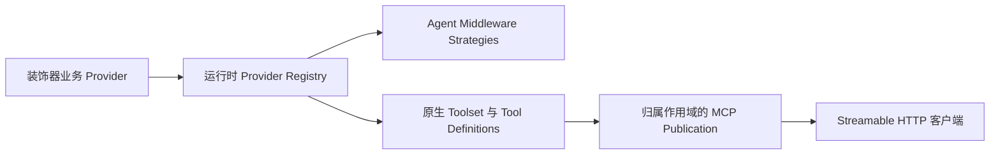

插件原生 MCP 工具让插件只实现一次业务方法，再由 Xpert 自动适配为 Agent Middleware Tool、MCP Tool，或同时暴露到两个调用面。插件不需要创建 stdio MCP Server；Xpert 通过受管的 [MCP Server](../middleware/mcp-server/index) 负责能力发现、Streamable HTTP、鉴权、策略、审计和启停。

## 何时使用

| 场景                                                          | 推荐方式                                                  |
| ------------------------------------------------------------- | --------------------------------------------------------- |
| 已有插件业务服务，希望由 Xpert 统一鉴权和发布                 | 插件原生 MCP Tool Provider                                |
| 同一业务方法需要同时供 Agent Middleware 和外部 MCP 客户端调用 | 插件原生 MCP Tool Provider                                |
| MCP Server 必须脱离 Xpert 运行，或需要跨 MCP Host 复用        | [插件托管的 MCP Server](./mcp-tools-and-apps)             |
| 为已有宿主原生 Tool 增加交互式 MCP App                      | 下文的 Provider `apps` 与 Tool `mcp.app`                 |

一个 `@XpertToolProvider()` 类对应一个独立管理的 MCP 服务。一个插件可以注册多个 Provider 类；每个 Provider 都有自己的 Tool 集合、启用状态、Publication、端点和客户端配置。安全边界、生命周期或用途明显不同的能力，应拆成不同 Provider 类。一个 Provider 内声明的多个 Middleware 分组不会自动变成多个 MCP 服务。

## 工作原理



插件加载器只注册业务类一次。宿主读取类和方法上的元数据，验证名称、Schema、行为与上下文声明，然后展开出：

- 一个原生 Toolset Provider；
- 每个已声明分组对应的 Agent Middleware Strategy；
- 每个启用 MCP 的方法对应的 MCP Tool definition；
- 每个已声明 App 对应的 Resource 型 MCP App definition；
- 一个运行时发现的虚拟 `TOOLSET` 插件组件。

运行时装饰器定义是执行契约的权威来源。无需在 `.xpertai-plugin/plugin.json` 中重复声明 `toolsets`。

公开端点身份由宿主管理。平台根据插件 `artifactNamespace`、Provider key 和归属作用域派生稳定的 Publication slug。不要把某个客户端产品名称写入 Provider key、展示名称、文档或端点。旧的 `slug` 选项只是已弃用的展示提示，不能作为端点契约。

## 前置条件

插件需要使用兼容且实际提供本文 API 的 `@xpert-ai/plugin-sdk` 和 `@xpert-ai/contracts`。尤其应确认已安装 SDK 包含 `defineMcpApp`、`XpertToolProviderOptions.apps`、`XpertMcpToolOptions.app`，宿主适配器也支持这些声明。支持早期手写原生 definitions 的版本，不一定支持装饰器 App 绑定。本地 SDK 构建或 tarball 验证不代表相同 API 已经发布到 npm。

业务输入和输出必须使用 `zod/v3` 的严格对象 Schema。MCP Tool 必须同时声明 `inputSchema` 和 `outputSchema`。

## 定义业务 Tool Provider

下面的 Provider 将同一个读取操作暴露到 Agent Middleware 和 MCP，并为结果绑定一个可选交互式 App。`OrderService` 是已有的类型化业务服务；增加 App 不改变业务 handler：

```ts
import { z } from "zod/v3";
import type { TAgentMiddlewareMeta } from "@xpert-ai/contracts";
import {
  defineMcpApp,
  XpertTool,
  XpertToolProvider,
  type XpertBusinessToolContext,
} from "@xpert-ai/plugin-sdk";

const coordinationMeta: TAgentMiddlewareMeta = {
  name: "OrderCoordinationMiddleware",
  label: { en_US: "Order coordination", zh_Hans: "订单协调" },
  description: { en_US: "Search governed orders.", zh_Hans: "搜索受控订单。" },
  configSchema: { type: "object", properties: {}, required: [] },
};

const searchOrdersInputSchema = z
  .object({
    query: z.string().trim().min(1).max(120).optional(),
    cursor: z.string().trim().max(200).optional(),
    limit: z.number().int().min(1).max(50).default(20),
  })
  .strict();

const orderSummarySchema = z
  .object({
    id: z.string().uuid(),
    number: z.string().max(80),
    status: z.string().max(40),
  })
  .strict();

const searchOrdersOutputSchema = z
  .object({
    items: z.array(orderSummarySchema).max(50),
    nextCursor: z.string().max(200).nullable(),
  })
  .strict();

const ordersApp = defineMcpApp({
  key: "orders_search_app",
  entry: "dist/mcp-apps/orders/index.html",
  title: "Order search",
  description: "Interactive results from the governed order search Tool.",
  csp: { connectDomains: [], resourceDomains: [] },
});

@XpertToolProvider({
  provider: "order_ops",
  componentKey: "order-operations",
  name: "Order Operations",
  description: "Organization-scoped order operations.",
  instructions: "Search before updating an order.",
  apps: [ordersApp],
  defaultMiddleware: "OrderCoordinationMiddleware",
  middlewares: [
    { provider: "OrderCoordinationMiddleware", meta: coordinationMeta },
  ],
})
export class OrderOperationsTools {
  constructor(private readonly service: OrderService) {}

  @XpertTool({
    name: "orders_search",
    title: "Search orders",
    description: "Search orders in the authenticated organization.",
    inputSchema: searchOrdersInputSchema,
    outputSchema: searchOrdersOutputSchema,
    middleware: true,
    mcp: {
      behavior: { risk: "read", sideEffect: "none", idempotency: "safe" },
      requiredContext: ["tenant", "organization", "principal", "execution"],
      visibility: ["model", "app"],
      app: { resourceKey: ordersApp.key },
    },
  })
  async search(
    input: z.infer<typeof searchOrdersInputSchema>,
    context: XpertBusinessToolContext,
  ) {
    if (!context.organizationId) {
      throw new Error("An organization context is required.");
    }
    return this.service.search(
      {
        tenantId: context.tenantId,
        organizationId: context.organizationId,
        principalId: context.principal.id,
      },
      input,
    );
  }
}
```

### Tool 暴露组合

| 配置                                       | 结果                                |
| ------------------------------------------ | ----------------------------------- |
| `middleware: true`，设置 `mcp`             | 使用类默认 Middleware，同时暴露 MCP |
| `middleware: 'SomeMiddleware'`，设置 `mcp` | 使用指定 Middleware，同时暴露 MCP   |
| `middleware: false`，设置 `mcp`            | 仅暴露 MCP                          |
| 设置 `middleware`，省略 `mcp`              | 仅暴露 Agent Middleware             |

`mcp` 必须显式配置。宿主不会根据 TypeScript 类型或方法名自动猜测协议 Schema、风险或可见性。

## 为已有 Tool 绑定 MCP App

示例仍然只有 **1 个 Tool**：`orders_search`。`orders_search_app` 是 **App 资源**，不是第二个可调用工具。App 为已有 Tool 校验后的 DTO 提供界面，不需要再增加业务方法、Provider 或 stdio Server。

| 声明 | 职责 |
| --- | --- |
| `defineMcpApp({ key, entry, title, description, csp, permissions })` | 描述静态 HTML App bundle |
| `@XpertToolProvider({ apps: [ordersApp] })` | 将 App 随所属 Provider 一起发布 |
| `@XpertTool({ mcp: { app: { resourceKey }, ... } })` | 把已有 Tool 绑定到同一 Provider 声明的 App |
| Tool `_meta.ui` | 宿主生成的 `resourceUri` 与 Tool 可见性 |
| Resource `_meta.ui` | App 展示元数据、CSP 与请求的权限 |

App key 必须在 Provider 内唯一，Tool 引用的 App 必须由同一 Provider 声明。供模型与 iframe 共用的入口 Tool 应显式使用 `visibility: ["model", "app"]`；App 绑定存在而省略可见性时，默认也是这两项，显式排除 `app` 会校验失败。只有真正的 iframe 专用 Tool 才使用 `["app"]`。

### 构建与交付 App

将前端源码与业务 handler 分开：

```text
src/mcp-apps/orders/{index.html,main.ts,styles.css}
scripts/build-mcp-apps.mjs
dist/mcp-apps/orders/index.html
```

尽量把 JS、CSS 内联为自包含 HTML。`entry` 相对已安装插件根目录，必须存在于实际打包产物中。原生读取器提供的是声明的 HTML，不是任意静态文件目录；它会验证插件归属、真实路径（含 symlink）不能逃出插件根目录，并限制 HTML 不超过 2 MiB。不要使用绝对路径、路径穿越或仅存在于源码中的入口。App 构建应接入插件 build，`verify:dist` 应拒绝缺失或过期产物。

Xpert 自动生成 `ui://` URI，通过 `resources/list` 和 `resources/read` 发布 App，MIME 为 `text/html;profile=mcp-app`。不要硬编码 Publication ID，也不需要另写资源 HTTP 路由。

支持 MCP Apps 的客户端读取资源、初始化标准 bridge，再通过 `ui/notifications/tool-result` 将原有 Tool 的 `structuredContent` 交给 App。App 可以通过获准的 app-visible Tool 继续交互。遵循[共用 bridge、i18n 与主题规范](./mcp-tools-and-apps)，不要向 iframe 注入 API Key 或让它直连 Xpert 业务 API。不支持 MCP Apps 渲染的客户端仍可消费 Tool 的文本/DTO 降级结果。

### Tool 数量与能力数量

App 不会增加可调用 Tool 的数量。例如 **5 个 Tool + 2 个 App = 7 项 Publication 能力**，此时 `tools/list` 返回 5 项、`resources/list` 返回 2 项是正常结果。应用页的 Tool 数量与 MCP 管理页的能力数量口径不同；应检查明确的 capability type，而不是根据 `_app` 后缀判断。凭证 scope、可见性、策略与 required context 还可能进一步过滤协议列表。不能仅因 Tool 数量没增加就判定更新失败。

## 注册到插件模块

`@XpertToolProvider()` 会把类标记为 Injectable，但仍需将类加入插件 Nest 模块的 `providers`：

```ts
import { XpertServerPlugin } from "@xpert-ai/plugin-sdk";

@XpertServerPlugin({
  providers: [OrderService, OrderOperationsTools],
  exports: [OrderOperationsTools],
})
export class OrderOperationsPlugin {}
```

不要再为同一组方法编写单独的 Middleware 类、Toolset 聚合类或 stdio 入口。

## Marketplace 展示

运行时发现不依赖 manifest `toolsets`。如果需要在插件详情中展示 MCP 能力，建议增加一个描述性的 Marketplace contribution；`name` 必须与 `componentKey` 一致，Provider key 也必须一致：

```ts
{
  type: 'mcp',
  name: 'order-operations',
  displayName: { en_US: 'Order Operations MCP', zh_Hans: '订单运营 MCP' },
  description: {
    en_US: 'Governed order tools published by Xpert.',
    zh_Hans: '由 Xpert 发布的受控订单工具。'
  },
  metadata: { protocol: 'native', provider: 'order_ops' }
}
```

该 contribution 只负责市场展示。工具 Schema、handler、行为标签和实际数量仍以运行时 Provider 为准。一个插件注册多个 Provider 时，应为每个 Provider 各声明一个 contribution，并保持 `name`、`componentKey` 与 `provider` 一一对齐。

## 上下文、结果与业务边界

每次调用都会创建新的 `XpertBusinessToolContext`。它包含调用面、租户、组织、principal、工作空间、项目、会话、Agent、执行、请求和终止信号等信息。

- 不要把 context 保存到单例 Provider；
- 不要让模型传入 tenant、organization、user 或凭证；
- 在业务服务中再次按 tenant、organization 和 principal 做范围校验；
- 返回字段白名单 DTO，不要直接返回 ORM entity 或供应商响应；
- MCP 将 DTO 放入 `structuredContent`，同时提供简短文本降级内容；
- 写操作应使用 `operationId`、revision/CAS 和紧凑回执实现明确的重试语义。

可选的 `getMiddlewareExtensions()` 只用于 `wrapToolCall` 等 Agent 生命周期扩展。直接 MCP 调用不会自动执行 Agent 的 `wrapToolCall`，因此授权、校验、持久化、幂等和审计不能只写在该 hook 中。

## 在产品中启用

只有超级管理员可以启用或停用插件 MCP Provider：

1. 打开 **插件** 页面。
2. 在已安装插件卡片上选择 **初始化**。
3. 在插件详情 dialog 的 **MCP** 区域找到 Provider。
4. 选择 **启用 MCP Server**。
5. 通过受保护的 Token 展示/复制操作取得凭证，并保存到客户端的安全密钥存储。
6. 复制页面显示的 Streamable HTTP 配置。

插件卡片不提供独立的“管理 MCP”按钮。详情 dialog 分别展示每个 Provider 的 Tool 数量、传输方式、当前组织状态、启停、端点、受保护的 Token 展示/复制和客户端无关配置。出现 **高级设置** 入口时，它会打开 MCP 管理中的对应 Publication；策略、Key 轮换、就绪检查、测试和审计仍由 Publication 管理。

应用 contribution 与 MCP Provider 保持分离。**查看详情** 打开应用目录详情页，该页 MCP 区域可以在 Accordion 中复用相同 Provider 控件。两个入口管理同一个 Publication，不会生成重复端点。

### 组织范围

MCP Provider 的访问始终按当前组织控制，但 Publication 的归属跟随插件级别：

| 插件级别             | Publication 归属                                        | 组织行为                                                                                                              |
| -------------------- | ------------------------------------------------------- | --------------------------------------------------------------------------------------------------------------------- |
| `system` 或 `tenant` | 每个 Provider 拥有一个租户级 Toolset 和 Publication     | 每个组织拥有独立 access grant 和绑定该组织的 API Key。共享端点可以继续保持 active，而某个组织停用的只是自己的访问权。 |
| `organization`       | 每个 Provider 在每个组织拥有独立 Toolset 和 Publication | 启用或停用会直接改变该组织的 Publication。                                                                            |

因此，组织 A 启用 Provider 后，组织 B 仍然不能使用，必须由 B 独立启用。对于 tenant/system 插件，A 与 B 都启用后可能连接同一个租户级端点，但两者的 grant、凭证、认证主体和数据作用域仍然隔离。租户级 Publication 的 catalog、binding 和能力策略由这些组织共享；组织绑定 Key 的 scope 可以进一步限制调用方。A 创建的 API Key 不能作为 B 使用。

### 启用时发生什么

一次启用操作会以幂等方式完成：

1. 在 Provider 的归属作用域创建或复用 Toolset；
2. 刷新 MCP capability catalog；
3. 创建或认领由宿主派生稳定 slug 的 MCP Publication；
4. 绑定 Provider 中的所有 MCP Tools 与 Apps；
5. 没有可复用 Key 时创建合适的 API Key：包含 `tools:list` / `tools:call`，发布 App 的 Provider 还需要 `resources:list` / `resources:read`；
6. 启用 Publication。

插件受管客户端凭证支持当前管理员在当前组织、Provider 启用的前提下显式重复展示和复制，secret 加密存储，不随普通列表或 connection-info 响应返回。普通仅存 hash 的 Publication Key 仍是一次性展示。增加 App 不会静默扩大旧 tools-only Key 的权限：需通过已授权的 Provider 操作取得合适的受管凭证，或在 MCP 管理中创建/轮换 Key，然后更新客户端。

## 通用客户端配置

平台显示的是客户端无关的 Streamable HTTP 配置，不与任何特定 MCP 客户端品牌绑定：

```json
{
  "mcpServers": {
    "order_ops": {
      "type": "streamableHttp",
      "url": "https://<xpert-host>/api/mcp/p/order-operations-mcp",
      "headers": {
        "Authorization": "Bearer ${XPERT_MCP_API_KEY}"
      }
    }
  }
}
```

将 `XPERT_MCP_API_KEY` 写入客户端支持的环境变量或安全密钥存储。产品中已授权的配置复制操作可以将当前 Token 填入复制的 JSON，因此剪贴板内容应按密钥保护；示例和预览保留占位符。不要把真实 secret 提交到代码仓库、文档或聊天记录，也不要传入 App iframe。

## 更新、停用与策略

- 运行中的插件刷新后，已启用的自动管理 Publication 会同步新增、删除和变化的 Tool 与 App。
- capability type 与 key 相同的条目会保留 public name、启用状态和管理员策略覆盖；新增条目会绑定并启用。
- 默认策略为：读取 `allow`、写入 `confirm`、危险操作 `deny`。
- 同步失败时保留最后一套有效绑定，不提交半套配置。
- 停用会关闭组织级 Publication，或当前组织对租户级 Publication 的 access grant；不会自动删除历史、Key 或审计。
- 插件被显式禁用或卸载时，关联 Publication 会被关闭；普通版本刷新会保留期望启用状态。

### 如何更新 Tool 或 App bundle

1. 构建插件与 App 资源，运行打包检查和 `verify:dist`，再按插件声明作用域部署/刷新。仅修改源码不会替换已安装的运行时副本。
2. 部署返回 `restartRequired` 时重启 API。宿主在 Provider 注册和应用 bootstrap 完成后协调已启用服务；若仍保留旧的有效配置，应检查同步错误。
3. 手动组合的 Publication：进入 **MCP 管理 → 对应服务 → 能力 → 刷新可用能力**，选择需要的 Tool **和** App，再点击 **保存**。刷新只更新可用目录，保存才更新发布绑定。这也是确认运行时定义已更新后的手动恢复路径。
4. 刷新/重连客户端，验证 Tool 元数据与 Resource 操作。保持原有端点，不需要重建服务，也不要为刷新而停用其他组织。

## 验证清单

- Provider、component、Middleware 和 Tool key 稳定且无冲突；同一插件的多个 Provider 可以被独立发现和管理；
- 每个 MCP Tool 都有严格输入/输出 Schema、行为标签、上下文和可见性；
- 未知字段、非法 ID、超限数组和错误 revision 会被拒绝；
- 调用使用当前请求的 principal 和 organization；即使共享租户级端点，跨组织凭证也会被拒绝；
- DTO 出现在 `structuredContent`，且不泄露内部路径、scope 或完整实体；
- 插件构建、`verify:dist`、package dry-run 和生命周期加载通过；
- 启用后 `initialize`、`tools/list` 和至少一个只读 `tools/call` 通过；
- 对于 App，Tool 的 `_meta.ui.resourceUri` 必须对应 `resources/list` 中的资源；使用有 Resource scope 的凭证调用 `resources/read`，验证 HTML MIME、安全元数据与最新 bundle；
- 为已有 Tool 增加 App 后，Tool 名称集合不变；测试重复 App key、未知引用、非法入口、scope 拒绝，以及同步时保留既有策略覆盖；
- 在相应客户端验证渲染、Tool 结果传递、获准交互、尺寸变化、语言/主题与文本降级；协议成功不等于客户端已支持界面渲染；
- 协议调用出现在 Publication 审计中。

## 相关文档

- [MCP Server](../middleware/mcp-server/index)
- [MCP Tools 与 MCP Apps](./mcp-tools-and-apps)
- [插件开发步骤](./development-steps)
- [MCP 工具](../agent/toolset/mcp-tools/mcp-tools)
