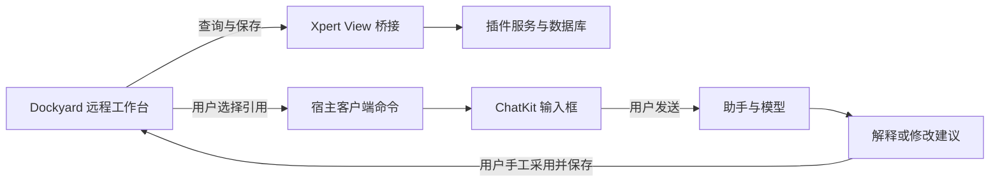

本教程以 Dockyard 为例，说明如何把一个已有的 Web 工作台接入 Xpert。你将保留原来的多面板界面，通过插件保存工作台数据，提供助手模板，并把用户选中的内容交给聊天助手解释或讨论修改。

教程重点是接入过程中的职责划分、实现步骤和验证方法。最终示例 Demo 的完整实现和开发材料见 [Dockyard 示例 Demo PR #627](https://github.com/xpert-ai/xpert-plugins/pull/627)，该 PR 已合并到官方仓库的 main，教程示例固定在合并提交 [9871c50f](https://github.com/xpert-ai/xpert-plugins/tree/9871c50f408d19ae3e6c3951721ab1c4574185c6/community/apps/dockyard)。读者可以通过 PR 查看代码差异、验证记录和六份配套文档；复现时使用上述官方仓库的固定提交。它是开发案例，不是已发布的 npm 插件。

<Warning>
本文基于 Dockyard 插件 0.3.0。右键引用需要宿主支持 `assistant.composer.append_references`，对应实现见 [Xpert PR #1025](https://github.com/xpert-ai/xpert/pull/1025)。复现前请确认部署版本包含该能力；不能只安装插件就假定未修改的 Xpert main 已支持。本文不将该接口描述为所有版本均可用的稳定能力。
</Warning>

## 最终体验与边界

用户打开工作台中的文本文件，选中一段文字，右键选择“解释一下”或“帮我改”。文件树提供相同操作，引用范围为整份文本。ChatKit 显示引用后，用户补充要求并发送；模型给出解释或修改建议，用户手工采用建议并保存。

本例中的文件树是虚拟文件树，正文保存在插件数据库记录中。整文件引用仍是文本快照，不是原生工作区文件附件，也不直接指向开发者电脑上的文件。浏览器下载后的存放位置由浏览器设置决定。

原案例曾尝试 AI 布局和复杂内容协作面板，随后收敛为两个右键操作。下面只介绍 0.3.0 保留的功能，不要求重新实现已删除的面板、草案应用或撤销工具。



## 第一步：准备独立仓库和测试环境

先阅读[插件开发](/zh-Hans/ai/plugin/plugin-development)和[自定义智能体应用](/zh-Hans/ai/tutorial/develop-custom-agentic-app)，理解插件、服务、工作台视图与助手模板的关系。

准备一个独立目录，分别放置插件仓和测试宿主。先在 GitHub fork 官方插件仓，再克隆自己的 fork：

```bash
# 在新建的开发目录执行；替换 YOUR_ACCOUNT。
git clone https://github.com/YOUR_ACCOUNT/xpert-plugins.git
cd xpert-plugins
git remote add upstream https://github.com/xpert-ai/xpert-plugins.git
git fetch upstream main
git switch -c feature/my-workbench upstream/main
```

如果要先运行本教程的固定示例，可在另一个目录克隆官方仓库并检出上述合并提交：

```bash
git clone https://github.com/xpert-ai/xpert-plugins.git dockyard-example
cd dockyard-example
git checkout 9871c50f408d19ae3e6c3951721ab1c4574185c6
```

这个检出用于复现；开发自己的插件时使用自己的功能分支。记录插件、宿主和上游界面的 SHA，不要只记录“最新版”。本例使用 Node 22、插件 pnpm 8.15.8 和 SDK/contracts 3.18.4；宿主包管理器版本按宿主自己的 package.json 选择。

测试宿主使用独立数据库、Redis、端口及日志目录。凭证从测试环境配置读取，不写入插件、文档或提交记录。配置插件工作区允许目录时，只允许测试实例需要访问的路径。

## 第二步：复用原界面，建立清晰的适配边界

Dockyard 的库提供布局能力，完整 sample 才包含工作台菜单、面板和编辑器。要保留原应用体验，先核对依赖库与示例各自承担什么职责，不能只安装库就认为界面已完成。

本例保留固定版本的上游文件及 MIT 许可，并以哈希清单校验；自有修改集中在构建适配层。主要目录如下：

```text
community/apps/dockyard/
├── src/index.ts                 # 插件元数据与注册入口
├── src/dockyard-assistant.yaml  # 助手模板 DSL
├── src/lib/
│   ├── workspace-view.provider.ts
│   ├── workspace.service.ts
│   ├── workspace.entity.ts
│   └── remote/                 # 界面适配、桥接、保存队列与右键菜单
├── scripts/                    # sample 适配、构建和校验
├── tests/
└── vendor/                     # 原版 Dockyard、许可及来源清单
```

原 sample 的接入点由 `adapt-sample.mjs` 处理。每个替换锚点都要检查匹配数量；上游结构变化时立即报错，避免构建成功却漏接保存或初始化逻辑。新产品优先使用上游正式扩展接口，只有示例没有扩展点时才采用受校验的构建适配。

## 第三步：注册插件、视图和助手模板

插件入口需要同时声明运行能力和用户可发现的入口。本例按测试租户安装，`package.json` 与运行时元数据保持相同的安装级别和 artifact namespace。安装级别、实体命名规则应以目标宿主与 SDK 的合同为准，不直接照搬其他示例。

按以下顺序核对：

1. `src/index.ts` 导出插件对象，注册服务端模块。
2. 服务端模块注册实体、保存服务、中间件和 View Provider。
3. View 清单声明 `remote_component`、`esm`、`iframe`，提供数据查询和三个保存动作。
4. 中间件提供对应 feature，View 的 `requiredFeatures` 与之匹配。
5. 模板贡献加载 DSL，marketplace 中显式列出 `assistant-template`。
6. 应用的 `appConfig` 关联同插件的模板 key；模板、应用和能力声明保持一致。

只有 YAML 文件并不足以让模板出现在界面中。模板内容、插件贡献清单和应用关联是三个需要同时核对的环节。

对于本例的 ESM 包，宿主先定位入口、再加载模块。包导出保留以下形式，避免只能 import、无法通过宿主定位：

```json
{
  "type": "module",
  "exports": {
    ".": {
      "types": "./dist/index.d.ts",
      "import": "./dist/index.js",
      "default": "./dist/index.js"
    }
  }
}
```

`default` 仍指向同一个 ESM 文件，并不表示额外生成了 CommonJS 构建。插件应通过生命周期测试验证真实加载方式。

## 第四步：通过 View 桥接保存数据

远程组件运行在隔离 iframe 中，不应沿用原 sample 的 localStorage。持久化数据通过 View 数据查询与动作交给服务端处理，iframe 不持有平台令牌。

本例把保存拆成三个独立版本：

| 数据 | View 动作 | 独立版本的作用 |
| --- | --- | --- |
| 布局、主题和预设 | `save_workspace` | 调整面板不覆盖正文 |
| 文件正文 | `save_buffers` | 检测编辑冲突，保留未保存内容 |
| 便签 | `save_scratchpad` | 与布局、文件保存互不干扰 |

服务端从宿主解析的可信上下文中取得租户、组织、工作空间、用户和助手范围；不要接受 iframe 自报的身份作为授权依据。保存请求携带 `expectedRevision`，与服务端版本不一致时拒绝旧写入，界面提示用户处理冲突。

实现保存队列时，检查两个容易遗漏的场景：

- 请求结束后才显示“已保存”，失败时保留脏状态和用户内容。
- 一次保存结束与 Promise 清理之间发生新编辑时，不能复用已经完成的 Promise 而漏掉新值。

还要测试初始数据加载失败：不能用默认空工作台自动覆盖服务端记录。恢复动态文档时，除了位置，还要重建内容工厂、主题和数据源绑定。

## 第五步：把选区作为聊天引用

先在 View 清单的 `clientCommands` 中声明允许调用的命令，再通过已初始化的桥接发送。下面是本例桥接发送的业务消息片段，不是可独立运行的完整桥接实现：

```ts
{
  type: 'invokeClientCommand',
  commandKey: 'assistant.composer.append_references',
  payload: {
    references: [{
      type: 'code',
      label: '解释一下',
      path: 'example.js',
      text: 'return amount * 0.2;',
      startLine: 2,
      endLine: 2
    }]
  }
}
```

完整消息还需要协议通道、版本、实例 ID 和请求 ID。桥接应核对消息来源、实例与响应类型，处理超时和组件销毁，避免把别的实例响应当成本次操作结果。实现可参考固定示例中的 `src/lib/remote/bridge.ts`。

选区在用户调用菜单时保存为快照，包括文件名、文本和行范围。文件树操作读取对应文件的当前文本缓冲区，不用名称猜测内容类型；没有可引用文本时应提示用户选择文本文件。

宿主负责验证引用、追加到输入框并聚焦，保留已有草稿，不自动发送。还应检测 ChatKit 元素是否已挂载：控制器对象存在，不一定代表输入框已可操作。收到失败回执时，界面不能提示引用成功。

如果目标宿主没有该命令，先记录接口缺口并停用对应入口。不要在插件中直接访问宿主 DOM 或模拟粘贴来绕过接口。

## 第六步：构建并检查最终 HTML

本例将 ESM 脚本和样式嵌入 HTML。除了 TypeScript 编译和产物一致性，还要验证最终嵌入的脚本能够解析。

一个实际出现过的错误是把 bundle 直接作为 `String.replace` 的替换字符串。JavaScript 中的 `$&` 等序列会被替换规则解释，导致生成脚本混入原 HTML，页面一直停在 Loading。

使用回调保留替换内容的字面值：

```js
html = html.replace(scriptPlaceholder, () => inlineScript)
```

还需处理脚本结束标签，并从最终 HTML 提取 module 脚本执行语法检查。仅证明“产物哈希与构建算法一致”，不能证明构建算法生成了有效 JavaScript。

在示例仓库根目录执行：

```bash
corepack pnpm@8.15.8 --dir community/apps/dockyard install --ignore-workspace --frozen-lockfile
corepack pnpm@8.15.8 --dir community/apps/dockyard test
corepack pnpm@8.15.8 --dir community/apps/dockyard typecheck
```

这里的独立安装方式适用于本例随包提交的锁文件。不要将 `--ignore-workspace` 作为所有 monorepo 包的通用安装方式。

按仓库 `plugin-dev-harness/README.md` 准备 harness 依赖和构建后，运行：

```bash
node plugin-dev-harness/dist/index.js \
  --workspace ./community/apps/dockyard \
  --plugin @community/apps-dockyard
```

本例 0.3.0 的构建、56 项上游测试、11 项插件测试、类型检查及 dist-first 生命周期检查已通过。harness 使用内置 mocks，不代表真实数据库和页面业务流程已经验收。

## 第七步：部署并初始化助手

在测试宿主配置 `PLUGIN_WORKSPACE_ROOTS`，允许访问插件所在目录。路径必须是 API 进程能够访问的绝对路径；宿主运行在容器时，要核对容器内路径与挂载关系。

在测试宿主根目录先查看当前版本部署命令，再使用真实插件路径和测试 API 地址：

```bash
pnpm plugin:deploy:local --help
pnpm plugin:deploy:local \
  --plugin-dir /absolute/path/to/xpert-plugins/community/apps/dockyard \
  --scope tenant \
  --api-url http://127.0.0.1:43100 \
  --no-keychain
```

端口只是示例。部署认证按目标版本 CLI 的要求从测试环境提供，模型密钥在平台中配置。

部署后的检查有明确顺序：

1. 查看安装回执，区分 `staged` 和 `loaded`。
2. 如果返回 `restartRequired`，重启目标测试 API，再确认插件版本和加载错误。
3. 在模板入口找到 Dockyard 助手，首次使用时创建并配置可用模型。
4. 已有助手使用模板更新流程，核对模型设置后发布，避免重复创建。
5. 打开工作台，确认运行 HTML 与本次 dist 一致，并能读取初始数据。
6. 执行真实引用提问，随后人工采用建议、保存并刷新确认。

安装成功、模板可见、助手已发布和业务流程可用，是四项不同的结果，应分别验证。

## 使用插件：从模板创建到 AI 提问

完成安装后，业务用户可以按以下步骤使用，无需了解插件代码。以下截图由示例使用者提供，展示实际界面；创建、配置和发布步骤以文字说明，未配示意截图。

### 1. 从模板创建专家

进入平台的模板入口，找到 **Dockyard 内容助手**，使用该模板创建数字专家（助手）。这里是使用插件已提供的专家模板创建实例，不需要从空白开始编写模板。

如果找不到模板，先确认插件已加载，并检查模板展示声明。已有 Dockyard 专家时，使用模板更新流程，不必重复创建。

### 2. 配置模型并发布

打开新建专家的配置或编排页面，选择当前组织可用的模型，确认模型凭证已配置。检查模板带来的 Dockyard 中间件和工作台关联，保存配置并发布。

“帮我改”和“解释一下”是工作台右键操作，不是需要在编排页面额外添加的两个 Agent 工具节点。它们把引用交给专家的 ChatKit 输入框，模型使用专家配置进行回答。

### 3. 打开 Dockyard 工作台

进入已发布专家的对话页面，打开 **Dockyard 工作台**。左侧 Explorer 是文件树，中间是文档编辑区，右侧聊天区域用于向 Dockyard 内容助手提问。


<Note>
这张截图同时显示工作台和助手回答，底部仍有“保存失败，编辑内容已保留”的提示。它证明界面和回答已展示，不代表保存成功。遇到该提示时保留当前编辑内容，按界面提示重试并确认保存成功后再刷新或离开。
</Note>

### 4. 解释选中的文字

1. 在 Explorer 打开文本文件，例如 `theme.css`。
2. 在编辑区选中需要解释的文字，再右键选择 **解释一下**。
3. 在右侧 ChatKit 核对引用的文件、文字和行范围。
4. 输入具体问题，例如：“解释这段主题颜色变量分别控制什么。”然后发送。


右键操作只准备引用，不会自动发送消息。只想讨论一小段时，先选中该段，避免把不相关内容带入问题。

### 5. 让助手帮忙修改文件

1. 在 Explorer 对目标文本文件右键，选择 **帮我改**，引用该文件的当前全文；如果只改局部，也可以对编辑区选区使用同一操作。
2. 核对 ChatKit 中的引用，写清修改目标，例如：“把 README 改成三步使用说明，保留安装命令。”
3. 发送后查看助手建议。需要调整时继续说明要求。
4. 将确认采用的内容手工写入编辑器，点击 **Save buffer**，确认保存成功，再刷新检查内容是否保留。


文件菜单的 **解释一下** 同样引用全文。两种入口的区别是引用范围：编辑器选区用于局部，文件树用于整份文本。**帮我改不会自动覆盖文件**，模型回复中的代码块也不表示已保存到工作台。

## 第八步：完成验收，而不只记录测试通过

| 层次 | 应验证什么 | 不能替代什么 |
| --- | --- | --- |
| 单元与构建 | 保存竞态、版本冲突、范围隔离、清单与最终脚本 | 真实鼠标交互 |
| 生命周期 | 从 dist 解析入口、初始化、关闭 | 真实平台部署 |
| 界面集成 | 选区、文件引用、草稿保留、错误提示与菜单清理 | 真实模型处理 |
| 平台业务流程 | 提问、真实回答、人工采用、保存恢复、失败重试 | 其他业务场景的质量验收 |

可以用一段合成代码完成最小检查：选中 `tax(amount)` 中的 `return amount * 0.2`，让助手解释 `tax(100)`，确认回答为 20。再要求一个明确修改，手工采用建议、保存并刷新；同时演示一次保存冲突或引用未就绪后的恢复。

本例已取得接口到真实模型的解释证据，并补充了使用者提供的工作台及两种右键菜单截图；人工采用后保存恢复和失败重试的完整界面路线仍待最终验收。不要把接口回执或上游截图标为本插件的浏览器验收。

## 常见问题

| 表现 | 优先检查 | 处理方向 |
| --- | --- | --- |
| pnpm 版本错误 | 当前命令实际使用的版本 | 按插件与宿主各自声明显式选择版本 |
| 安装后无法加载 | dist、exports、宿主入口解析错误 | 用同一包执行 dist-first harness |
| 助手模板不显示 | 模板贡献与 marketplace 声明 | 核对模板 key 与 appConfig 关联 |
| 页面一直 Loading | 最终 HTML 内 module 语法、桥接初始化与数据请求 | 定位首个失败环节，不只重复刷新 |
| 显示已保存但刷新丢失 | 保存回执、队列竞态、版本冲突 | 保留未保存状态，补针对性回归 |
| 点击引用没有反应 | 宿主命令支持、清单声明、ChatKit 挂载状态 | 返回可理解的失败原因并允许重试 |
| 更新后仍是旧页面 | staged/restartRequired、运行版本与 HTML 哈希 | 完成目标 API 重启与助手模板更新 |

## 继续阅读

- [最终示例 Demo PR #627：完整实现与配套文档](https://github.com/xpert-ai/xpert-plugins/pull/627)
- [工作台远程组件](/zh-Hans/ai/plugin/plugin-sdk/remote-component)
- [插件发布和使用](/zh-Hans/ai/plugin/publish-and-use)
- [固定版本的示例与六份开发材料](https://github.com/xpert-ai/xpert-plugins/tree/9871c50f408d19ae3e6c3951721ab1c4574185c6/community/apps/dockyard/docs/interview)
- [Dockyard 上游仓库](https://github.com/wieslawsoltes/Dockyard)
