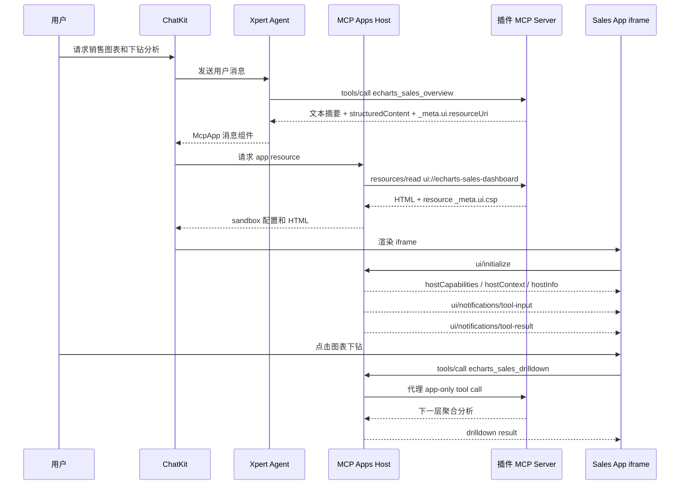

<Info>
本教程以 `@xpert-ai/plugin-echarts-mcp-app` 为例，从 MCP Apps 的基本概念、运行原理讲起，带你把一个“展示图表”的 demo 扩展成更贴近真实业务的销售经营分析插件。
</Info>

## 目标

我们要构建的不是一张静态图，而是一个可以嵌入 ChatKit 对话的“销售经营驾驶舱”：

- 用户在对话中提出“展示 2026 年各区域收入，并支持下钻分析”
- Agent 调用模型可见工具 `echarts_sales_overview`
- 工具返回文本摘要、结构化分析数据和 `_meta.ui.resourceUri`
- ChatKit 以内联 iframe 渲染 `ui://echarts-sales-dashboard`
- 用户在图表中切换指标、年份、维度，点击柱形图继续下钻
- iframe 通过 MCP Apps bridge 调用 app-only 工具 `echarts_sales_drilldown`
- 模型看不到 app-only 工具，但 App 可以安全调用它完成交互分析

这类模式适合经营分析、指标诊断、客户分群、供应链看板、工单排查、审批表单、地图分析等场景：模型负责理解意图和启动工作，MCP App 负责承载高密度、可交互的结果。

## 基本概念

MCP Apps 可以理解为三件事的组合：

1. **MCP Tool**：Agent 可以调用的工具。模型可见工具通常负责启动应用并返回首屏数据。
2. **MCP Resource**：由 MCP server 暴露的 HTML 资源。MCP App 的资源 URI 通常是 `ui://...`，MIME 类型必须是 `text/html;profile=mcp-app`。
3. **MCP Apps Host**：Xpert + ChatKit 中负责读取资源、创建 sandbox iframe、注入初始化上下文并代理 `tools/call` / `resources/read` 的宿主。

工具和 App 之间通过标准 JSON-RPC bridge 通信。常用方法包括：

- `ui/initialize`：App 向宿主初始化，获取 host 能力和上下文
- `ui/notifications/tool-input`：宿主把触发工具的输入通知给 App
- `ui/notifications/tool-result`：宿主把初始工具结果通知给 App
- `tools/call`：App 调用同一 MCP server 中允许 iframe 调用的工具
- `resources/read`：App 读取允许访问的 MCP resource
- `ui/notifications/size-changed`：App 通知 ChatKit 调整 iframe 高度

插件侧如何注册 MCP server、tool 和 resource 的通用规范见 [MCP Tools 和 MCP Apps](../plugin/mcp-tools-and-apps)。ChatKit 宿主的渲染与安全模型见 [ChatKit MCP Apps](../chatkit/chatkit-mcp-apps)。

官方协议参考：

- [MCP Apps Overview](https://modelcontextprotocol.io/extensions/apps/overview)
- [Build an MCP App](https://modelcontextprotocol.io/extensions/apps/build)
- [MCP Apps API](https://apps.extensions.modelcontextprotocol.io/api/)
- [MCP Apps compatibility in ChatGPT](https://developers.openai.com/apps-sdk/mcp-apps-in-chatgpt)

## 运行原理



关键点是：ChatKit 不把任意 HTML 存进历史消息。历史中只保存 `resourceUri`、`toolName`、`toolsetId`、`serverName` 等安全元数据，以及受大小限制的初始工具结果快照；刷新页面时，后端会优先使用仍然有效的 live app instance，过期后再重新读取 `ui://` resource 并恢复 App instance。

## 真实业务建模

为了让示例插件更像真实项目，我们把它建模成“销售经营分析”能力，而不是“画图工具”。

| 层次 | 示例能力 | 在插件中的落点 |
| --- | --- | --- |
| 业务问题 | 哪个区域收入最高？利润率是否下降？订单是否集中在某个产品？ | 工具描述和 summary |
| 指标 | 收入、毛利、订单数、毛利率 | `SalesMetric`、`totals`、`points` |
| 维度 | 区域、产品、月份 | `SalesGroupBy`、`filters`、`nextGroupBy` |
| 首屏分析 | 默认按区域展示 2026 年收入 | `echarts_sales_overview` |
| 交互分析 | 点击 West 后按产品下钻，再按月份看趋势 | `echarts_sales_drilldown` |
| 可视化 | 柱形图、折线图、统计卡片、面包屑 | `src/app/main.ts` + ECharts |
| 安全边界 | 模型只看到 overview，下钻工具只给 iframe | `_meta.ui.visibility` |

真实生产环境中，mock dataset 可以替换成 CRM、ERP、数据仓库、指标平台或语义模型查询。不要让浏览器直接访问敏感数据库；iframe 应只调用受控 MCP tools，由后端执行鉴权、租户隔离、行列权限和审计。

## 插件结构

`@xpert-ai/plugin-echarts-mcp-app` 的核心结构如下：

```text
examples/echarts-mcp-app/
├── .xpertai-plugin/
│   └── plugin.json
├── package.json
├── project.json
├── scripts/
│   └── build-app.mjs
├── src/
│   ├── index.ts
│   ├── mcp-server.ts
│   ├── app/
│   │   ├── index.html
│   │   ├── main.ts
│   │   └── styles.css
│   └── lib/
│       ├── app-html.ts
│       ├── mcp-tools.ts
│       └── sales-data.ts
└── tsconfig.lib.json
```

这份结构有一个长期维护上的好处：MCP server、业务聚合逻辑和浏览器 App 分开开发。`src/app` 是普通 Vanilla TypeScript 前端工程，构建后生成 `dist/app/index.html`；`src/lib/app-html.ts` 只负责读取构建产物并作为 MCP resource 返回。

## 声明 Plugin-Managed MCP Server

插件通过 `.xpertai-plugin/plugin.json` 把 MCP server 声明为可安装资源：

```json
{
  "mcpServers": {
    "echarts-drilldown": {
      "type": "stdio",
      "command": "node",
      "args": ["${PLUGIN_ROOT}/dist/mcp-server.js"],
      "policy": {
        "enabled": true,
        "defaultToolsApprovalMode": "approve",
        "enabledTools": ["echarts_sales_overview", "echarts_sales_drilldown"]
      }
    }
  }
}
```

`"${PLUGIN_ROOT}"` 很重要。插件安装到运行时目录后，路径会变化；不要把本机开发目录或某次 `@runtime__...` 目录写死到 manifest 或数据库中。

## 设计工具可见性

真实 MCP App 往往至少有两类工具：

- **模型可见工具**：让 Agent 知道什么时候应该打开 App，例如 `echarts_sales_overview`
- **App-only 工具**：只允许 iframe 调用，用于刷新、下钻、分页、导出预检等交互，例如 `echarts_sales_drilldown`

在这个销售分析插件中，overview 工具同时对模型和 App 可见：

```ts
export const OVERVIEW_TOOL_META = {
  ui: {
    resourceUri: 'ui://echarts-sales-dashboard',
    visibility: ['model', 'app']
  },
  'openai/outputTemplate': 'ui://echarts-sales-dashboard'
}
```

下钻工具只给 App：

```ts
export const DRILLDOWN_TOOL_META = {
  ui: {
    visibility: ['app']
  }
}
```

这样设计有两个收益。第一，模型工具列表保持简洁，不会把交互细节暴露给 LLM。第二，iframe 的能力仍然受 Xpert MCP Apps Host 管控，disabled tool、跨 toolset 调用或不可见工具都会被拒绝。

## 返回结构化业务结果

MCP App 不应该依赖解析自然语言摘要。工具结果应同时提供：

- `content`：给模型和不支持 UI 的客户端看的文本摘要
- `structuredContent`：给 App 渲染的稳定 JSON 数据
- `_meta.ui.resourceUri`：告诉 ChatKit 应渲染哪个 App resource

示例插件的 `structuredContent` 包含完整分析对象和图表友好字段：

```ts
function buildStructuredContent(analysis: SalesAnalysis) {
  return {
    kind: analysis.kind,
    analysis,
    chart: {
      title: `${analysis.metric} by ${analysis.groupBy}`,
      labels: analysis.points.map((point) => point.label),
      values: analysis.points.map((point) => point.value),
      metric: analysis.metric,
      groupBy: analysis.groupBy,
      year: analysis.year,
      filters: analysis.filters
    }
  }
}
```

生产系统建议为 `structuredContent` 制定版本字段，例如 `kind: 'sales-performance-analysis.v1'`，并在 App 中兼容一个版本窗口。这样后端分析结构演进时，不会轻易打破历史消息中的 App。

同时要控制初始结果大小。ChatKit 会优先从 live app instance 读取完整 `toolResult`，但聊天历史只内联小型结果快照；超过宿主阈值的大结果只记录大小和截断标记。销售经营分析类 App 应把初始 `structuredContent` 控制为首屏聚合、摘要和必要筛选条件，明细、长列表和更多层级通过 app-only 工具分页或按需下钻加载。

## 注册 MCP App Resource

MCP App 的 HTML 通过 MCP resource 返回。安全相关配置应放在 resource metadata，而不是 tool metadata：

```ts
registerAppResource(
  server,
  'echarts-sales-dashboard',
  'ui://echarts-sales-dashboard',
  {
    title: 'ECharts Sales Dashboard',
    description: 'Interactive ECharts dashboard for sales drilldown analysis.',
    mimeType: RESOURCE_MIME_TYPE,
    _meta: {
      ui: {
        csp: {
          resourceDomains: ['https://cdn.jsdelivr.net'],
          connectDomains: [],
          frameDomains: [],
          baseUriDomains: []
        },
        prefersBorder: true
      }
    }
  },
  () => buildDashboardResource(RESOURCE_MIME_TYPE)
)
```

如果 App 需要加载 ECharts CDN，就把 `https://cdn.jsdelivr.net` 放进 resource CSP。不要用宽泛的 `*`。生产 App 如果可以离线 bundle 第三方库，优先把外部依赖打进构建产物，CSP 会更简单。

## 集中开发 App 前端

不要把生产 App 写成几百行 TypeScript 模板字符串。推荐把 App 作为普通前端源码维护：

```text
src/app/
├── index.html
├── main.ts
└── styles.css
```

`scripts/build-app.mjs` 使用 esbuild 打包浏览器 TypeScript，并把 CSS 和 JS 内联到单个 HTML：

```json
{
  "scripts": {
    "build:app": "node scripts/build-app.mjs"
  }
}
```

最终 MCP resource 读取的是 `dist/app/index.html`。这让前端开发者可以按熟悉的方式维护 DOM、样式、状态和交互，也让测试可以直接检查构建产物里是否包含 `ui/initialize`、`tools/call` 等 bridge 调用。

## App Bridge 生命周期

App 启动时应先初始化，再等待宿主发送首屏工具输入和工具结果：

```ts
request('ui/initialize', {
  protocolVersion: '2026-01-26',
  appInfo: {
    name: 'xpert-echarts-sales-dashboard',
    version: '0.0.1'
  },
  appCapabilities: {
    availableDisplayModes: ['inline']
  }
})
```

当收到 `ui/notifications/tool-result` 后，App 从 `structuredContent.analysis` 中提取数据并渲染图表。用户点击图表时，App 调用 app-only 工具：

```ts
request('tools/call', {
  name: 'echarts_sales_drilldown',
  arguments: {
    metric: state.metric,
    year: state.year,
    groupBy: state.groupBy,
    filters: state.filters
  }
})
```

每次图表重绘、错误态展开或移动端布局变化后，App 应发送 `ui/notifications/size-changed`，避免 iframe 高度和内容不匹配。

## 构建和验证

开发时先构建 App asset，再构建插件 server：

```bash
pnpm -C examples/echarts-mcp-app run build:app
pnpm -C examples/echarts-mcp-app exec tsc --build tsconfig.lib.json
```

如果通过 workspace Nx 构建，确保 `nx build @xpert-ai/plugin-echarts-mcp-app` 同时执行 server 编译和 App 构建。

发布前至少验证：

- stdio MCP server 启动时不向 stdout 写普通日志
- `tools/list` 中模型可见工具包含 `echarts_sales_overview`
- app-only 工具 `echarts_sales_drilldown` 不暴露给模型
- overview 工具结果包含 `_meta.ui.resourceUri`
- resource 返回 `text/html;profile=mcp-app`
- resource metadata 包含最小 CSP
- iframe 能收到初始 tool input / tool result
- 点击图表后能通过 `tools/call` 下钻
- 刷新历史消息不会因为旧 app instance 过期而泄露或丢失原始 HTML

## 从示例走向生产

把这个插件用于真实业务时，可以沿着以下方向升级：

| 方向 | 生产化建议 |
| --- | --- |
| 数据来源 | 将 mock dataset 替换为指标平台、数据仓库、CRM 或语义模型查询 |
| 权限 | 在 MCP server 中使用 Xpert 租户、组织、用户上下文执行行列权限 |
| 指标治理 | 使用稳定指标 ID，不要只依赖 UI 文案 |
| 性能 | 对聚合查询做缓存，限制下钻层级和返回点数 |
| 解释能力 | 增加 app-only `explain_variance` 工具解释同比、环比和异常点 |
| 行动闭环 | 增加 `create_followup_task`、`export_snapshot` 等需要审批的工具 |
| 模型上下文 | 用 `ui/update-model-context` 把用户当前筛选条件反馈给下一轮对话 |
| 可观测性 | 记录每次 app-only 工具调用、拒绝原因和 resource 读取错误 |

一个成熟的 MCP App 插件不只是“HTML + 图表”。它应该把业务语义、工具权限、交互状态、审计和降级体验一起设计好。

## 常见问题

**为什么不用 ChatKit Widget？**

Widget 适合声明式、受控的结构化 UI。MCP App 适合由插件提供完整 HTML 应用，需要复杂状态、第三方可视化库、图表交互或多次 app-only 工具调用的场景。

**为什么不用 extension view？**

Extension view 是平台槽位，适合长期存在的工作台页面、配置页和集成详情页。MCP App 是工具调用结果，生命周期跟随对话和工具调用，更适合“问一个问题，得到一个可交互结果”。

**模型为什么不能直接看到所有下钻工具？**

下钻、分页、刷新这类工具是 UI 内部交互细节。把它们设为 app-only 可以减少模型工具选择负担，也能降低误调用风险。

**HTML 会写入聊天历史吗？**

不会。Xpert 只保存安全元数据，HTML 在渲染时由 MCP Apps Host 重新读取 resource。

## 下一步

你可以从 `@xpert-ai/plugin-echarts-mcp-app` 开始，把示例中的销售数据替换为自己的业务查询，把 ECharts 图表替换为更贴近业务的分析视图。只要保持 MCP tool、MCP resource 和标准 bridge 的边界清晰，同一个插件就可以在 ChatKit 中提供非常接近真实业务系统的交互体验。
