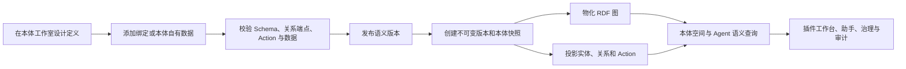

UOSE 中的本体是一层用于定义、发布、探索和使用业务语义的产品能力。它为重要对象提供稳定类型和标识，用明确关系连接对象，描述可以作用于对象的动作，并保留人员与 Agent 作出判断时所依据的版本和证据。

本体不只是一张 Schema 图或一份词表。发布后的本体会成为受治理的运行时契约，用于实体搜索、图谱探索、Action 发现、助手上下文、插件体验和审计。

<CardGroup cols={2}>
  <Card title="本体工作室" icon="pen-ruler" href="./ontology-studio">
    设计实体类型、关系、属性、动作、数据绑定和本体自有数据，校验并发布不可变版本。
  </Card>
  <Card title="本体空间" icon="circle-nodes" href="./ontology-workspace">
    浏览已发布业务对象、搜索实体、检查实例图谱、比较快照，并使用本体助手。
  </Card>
  <Card title="运行时语义" icon="database">
    将快照物化为 RDF 和运行时投影，支持快速搜索、邻域查询、能力发现与追溯。
  </Card>
  <Card title="插件场景" icon="puzzle-piece" href="./cases/plugin-scenarios">
    让插件携带领域本体，并把已发布对象和 Action 转化为聚焦的业务工作台。
  </Card>
</CardGroup>

## 核心语义模型

| 元素 | 用途 | 示例 |
| --- | --- | --- |
| 实体类型 | 定义一类业务对象及其属性 | `valve`、`supplier`、`purchase_order` |
| 实体实例 | 使用外部键标识一个具体对象 | 阀门 `V-1001` |
| 关系类型 | 定义合法的源类型、目标类型、基数和关系属性 | 阀门**使用材料** |
| 关系实例 | 连接两个具体对象 | `V-1001` 使用 `CF8M` |
| Action 定义 | 描述可以做什么、作用于哪些类型，以及输入、风险、审批和预期影响 | `create_maintenance_work_order` |
| 约束与策略 | 限定合法使用方式，并控制有后果的操作 | CRITICAL Action 必须审批 |
| 数据绑定 | 把本体属性映射到外部 UOSE 资源 | `valve.code` → 源字段 `VALVE_ID` |
| 来源信息 | 记录定义或事实来自哪里 | Manifest、源 Schema、源实例或派生结果 |

这些元素共同形成稳定语义契约。Agent 可以围绕可读名称和关系推理，系统则继续使用稳定编码、类型、Schema、版本、策略和操作者范围进行校验。

## 从设计到运行时

### 1. 编写

本体工作室使用修订号保存可编辑草稿。草稿可以包含 Schema、Action 定义、外部数据绑定、代表性实例、实例关系和画布布局。用户可以从空白本体、内置模板或 RDF/XML 导入开始。

### 2. 校验与编译

校验会检查 Schema 完整性、关系端点、属性类型、Action 目标与契约、实例属性和实例关系。预览会把草稿编译为即将进入运行时发布链路的完整 `MetaManifest` 与发布请求。

### 3. 发布与版本化

发布前会再次校验，随后分配语义版本、创建不可变版本记录、发布业务本体快照，并返回 snapshot ID、graph version 和 ontology ID。即使把历史版本恢复为新草稿，已发布历史也会继续保留。

### 4. 物化与投影

规范本体中间表示包含 Schema、实例、关系、约束、affordance、别名和来源信息。UOSE 可以把它物化为具名 RDF 图，并将运行时对象投影到实体、关系和动作表。详见 [Snapshot、RDF 与实例投影](./snapshot-and-projection)。

### 5. 探索与使用

本体空间会把本体定义、本体自有数据和关联业务对象归组展示。用户可以监控健康状态、跨有效实体搜索、查看当前及历史图谱，并把准确对象与快照上下文交给本体助手。插件也可以使用相同的已发布上下文构建领域 Object 360 和受治理 Action 流程。

## 数据进入本体的两种方式

### 本体自有数据

在本体工作室直接创建代表性或由领域管理的实例与关系。这些记录与本体草稿共用生命周期，在定义发布后成为可检索实体。它适合参考对象、中性演示数据、小型受控词表，以及不属于其他源系统的例外记录。

### 连接资源数据

把实体类型和属性绑定到外部 UOSE 资源，或由资源适配器直接发布规范本体。数据库、SAP OData、语义模型、知识和插件自有资源都可以生成版本化快照，真实数据仍由源适配器治理。

<Info>
本体图是语义与治理层，不会复制源系统的全部事实，也不会绕过源适配器直接执行实时操作。
</Info>

## 运行时能力

本体发布后可支持：

- 按名称、外部键、别名或实体类型进行精确实体定位和有界跨资源搜索；
- 读取一跳邻域，同时获得相关对象、约束、证据和可用 Action；
- 查询 Schema 摘要并探索语义路径；
- 根据目标类型、参数、约束、风险和审批要求进行 Action 发现与计划校验；
- 固定 snapshot 和 graph version，使 Agent 与插件判断可以复现；
- 使用 RDF/SPARQL 后端或本地投影后端执行语义查询；
- 在 tenant、organization、resource 和 partition 范围内隔离数据；
- 在审计中引用支撑操作的对象、快照、图版本和证据。

## 治理边界

本体让 Action 可以被发现，但不会自动授权或执行 Action。完整操作链路还可以包含策略评估、预检、人工审批、幂等、执行适配器和追加式审计。插件案例会展示这些责任在实际产品中如何分离。

## 继续阅读

1. 使用[本体工作室](./ontology-studio)创建并发布定义。
2. 使用[本体空间](./ontology-workspace)检查已发布快照与业务对象。
3. 阅读[插件场景中的本体](./cases/plugin-scenarios)，了解插件如何携带并消费领域本体。
