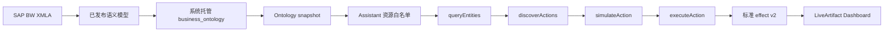

SAP BW 的 Cube、度量和维度是多维分析对象。新的 Data 产品流程把已发布的语义模型投影成系统托管的本体资源。Assistant 先从本体定位对象，再经过统一动作发现、授权、预演和执行，最后把标准化结果交给 Workbench 或 LiveArtifact，而不是直接拼接 XMLA 地址或未经治理的 MDX。

本文使用本地环境中真实存在的 SAP BW 语义模型，完整走通从模型发布、查看本体资源、绑定 Assistant、执行 Cube slice 到生成 LiveArtifact Dashboard 的过程。截图来自这次真实操作；第 5 张是由真实动作响应生成的执行回执视图，数值没有使用示例数据。

## 本次实测环境和目标

| 项目                  | 实测值                                                      |
| --------------------- | ----------------------------------------------------------- |
| 语义模型              | `公网BW采购订单分析_20260913`                               |
| `modelId`             | `b07f52aa-5866-4400-9240-16da6567d55f`                      |
| 系统托管 `resourceId` | `datax-semantic-model-b07f52aa-5866-4400-9240-16da6567d55f` |
| 数据源                | `公网 BW XMLA 测试`                                         |
| Cube                  | `2CREPM_PURCHASEO/2CREPM_PURCHASEQ`                         |
| 业务域                | `采购部门`                                                  |
| 实际分析维度          | `[2CLQV6IYPDAMTF6DFH2S2PADWW5]`                             |
| 实际动作              | `mdx.query_cube_slice`                                      |

这个模型没有可用的时间维度，因此本次真实闭环按公司代码切片，展示采购金额和采购订单量。它不能被描述成月度趋势模型；如果业务需要月度趋势，应换用存在合法时间维度的已发布模型，再使用 `query_metric_snapshot` 或带时间维度的 Cube slice。

本次生成的 LiveArtifact 分享页：

```text
http://localhost:5174/live-artifacts/share/hCyYKaKEmA9c
```

分享地址只适用于本地测试环境。看板每次刷新仍然按当前查看者重新检查资源访问和 action policy。

## 新系统的执行链路

发布语义模型后，系统自动生成 `datax-semantic-model-${modelId}` 资源。该资源在本体空间中以 `business_ontology` 类型保存，capabilities 中的 `runtimeAdapterId: semantic_model` 将查询路由到语义模型运行时。因此不需要手工创建旧式 `semantic_model` resource、填写 `modelIds` 或再发一个补偿请求。



创建者保存 binding 时要有资源和业务域权限；看板查看者打开或刷新时，会针对每个 binding 重新检查资源访问和 `live_artifact` action policy。组织内分享不会绕过查看者权限。

## 前置条件

- 可以登录 Data X Web 和 Xpert 工作台；
- 有权查看已发布的 SAP BW 语义模型和本体空间；
- 有权在 `采购部门` 业务域中创建或编辑 Assistant；
- 对目标资源拥有读取权限，并允许执行 `mdx.query_cube_slice`；
- 若要复现实测结果，需要使用同一个本地租户和可访问 `公网 BW XMLA 测试` 的账号。

只有本体查看权限时，仍可能看见 Cube 元数据，但 `simulateAction` 会返回拒绝。

## 1. 确认已发布的 SAP BW 模型

打开语义模型列表，搜索 `公网BW采购订单分析_20260913`，确认状态为“已发布”。发布是后续生成本体资源的前提。


图 1：本次实测使用的模型已经发布，名称和版本来自真实的语义模型列表。

记录模型 ID 和系统托管资源 ID：

```text
modelId: b07f52aa-5866-4400-9240-16da6567d55f
resourceId: datax-semantic-model-b07f52aa-5866-4400-9240-16da6567d55f
```

不要把 XMLA 密码、访问令牌或连接地址复制到 Assistant 指令或 LiveArtifact HTML；连接信息由语义模型和服务端 Secret 管理。

## 2. 在模型工作台确认 Cube 契约

打开模型工作台，确认数据源为 `公网 BW XMLA 测试`，查看 Cube `2CREPM_PURCHASEO/2CREPM_PURCHASEQ` 的度量和维度。


图 2：模型工作台显示真实 Cube、度量和维度；这里用于确认查询契约，不是 Assistant 的运行时入口。

本次实测发现：

| 对象         | 技术引用                                    | 用途                  |
| ------------ | ------------------------------------------- | --------------------- |
| 采购金额     | `[Measures].[GrossAmountInTransacCurrency]` | 按公司汇总采购金额    |
| 采购订单数量 | `[Measures].[po_counter]`                   | 按公司统计采购订单量  |
| 公司维度     | `[2CLQV6IYPDAMTF6DFH2S2PADWW5]`             | Cube slice 的分组维度 |

这份模型没有合法时间维度，所以不要在 prompt 中要求“最近 12 个月趋势”，也不要让 Agent 自动补默认时间窗。

## 3. 查看系统托管本体资源

进入本体空间，搜索模型名称或 `resourceId`，确认模型、Cube、度量和维度已经出现在 ontology snapshot 中。


图 3：本体空间中的项目来自已发布模型。正式资源类型是 `business_ontology`，通过 `runtimeAdapterId: semantic_model` 使用语义模型适配器。

这里不要按旧系统教程手工注册第二个 `semantic_model` 外部资源，也不要填写一套 `modelIds`、`endpoints` 和 full sync 表单。只需确认：

1. 资源状态可用，snapshot 已生成；
2. 目标 Cube、度量和维度出现在本体中；
3. 资源没有归档，当前租户和组织可以访问；
4. 目标 action 属于该资源的只读能力集合。

本体负责定位对象和保存查询契约，事实值仍由语义模型运行时回源 SAP BW。看见本体实体不等于当前用户一定可以读取事实数据。

## 4. 将资源绑定到 Assistant

在 Assistant 配置页选择业务域 `采购部门`，在资源访问配置中勾选本次模型的系统托管资源。


图 4：Assistant 只被授予本次分析需要的系统托管资源。资源白名单是运行时授权边界，不是 prompt 中的一段说明。

可使用下面的指令约束分析边界：

```text
你是 SAP BW 采购运营分析助手。
先在已授权的本体资源中定位 semantic_cube、semantic_measure 和 semantic_dimension，
再发现并模拟可用的只读 action。执行前说明目标 Cube、维度、度量和过滤条件；
执行后说明 effect kind、返回行数、是否截断、数据更新时间和审计引用。
如果目标模型没有时间维度，不要自动补默认时间窗，也不要把公司行数称为订单总数。
缺少资源、目标对象或当前查看者权限时，直接返回结构化拒绝原因。
```

资源绑定和业务域变更由同一个 Assistant 配置命令保存。外部同步如果暂时未完成，会显示同步状态并由 outbox 重试，不需要前端再发第二个补偿请求。

## 5. 真实执行本体动作

使用统一链路：

```text
queryEntities → discoverActions → simulateAction → executeAction
```

### 5.1 定位 Cube

```json
{
  "resourceId": "datax-semantic-model-b07f52aa-5866-4400-9240-16da6567d55f",
  "entityTypeCode": "semantic_cube",
  "entityRef": "b07f52aa-5866-4400-9240-16da6567d55f::2CREPM_PURCHASEO/2CREPM_PURCHASEQ"
}
```

### 5.2 发现并预演 action

本次对目标 Cube 发现并执行 `mdx.query_cube_slice`，payload 为：

```json
{
  "actionTypeCode": "mdx.query_cube_slice",
  "target": {
    "entityTypeCode": "semantic_cube",
    "entityRef": "b07f52aa-5866-4400-9240-16da6567d55f::2CREPM_PURCHASEO/2CREPM_PURCHASEQ"
  },
  "params": {
    "dimensions": ["[2CLQV6IYPDAMTF6DFH2S2PADWW5]"],
    "measures": [
      "[Measures].[GrossAmountInTransacCurrency]",
      "[Measures].[po_counter]"
    ],
    "limit": 10,
    "title": "SAP BW采购订单按公司代码"
  }
}
```

`simulateAction` 返回 `ALLOWED` 后，才用完全相同的 payload 调用 `executeAction`。保存 LiveArtifact 时服务端也会重新预演，确保保存的 binding 与预演 payload 一致。


图 5：回执截图由本次真实的 `queryEntities → discoverActions → simulateAction → executeAction` 响应生成，包含动作、策略、返回行数、耗时、审计引用和标准 effect v2，不是 mock 数据，也不是原始 XMLA 响应。

| 字段               | 真实结果                               |
| ------------------ | -------------------------------------- |
| `simulateAction`   | `ALLOWED`                              |
| `executeAction`    | `SUCCEEDED`                            |
| `policyDecision`   | `allow`                                |
| `returnedRowCount` | `10`                                   |
| `truncated`        | `false`                                |
| 执行耗时           | 约 `1255 ms`                           |
| `auditRef`         | `cc97c35e-8c1c-471a-bd2b-9c532ad783b0` |

返回结果是标准 effect v2 的 `kind: rows`，包含 `columns`、`rows` 和 `summary`。适配器负责转换 SAP BW 响应；HTML 和图表层不读取 XMLA envelope 或 SAP BW 专用字段。

## 6. 生成 LiveArtifact Dashboard

向 Assistant 提出一句业务需求即可：

```text
请基于已授权的 SAP BW 采购订单 Cube 创建一个采购运营指挥中心。
按公司展示采购金额和采购订单量，顶部显示返回金额、返回订单量和公司数，
同时显示使用的 Cube、resourceId、返回行数、truncated 和 policyDecision。
如果模型没有时间维度，就做公司切片，不要生成月度趋势。
保存前完成每条 binding 的 simulateAction，并在运行时继续按查看者权限校验。
```

binding 使用资源、动作、target 和解析后的参数，不保存 XMLA URL：

```json
{
  "company_procurement": {
    "resourceId": "datax-semantic-model-b07f52aa-5866-4400-9240-16da6567d55f",
    "actionTypeCode": "mdx.query_cube_slice",
    "target": {
      "entityTypeCode": "semantic_cube",
      "entityRef": "b07f52aa-5866-4400-9240-16da6567d55f::2CREPM_PURCHASEO/2CREPM_PURCHASEQ"
    },
    "params": {
      "dimensions": ["[2CLQV6IYPDAMTF6DFH2S2PADWW5]"],
      "measures": [
        "[Measures].[GrossAmountInTransacCurrency]",
        "[Measures].[po_counter]"
      ],
      "limit": 10,
      "title": "SAP BW采购订单按公司代码"
    }
  }
}
```

保存和查询都要求资源状态、目标实体和 action policy 校验；运行时按当前查看者重新校验。资源撤权、归档、业务域变化或 policy 收紧后，已有看板下一次刷新会立即受影响。缺少 assistant context 的 Artifact 不允许查询，组织内分享不会绕过权限。

本次实测生成：

```text
artifactId: 2c405f12-87b6-4de0-986d-269607f9c3c7
versionId: 93ce721b-30dd-4637-9be4-acd74923de5f
shareSlug: hCyYKaKEmA9c
```


图 6：真实分享页中的看板。当前返回采购金额为 `146,803.12`，返回订单量为 `26`，公司数为 `10`，`policyDecision` 为 `allow`，`truncated` 为“否”。这些数字来自本次 Cube slice 返回范围，不代表 SAP BW 历史订单的全量聚合。

## 7. 标准 effect v2 和图表

LiveArtifact 的 HTML 或 ECharts 渲染层只读取统一结构：

```ts
interface DataXLiveArtifactEffect {
  version: 2;
  kind: "rows" | "series" | "entity";
  columns: Array<{
    key: string;
    label?: string;
    type?: "string" | "number" | "boolean" | "date" | "datetime";
    semanticRef?: string;
  }>;
  rows?: Array<Record<string, unknown>>;
  series?: Array<Record<string, unknown>>;
  entity?: Record<string, unknown>;
  summary: {
    rowCount: number;
    returnedRowCount: number;
    truncated: boolean;
  };
}
```

本次使用 `kind: rows`：`columns` 描述列，`rows` 提供公司真实返回值，`summary.returnedRowCount` 表示实际行数，`summary.truncated` 表示是否截断。ECharts 只负责展示，不能负责资源发现、动作执行或授权；不能读取 `raw`、XMLA envelope 或 adapter-specific 字段。首版 OData 动作最多返回 200 行，截断数据不能直接作为全量 KPI。

## 8. 验收清单

- [ ] 模型已发布，`modelId` 和系统托管 `resourceId` 与当前版本一致。
- [ ] 本体空间可以看到 `business_ontology`、Cube、度量和维度实体。
- [ ] Assistant 业务域为 `采购部门`，资源白名单包含目标资源。
- [ ] `queryEntities` 能定位目标 `semantic_cube`。
- [ ] `discoverActions` 返回只读 `mdx.query_cube_slice`。
- [ ] 保存前和运行前的 `simulateAction` 均返回 `ALLOWED`。
- [ ] `executeAction` 返回标准 effect v2、策略结果、行数和审计引用。
- [ ] LiveArtifact 显示资源、Cube、`returnedRowCount` 和 `truncated`。
- [ ] 无权查看者刷新会被拒绝；组织分享不会绕过权限。

## 常见问题

### 为什么资源类型是 `business_ontology`？

这是新系统的正式资源类型。已发布语义模型由系统生成 `datax-semantic-model-${modelId}`，再通过 `runtimeAdapterId: semantic_model` 路由到语义模型运行时。不要再手工创建第二个同模型资源。

### 为什么本次没有生成月度趋势？

`公网BW采购订单分析_20260913` 没有可用时间维度。没有时间维度时，运行时不会自动补默认时间窗，本次使用公司维度 Cube slice；需要趋势时请换用带时间维度的模型并重新预演。

### `simulateAction` 返回 `ACTION_PARAMS_INVALID` 怎么办？

确认 target 的 `entityRef` 来自当前 snapshot，并确认 dimensions 和 measures 都来自该 Cube 的分析契约。不要把另一个 Cube 的技术名称复制过来，也不要把 `business_ontology` 错误地当成旧 `semantic_model` 注册。

### 为什么能看到 Cube，却不能查询事实数据？

本体可见性和事实数据访问是两层权限。查看者还需要资源读取权限和 `live_artifact` action policy；资源归档或策略撤销后，已有看板下一次刷新也会被拒绝。

### 为什么看板数字不一定等于 SAP BW 全量报表？

本教程 binding 设置 `limit: 10`，看板展示的是本次返回范围。必须同时展示 `returnedRowCount` 和 `truncated`；需要全量聚合时，应在语义模型中定义指标，而不是在 LiveArtifact HTML 中对截断行自行求和。

## 延伸阅读

- [资源类型与扩展模型](../../ontology/integrations/overview)
- [语义模型资源](../../ontology/integrations/semantic-model)
- [Agent Tools：查询、发现、预演和执行](../../features/agent-execution/agent-tools)
- [语义模型资源](../../ontology/integrations/semantic-model)
