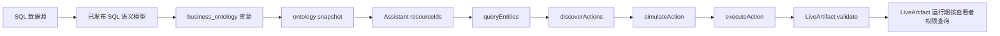

SQL 语义模型把关系数据库中的事实表、度量和维度组织成受治理的分析契约。它与 SAP BW 使用的 XMLA/MDX 模型都可以进入同一套本体资源和 Agent Tools 执行链路，但查询语言、适配器和可用 action 不同：SQL 模型通过 `sql.query_metric_snapshot` 或 `sql.query_cube_slice` 执行，Agent 传入的是语义模型已经发布的维度、度量和时间窗，不能传任意 raw SQL。

本文使用本地 Data X 工作区中真实存在的 `SalesDashboardModel`，测试从模型发布、本体快照、Assistant 资源白名单、action 发现、`simulateAction`、真实 SQL 执行，到 LiveArtifact 导入、分享和运行期查询的完整流程。FortiClient VPN 已连接，Doris 数据源 `10.151.66.218:9030` 可达；下文的 rows、执行回执和看板截图都来自这次真实操作，没有使用 mock 或静态占位数据。

## 本次实测环境

| 项目         | 实测值                                                      |
| ------------ | ----------------------------------------------------------- |
| SQL 语义模型 | `SalesDashboardModel`                                       |
| `modelId`    | `eb8dbcf7-7a9f-42d7-9e5f-ab7d768a0782`                      |
| 状态         | 已发布，`publishedVersion: 3`                               |
| 数据源       | `BI数据源`（Doris）                                         |
| 事实表       | `STG.stg_ecc_sapecp_VBAK`                                   |
| Cube         | `SalesAnalysis`                                             |
| 业务域       | `采购部门`                                                  |
| 系统托管资源 | `datax-semantic-model-eb8dbcf7-7a9f-42d7-9e5f-ab7d768a0782` |
| 资源类型     | `business_ontology`                                         |
| Assistant    | `bw_purchase_analytics_20260913`                            |

模型包含 `订单记录数`、`客户数量`、`销售组织数量` 等度量，以及 `销售日期`、`客户`、`销售组织`、`分销渠道`、`产品组`、`销售组` 等维度。这里的 `business_ontology` 是发布后的正式资源类型；它通过 `runtimeAdapterId: semantic_model` 路由到 SQL 语义模型适配器。不要为同一个模型再手工注册一份旧式 `semantic_model` 资源。

## SQL 模型和 XMLA 模型的区别

两种模型共享资源、快照、授权、action registry 和 LiveArtifact effect v2，但有三个实际差异：

| 对比项          | SQL 语义模型                                        | SAP BW/XMLA 语义模型                                |
| --------------- | --------------------------------------------------- | --------------------------------------------------- |
| 事实查询 action | `sql.query_metric_snapshot`、`sql.query_cube_slice` | `mdx.query_metric_snapshot`、`mdx.query_cube_slice` |
| 运行时适配器    | SQL/Doris 适配器                                    | XMLA/MDX 适配器                                     |
| 参数边界        | 语义模型中的 measures、dimensions、window           | Cube 中的 MDX 维度、度量和时间层级                  |
| Agent 输入      | 受治理的语义 DSL                                    | 受治理的 MDX 语义 DSL                               |
| raw statement   | 不允许                                              | 不允许                                              |

SQL action 名称包含 `sql`，但这不表示可以把 `SELECT ...` 放入 `params`。服务端根据目标 `semantic_cube` 的 `analysis_contract` 生成和验证查询。若模型没有合法时间维度，运行时不会自动补默认日期；应改用无时间窗的 Cube slice，或先修复并重新发布模型。

完整的资源字段和 `analysis_contract` 说明见[语义模型资源](../../ontology/integrations/semantic-model)，执行入口见[Agent Tools](../../features/agent-execution/agent-tools)。

## 执行链路



创建者保存 binding 时必须通过资源白名单、业务域、动作注册表和显式 policy。查看者打开或刷新时再次校验 Assistant context、资源访问权和 `live_artifact` action policy。组织分享不会绕过查看者权限。

## 1. 确认 SQL 模型已发布

在 AI 工作空间的“数据智能 → 语义模型”中搜索 `SalesDashboardModel`，确认状态为“已发布”、版本为 `v3`、类型为 `SQL`，并记录模型 ID。发布是生成或刷新本体快照的前提。


图 1：真实工作区中的 SQL 模型列表。`SalesDashboardModel` 显示为已发布，类型为 SQL，数据源为 `BI数据源`。

不要把 Doris 用户名、密码或地址复制到 Assistant prompt、binding 参数或 HTML。连接凭据由数据源和服务端 Secret 管理。

## 2. 在模型工作台核对分析契约

打开 `SalesDashboardModel` 工作台，检查事实表、Cube、度量和维度。这里要确认业务需求使用的名称确实存在于已发布版本，而不是只存在于草稿。


图 2：模型工作台中的 `SalesAnalysis` Cube。模型验证结果为 100/100，当前版本包含 8 个度量和 6 个维度。

本次绑定使用以下语义字段：

```json
{
  "cube": "SalesAnalysis",
  "dimensions": ["销售组织"],
  "measures": ["订单记录数", "客户数量"],
  "window": {
    "from": "2025-01-01",
    "to": "2026-12-31"
  },
  "timeDimension": "销售日期",
  "granularity": "month",
  "limit": 20
}
```

这些值属于模型契约，不是 SQL 列名拼接。若修改了度量、维度或时间粒度，必须重新验证草稿并发布新版本，然后重新生成 ontology snapshot。

## 3. 查看 SQL 模型的本体资源

进入“数据与本体 → 本体空间”，选择“语义模型本体”资源组，搜索 `SalesDashboardModel` 或资源 ID。已发布的 SQL 模型会被投影为 `business_ontology`，其中包含 `semantic_cube`、`semantic_measure` 和 `semantic_dimension` 实例。


图 3：真实本体空间中的资源组和快照。SQL 模型的业务实体从发布版本生成，不能把本体元数据可见性当作事实数据访问权。

本次快照和目标实体为：

```text
resourceId:
datax-semantic-model-eb8dbcf7-7a9f-42d7-9e5f-ab7d768a0782

snapshotId:
datax-semantic-model-eb8dbcf7-7a9f-42d7-9e5f-ab7d768a0782:3:metrics:b8eb8bd41272:a03287a376b8bc48

entityTypeCode: semantic_cube
entityRef:
eb8dbcf7-7a9f-42d7-9e5f-ab7d768a0782::SalesAnalysis
```

如果资源显示旧版本快照，先刷新资源同步，再重新执行 `queryEntities`；不要把旧 snapshot 的 `entityRef` 混入新版本 binding。

## 4. 把 SQL 资源加入 Assistant 白名单

本次使用已有的 `BW采购分析助手_20260913`（编码 `bw_purchase_analytics_20260913`）。在“AI 工作空间 → 助理智能体”编辑该 Assistant，把 SQL 资源加入 `resourceIds`，保留已有资源。保存操作只提交一次配置命令，同时更新业务域和资源绑定；xpert-pro 的 import/publish 由 outbox worker 异步重试。


图 4：真实 Assistant 列表显示该 Assistant 已有 5 个资源，其中包括新发布的 SQL 语义模型资源。资源白名单只决定 Assistant 可以申请哪些资源，不能代替每次 action 的 policy 检查。

本次最终资源集合包含：

```text
resourceIds:
- datax-semantic-model-4c93545d-52d6-4466-b522-4a5d92344308
- datax-semantic-model-84d09399-d8af-407d-82f5-b13e34ce49ce
- datax-semantic-model-ad7d0bee-53fa-4258-8cd2-88eb71a386c5
- datax-semantic-model-b07f52aa-5866-4400-9240-16da6567d55f
- datax-semantic-model-eb8dbcf7-7a9f-42d7-9e5f-ab7d768a0782
```

在生产环境中，建议把 `sql.query_cube_slice` 和 `sql.query_metric_snapshot` 的 `live_artifact` policy 绑定到角色或用户组，而不是只绑定某一个用户。策略仍需显式允许，缺失匹配策略时保存和查询都会拒绝。

## 5. 从本体定位 Cube 并发现 SQL action

### 5.1 `queryEntities`

请求只定位业务对象，不执行事实查询：

```json
{
  "resourceId": "datax-semantic-model-eb8dbcf7-7a9f-42d7-9e5f-ab7d768a0782",
  "intent": "销售订单按月份和销售组织分析",
  "scope": {
    "entityTypeCode": "semantic_cube",
    "query": "销售分析",
    "limit": 10
  }
}
```

真实返回为 HTTP `201`，解析状态 `unique`，目标为 `SalesAnalysis`，并生成了上面的 `snapshotId`。`entityRef` 必须使用返回的资源和 Cube 标识：

```text
eb8dbcf7-7a9f-42d7-9e5f-ab7d768a0782::SalesAnalysis
```

### 5.2 `discover-actions`

使用 `target` 传入 `entityTypeCode` 和 `entityRef`：

```json
{
  "resourceId": "datax-semantic-model-eb8dbcf7-7a9f-42d7-9e5f-ab7d768a0782",
  "target": {
    "entityTypeCode": "semantic_cube",
    "entityRef": "eb8dbcf7-7a9f-42d7-9e5f-ab7d768a0782::SalesAnalysis"
  }
}
```

真实返回的允许 action 包含：

```text
mdx.query_metric_snapshot
mdx.query_cube_slice
mdx.query_dimension_members
sql.query_metric_snapshot
sql.query_cube_slice
mdx.query_calculated_expression
```

LiveArtifact 只能持久化 action registry 中注册且 `readOnly: true` 的能力。本次选择 `sql.query_cube_slice`，因为需求是按销售组织分组；`sql.query_metric_snapshot` 更适合单个时间序列指标，而且必须提供完整 `window` 或 `timeRange`。

## 6. 预演和真实执行

### 6.1 `simulateAction` 使用最终 binding payload

本次实际 payload 如下。保存前预演和运行时查询必须复用同一份解析后的参数，服务端会据此生成 fingerprint：

```json
{
  "resourceId": "datax-semantic-model-eb8dbcf7-7a9f-42d7-9e5f-ab7d768a0782",
  "actionTypeCode": "sql.query_cube_slice",
  "target": {
    "entityTypeCode": "semantic_cube",
    "entityRef": "eb8dbcf7-7a9f-42d7-9e5f-ab7d768a0782::SalesAnalysis"
  },
  "params": {
    "dimensions": ["销售组织"],
    "measures": ["订单记录数", "客户数量"],
    "window": {
      "from": "2025-01-01",
      "to": "2026-12-31"
    },
    "timeDimension": "销售日期",
    "granularity": "month",
    "limit": 20,
    "title": "SQL销售订单按销售组织"
  }
}
```

在本次测试中，`simulateAction` 返回 HTTP `201`、`status: ALLOWED`、`policyDecision: allow`，并明确说明这是只读 Cube slice，不会产生状态变更。


图 5：真实 `simulateAction` 回执。参数、目标和 action 都来自本次 SQL 模型的 snapshot，不是 raw SQL 或示例 binding。

### 6.2 `executeAction` 返回真实 rows

FortiClient VPN 连接成功后，使用与预演完全相同的 payload 调用 `executeAction`。本次返回 HTTP `201`、`status: SUCCEEDED`、`policyDecision: allow`：

```json
{
  "status": "SUCCEEDED",
  "executionId": "cbea0caa-284f-4e30-9007-ab6ea97f2eb3",
  "auditRef": "1a7d6e67-1898-486f-837f-0d1ff8db185a",
  "effect": {
    "rows": [
      { "销售组织": "1000", "订单记录数": 89445, "客户数量": 348 },
      { "销售组织": "2000", "订单记录数": 3269, "客户数量": 3 }
    ],
    "summary": { "rowCount": 2 }
  },
  "diagnostics": {
    "queryHash": "6f76b938ffe969ce280314cf4da40fb10f449139b006f49a0aa62038055b14ad",
    "durationMs": 227
  }
}
```


图 6：真实 SQL action 执行回执。截图展示的是随后打开分享页时产生的标准 effect v2 runtime receipt，因此 `executionId`、`auditRef` 和耗时会与上面的首次 `executeAction` 不同；两次查询都使用同一个 binding，rows 来自同一个 Doris 模型。看板 HTML 没有内嵌这些数值。

这里的 SQL 是由语义模型根据 `dimensions`、`measures` 和时间窗编译出来的。`effect.rows` 是业务数据，`effect.summary` 还要检查 `returnedRowCount` 和 `truncated`，不能把截断结果当作全量 KPI。

## 7. 导入、分享并打开 LiveArtifact

保存 HTML 前，服务端会对 portable bundle 重新执行完整的 manifest simulation：检查 Assistant context、资源白名单、业务域、目标实体、动作注册表、查看者 policy 和 effect v2 schema。任一 binding 失败，整个导入都会回滚。本次导入返回 HTTP `201`，生成了以下真实版本：

```json
{
  "version": 2,
  "draftId": "b948ecf0-7e68-45fd-a6bc-b45d59dab966",
  "contentRef": {
    "artifactId": "e24f71c3-e641-445d-b636-99d0fe8e1961",
    "artifactVersionId": "07e8977d-8054-4fb7-89eb-66c6fc90dc0d",
    "versionNumber": 1
  },
  "bindingIds": ["sql-sales-by-org"]
}
```


图 7：真实 portable import 回执。导入阶段已重新通过 binding simulation，随后为版本创建组织分享链接 `PgXdgJxzMNMw`。分享链接仍按当前查看者重新校验资源访问权和 `live_artifact` action policy。

创建完成后对该版本再次调用 `POST /agent-workbench/live-artifacts/:artifactId/versions/:artifactVersionId/validate`，返回 `ok: true`。本次 receipt 的 fingerprint 是 `af2c7a3d16ac64490c7b4841d5279a07f52e5d0a82f060b584825d306e452c72`，effect schema 为 `version: 2 / kind: rows`，说明持久化 binding 与预演 payload 一致。

打开分享页：

```text
http://localhost:5174/live-artifacts/share/PgXdgJxzMNMw
```

页面加载后，HTML 只调用 `window.dataxLiveArtifact.query('sql-sales-by-org', {})`。运行时通过 `/api/agent-workbench/live-artifacts/shares/PgXdgJxzMNMw/query` 重新执行同一个 governed binding；这一步再次返回标准 effect v2 `kind: rows`，并记录新的 `executionId` 和 `auditRef`。因此截图中的行数是查看者当前权限下实时查询的结果，而不是导入时保存的快照。


图 8：真实分享页截图。看板显示返回的两个销售组织、订单记录数 `89,445 + 3,269`、客户数量 `348 + 3`，并在页脚显示本次 runtime query 的 execution 和 audit 回执。图表和表格都从 effect v2 的 `columns/rows` 动态渲染。

### LiveArtifact HTML 的数据边界

HTML 只读取标准化的 effect v2，不读取 SQL adapter 原始响应，也不自行拼接 SQL：

```ts
interface DataXLiveArtifactEffect {
  version: 2;
  kind: "rows" | "series" | "entity";
  columns: Array<{
    key: string;
    label?: string;
    type?: "string" | "number" | "boolean" | "date" | "datetime";
    semanticRef?: string;
  }>;
  rows?: Array<Record<string, unknown>>;
  series?: Array<{
    ts?: unknown;
    value?: unknown;
    row?: Record<string, unknown>;
  }>;
  entity?: Record<string, unknown>;
  summary: {
    rowCount: number;
    returnedRowCount: number;
    truncated: boolean;
  };
}
```

`sql.query_cube_slice` 使用 `kind: rows`，`sql.query_metric_snapshot` 使用 `kind: series`。ECharts 或表格只负责消费这些字段；字段映射、空状态、错误和主题由 LiveArtifact authoring skill 约束，SQL 适配器负责协议解析和标准化。不能在 HTML 中对截断行计算全量 KPI。

## 8. 本次真实验收结果

本次在 VPN 已连接的环境完成了从模型到看板的闭环：

1. `queryEntities` 定位到唯一的 `SalesAnalysis` Cube；
2. `discover-actions` 返回 `sql.query_cube_slice`；
3. `simulateAction` 返回 `ALLOWED`，策略为 `allow`；
4. `executeAction` 返回真实 `rows`，共 2 行，`truncated: false`；
5. portable import 返回 artifact/version ID，并生成组织分享链接；
6. 分享页运行期再次查询，dashboard 显示销售组织 `1000`、`2000` 及对应订单和客户数据。

如果 VPN 断开，执行阶段会返回结构化的 `upstream` 或 `transport` 错误；这时应恢复网络后重新预演和执行，不要用固定数字替代 LiveArtifact 查询结果。

## 验收清单

- [x] `SalesDashboardModel` 已发布，版本和模型 ID 与当前资源一致。
- [x] `business_ontology` 快照包含 `SalesAnalysis`、度量和维度。
- [x] Assistant 白名单包含 `datax-semantic-model-eb8dbcf7-7a9f-42d7-9e5f-ab7d768a0782`。
- [x] `queryEntities` 返回唯一的 `semantic_cube`。
- [x] `discoverActions` 返回 `sql.query_cube_slice`。
- [x] 保存前 `simulateAction` 返回 `ALLOWED`，且 policy decision 为 `allow`。
- [x] LiveArtifact validate 返回 effect v2 的 `rows` schema 和 fingerprint。
- [x] `executeAction` 返回真实 `rows` 和 `summary`，包含 2 个销售组织。
- [x] LiveArtifact 已导入、创建版本、生成分享链接并打开最终 dashboard。
- [x] 分享页运行期返回标准 effect v2 `rows`，看板显示真实数据。
- [ ] 查看者权限撤销、资源归档或 action policy 变化后，已有 dashboard 下一次刷新被拒绝。

## 常见问题

### 为什么 SQL 模型的资源类型是 `business_ontology`？

这是发布后的统一资源形态。SQL 模型由 `runtimeAdapterId: semantic_model` 路由到语义模型适配器，资源本身仍属于本体资源。不要为了 SQL 再注册一份重复资源。

### 为什么不能直接传 raw SQL？

LiveArtifact action registry 只接受受治理的语义参数。raw SQL 会绕过模型的度量、维度、业务域和权限契约，在保存阶段被拒绝。需要改变查询语义时，应修改模型或使用模型允许的 `dimensions`、`measures`、`window` 和 `slicers`。

### VPN 为什么是这次执行成功的前置条件？

`simulateAction` 只证明资源、目标、参数和策略满足契约。`executeAction` 还要通过 Data X API 访问 Doris `10.151.66.218:9030`；VPN 连接恢复后才会返回 SQL 编译结果和真实 rows。分享页运行时仍会重新查询，网络或权限变化会立即反映到已有看板。

### 为什么 LiveArtifact validate 要求显式 policy？

LiveArtifact 保存和查询都采用显式允许策略。Assistant 资源白名单只表示“可以申请该资源”，不能自动授予每个查看者的事实查询权。生产环境应把 `live_artifact` action policy 绑定到合适的角色或用户组，并保留审计记录。

### 数据源恢复后可以复用这份 binding 吗？

可以复用资源、target、action 和参数，但必须重新执行 `simulateAction` 和保存前 validate。模型发布后如果 snapshot 或字段版本改变，要重新定位实体并生成新的 fingerprint。

## 延伸阅读

- [语义模型资源](../../ontology/integrations/semantic-model)
- [Agent Tools：查询、发现、预演和执行](../../features/agent-execution/agent-tools)
- [SAP BW 本体模型教程](./how-to-analyze-sap-bw-data-models)
- [SAP 采购运营指挥中心教程](./sap-procurement-operations-command-center)
