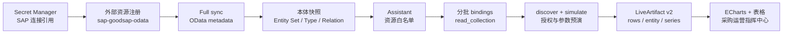

本教程用一个完整场景串起 Data 产品的数据接入、语义治理、Assistant 配置和可视化交付：采购负责人只需要向 Assistant 说一句业务需求，系统就能在已授权的 SAP OData 资源上完成预演、查询并生成可刷新的 LiveArtifact Dashboard。

教程使用本地环境中已经注册的 `sap-goodsap-odata` 作为示例资源。该资源包含 `zPurchaseorderSet`、`BusinessPartnerSet`、`ProductSet` 和 `SalesOrderSet` 四个 Entity Set。截图来自一次真实的 SAP 采购分析 Assistant 运行结果；你的租户中的数量、字段和数据值可能不同。

## 完成后你将得到什么

- 一个可复用的 `sap-goodsap-odata` 外部资源和对应本体快照。
- 一个名为 `SAP采购分析助手` 的 Assistant，按采购、供应商、产品和销售订单分组使用资源。
- 一套经过动作发现、权限校验和 `simulateAction` 预演的 LiveArtifact bindings。
- 一个包含 KPI、ECharts 图形和明细表的“SAP 采购运营指挥中心”看板。

整个链路如下。外部系统的凭据只保存在 Secret Manager 中，Assistant 和 LiveArtifact 只引用资源及其授权上下文。



## 前置条件和权限

| 角色 | 需要的能力 | 本教程中的职责 |
| --- | --- | --- |
| SAP 连接管理员 | Secret Manager 写入权限、SAP catalog 和 `$metadata` 读取权限 | 创建连接引用并验证上游可用 |
| 数据平台管理员 | 外部资源注册、同步、本体查看权限 | 注册资源并确认快照 |
| Assistant 管理员 | 创建/编辑业务 Assistant、配置资源访问 | 绑定四个 Entity Set |
| 看板创建者 | 对 Assistant 资源拥有读取权限 | 创建 Artifact 版本 |
| 看板查看者 | 对每个资源和 `read_collection` 动作拥有读取权限 | 打开和刷新看板 |

LiveArtifact 的创建权限和查看权限分别校验。组织内分享不会绕过查看者对资源和动作的权限；资源被撤权、归档或动作策略变更后，已有看板也会在下一次查询时重新校验。连接凭据和 Secret 的管理原则见[密钥管理](../../features/control-plane/secret-management)，资源控制面字段见[资源接入控制面](../../features/control-plane/resource-access)。

## 1. 注册 SAP OData 外部资源

### 1.1 准备连接引用

在“数据与本体 → 密钥管理”创建 SAP 连接。连接中保存 SAP base URL、认证方式、`sap-client` 和 TLS 配置，保存后得到类似下面的不可变引用：

```text
secret://sap%2Fgoodsap%2Fmain?version=1
```

不要把密码、Bearer token 或证书内容直接填写到 resource capabilities 中。资源只保存 `connectionRef`，凭据轮换时创建新的 Secret 版本即可。

### 1.2 填写资源注册表单

打开“数据与本体 → 资源接入”，点击“新注册外部资源”，填写：

| 字段 | 示例值 | 说明 |
| --- | --- | --- |
| 资源 ID | `sap-goodsap-odata` | 在当前组织内唯一，建议使用业务系统和协议命名 |
| 资源类型 | `SAP OData API` | 对应 `sap_odata_api` adapter |
| 连接引用 | `secret://sap%2Fgoodsap%2Fmain?version=1` | 从 Secret Manager 选择，不手工复制密钥 |
| 负责人 | `data-platform-team` | 负责同步失败和字段变更排查 |
| 版本 | `v1` | 资源配置版本，不是 OData 协议版本 |
| 标签 | `sap, goodsap, gateway` | 便于检索和治理 |


图 1：注册 SAP OData 资源时只填写连接引用和 adapter 能力配置，不暴露敏感凭据。

SAP OData adapter 会同时发现 V2 Gateway catalog 和 V4 catalog，并在同步时读取所选服务的 `$metadata`。协议版本、Entity Set 可写性和字段定义以 metadata 为准，不要在表单中维护第二份动作白名单。更多协议细节见[SAP OData API 资源](../../ontology/integrations/sap-odata)。

点击“创建资源”后，列表中出现资源只代表控制面记录已经创建；它还不能直接被 Assistant 使用。必须继续执行连接和首次 full sync。


图 2：资源注册完成后，在资源列表中确认状态为“已启用”，再进入详情页执行同步。

## 2. 同步并验证本体资源

### 2.1 运行首次同步

进入 `sap-goodsap-odata` 详情页，按以下顺序操作：

1. 在“资源上下文”确认连接引用、负责人、版本和标签。
2. 打开服务发现，搜索并勾选采购相关服务根路径。
3. 执行 full sync，等待同步作业变为成功。
4. 在“本体图谱”查看 Entity Set、Entity Type、字段和导航关系。
5. 在“同步作业”保存本次 snapshot 的版本和错误信息。

### 2.2 确认四个采购 Entity Set

本教程的 bindings 使用下表。实际系统的 Entity Set 名称以你的 `$metadata` 和本体快照为准。

| 业务用途 | Entity Set | 典型字段 | 首版动作 |
| --- | --- | --- | --- |
| 采购订单 | `zPurchaseorderSet` | 订单号、公司代码、供应商、物料、数量、价格、币种 | `sap_odata.read_collection` |
| 供应商 | `BusinessPartnerSet` | 供应商编号、名称、国家、供应商组 | `sap_odata.read_collection` |
| 产品 | `ProductSet` | 产品编号、名称、类别、单位、价格 | `sap_odata.read_collection` |
| 销售订单 | `SalesOrderSet` | 销售订单号、客户、组织、状态、金额 | `sap_odata.read_collection` |


图 3：在本体图谱中确认服务、Entity Set、Entity Type 和关系已经生成；资源注册成功并不等于本体同步成功。

对每个 Entity Set 打开邻域，检查以下信息：

- 目标 Entity Type 和 key schema 是否存在。
- `properties` 中是否有需要展示的字段。
- `query_capabilities` 是否允许 `$select`、`$filter` 和 `$top`。
- 快照状态是否为可用，资源是否被归档。
- `discoverActions` 是否只返回本教程需要的只读动作。

Agent 应先通过本体定位 Entity Set，再通过受控 action 查询；不要在 prompt 中拼接 SAP URL。完整的查询、预演和执行顺序参见[SAP OData 操作案例](../../practices/sap-odata-execution)和[动作发现](../../features/agent-execution/action-discovery)。

## 3. 构建采购 Assistant

### 3.1 创建业务 Assistant

打开“AI 工作空间 → 助理智能体”，创建业务 Assistant，建议使用以下配置：

```yaml
name: SAP采购分析助手
assistantCode: sap_purchase_analytics
description: 面向采购运营的 SAP 数据分析助手，使用已授权的 OData 资源生成可追溯看板。
```

Assistant 的系统指令应描述业务目标和边界，而不是写死某个 URL 或 token。例如：

```text
你是 SAP 采购运营分析助手。先通过 UOSE 本体定位已授权的 Entity Set，
再发现并预演只读 action。回答采购订单、供应商、产品和销售订单问题时，
说明数据来源、更新时间、返回行数和是否被截断。不要把不同币种的价格直接相加；
需要完整聚合、趋势或治理口径时，提示用户使用已认证的语义模型动作。
```


图 4：实际 Assistant 编辑页。这里可以设置名称、业务域、描述和启用状态；系统指令负责业务边界，资源白名单负责数据边界。

### 3.2 按业务域分批准备资源

“分批”用于控制上下文和验证范围，不意味着绕过统一配置命令。推荐先准备两个逻辑批次，最终由一次 Assistant 配置提交写入目标状态：

| 批次 | 包含的 binding | 适用问题 | 验证重点 |
| --- | --- | --- | --- |
| 批次 A：采购主链路 | `po_collection`、`bp_collection` | 订单量、供应商覆盖、采购明细 | Entity Set 存在、供应商字段可读、`top` 合法 |
| 批次 B：运营扩展 | `product_collection`、`so_collection` | 产品结构、销售订单状态、供需联动 | 目标实体属于资源、字段类型和筛选条件有效 |

每个 binding 只允许引用 Assistant 已授权的资源。配置时使用下面的稳定 binding ID，方便预演 receipt、审计和后续更新：

```json
{
  "po_collection": {
    "resourceId": "sap-goodsap-odata",
    "actionTypeCode": "sap_odata.read_collection",
    "target": { "entitySet": "zPurchaseorderSet" }
  },
  "bp_collection": {
    "resourceId": "sap-goodsap-odata",
    "actionTypeCode": "sap_odata.read_collection",
    "target": { "entitySet": "BusinessPartnerSet" }
  },
  "product_collection": {
    "resourceId": "sap-goodsap-odata",
    "actionTypeCode": "sap_odata.read_collection",
    "target": { "entitySet": "ProductSet" }
  },
  "so_collection": {
    "resourceId": "sap-goodsap-odata",
    "actionTypeCode": "sap_odata.read_collection",
    "target": { "entitySet": "SalesOrderSet" }
  }
}
```

保存时服务端会一次性校验业务域、资源状态、目标实体、动作策略和操作者权限，并在同一个配置命令中写入 Assistant 资源白名单。任一 binding 失败，整个目标状态回滚；不要让前端先保存 Assistant、再发第二个补偿请求。Assistant 级别先授权 `sap-goodsap-odata`，看板级别再把四个 Entity Set 分成独立 binding。


图 5：实际配置中只勾选 `sap-goodsap-odata`，其他语义模型资源保持未选中。资源授权和 Artifact binding 是两层边界。

### 3.3 资源绑定的权限边界

资源白名单只回答“这个 Assistant 可以申请哪些资源”。每次创建和查看 LiveArtifact 时还会执行以下检查：

1. 当前 actor 是否属于 Assistant 的租户和组织上下文。
2. `resourceId` 是否在 Assistant 白名单中、未归档且业务域匹配。
3. `actionTypeCode` 是否在服务端动作注册表中，且是 `readOnly: true`。
4. 当前查看者是否仍拥有该资源和动作的 UOSE 策略权限。
5. 目标 Entity Set 是否属于该资源 snapshot。

因此，组织分享只改变 Artifact 的入口，不会给没有 SAP 资源权限的用户增加数据访问权。缺少 Assistant context 的 Artifact 也必须拒绝查询。

## 4. 让 Assistant 自主生成 LiveArtifact Dashboard

### 4.1 用一句业务需求触发完整流程

在 SAP 采购分析 Assistant 中直接输入下面这一句话。它包含目标用户、业务范围、展示结构、刷新行为和数据安全边界，Assistant 可以据此选择已绑定的 resources，而不需要用户手写 JSON binding。

```text
请基于已授权的 SAP OData 资源创建“SAP 采购运营指挥中心”：顶部展示采购订单数、供应商数、产品数和销售订单数；中间用 ECharts 展示按公司代码的采购金额柱状图和销售订单状态分布；底部展示采购订单明细、供应商和产品明细表。所有数据使用只读 Entity Set，单次最多返回 50 行，显示更新时间和截断提示，不要把不同币种直接汇总为一个 KPI；生成后给出可刷新、可分享但仍按当前查看者权限校验的 LiveArtifact Dashboard。
```


图 6：实际 ChatKit 执行记录。用户只描述业务目标，技能先读取创作规则，再发现 `sap-goodsap-odata`、预览四个数据集并生成 Artifact。

工作空间需要安装并启用 `datax-live-artifact-authoring` 和 `uose-resource-usage`。前者负责 Manifest、HTML、effect v2、ECharts 和生命周期，后者负责资源选择、动作发现和预演；技能安装状态可以在“AI 工作空间 → 技能”中确认。


图 7：当前工作空间已安装 `uose-resource-usage`、`datax-live-artifact-authoring` 和 `datax-semantic-model-authoring` 三个内置技能。

### 4.2 服务端实际执行的保存前预演

Assistant 不应直接把自然语言保存成 HTML。服务端在创建或更新 Artifact 前，按每条 binding 执行以下链路：

1. 校验 HTML、binding ID、controls 和 Assistant context。
2. 解析 Entity Set、`select`、`filter`、`expand` 和 `top`。
3. 调用统一授权入口，重新检查创建者、资源和动作策略。
4. 调用 `discoverActions` 和 `simulateAction`，取得标准化参数、目标和 effect schema。
5. 为 `resourceId + actionTypeCode + target + resolvedParams + viewer context` 生成 fingerprint。
6. 所有 binding 成功后才创建 LiveArtifact v2 版本，并保存每条 binding 的 simulate receipt。

保存和查询使用相同的 binding 结构。查询时还会按当前查看者重新授权，再调用 `AgentToolsService.executeAction`。这意味着撤销资源权限、归档资源、修改业务域或收紧动作策略都会立即影响已经分享的看板。

### 4.3 统一 effect 和 OData 限制

LiveArtifact 只读取标准化 effect，不在 HTML 中解析 SAP adapter 的原始响应。首版 effect v2 的核心结构如下：

```json
{
  "version": 2,
  "kind": "rows",
  "columns": [{ "key": "PurchaseOrder", "type": "string" }],
  "rows": [{ "PurchaseOrder": "4500006684" }],
  "summary": {
    "rowCount": 50,
    "returnedRowCount": 50,
    "truncated": true
  }
}
```

OData 只读 collection/entity 动作的 `top` 默认值和最大值由服务端控制，最大为 200。`truncated: true` 时，数字卡片只能标注“当前返回集”，不能宣称全量 KPI。需要完整聚合、趋势或治理口径时，应改用已认证的语义模型动作；不要在前端把 200 行 OData 结果自行相加。

## 5. 设计和验收看板

### 5.1 推荐布局

| 区域 | 推荐组件 | 数据来源 | 业务解释 |
| --- | --- | --- | --- |
| 顶部 KPI | 四张指标卡 | 四个 collection binding 的返回行数或已认证指标 | 当前查询窗口的订单、供应商、产品和销售订单规模 |
| 左中 | ECharts 柱状图 | `zPurchaseorderSet` | 按公司代码或供应商分组的采购金额/数量，明确币种和截断状态 |
| 右中 | ECharts 饼图或环图 | `SalesOrderSet` | 订单状态分布，显示 `success`、`pending` 等状态 |
| 底部 | 明细表 | 四个 rows effect | 支持刷新、筛选和查看来源 binding |

ECharts 图表只消费 effect v2 的 `columns`、`rows`、`series` 或 `entity`。建议让技能或工作流负责“字段映射、颜色、tooltip 和空状态”，让 adapter 负责“协议解析和 effect 标准化”，不要在通用 LiveArtifact action 中加入 SAP 专用字段过滤。


图 8：实际生成的 SAP 采购运营指挥中心，包含 4 个实时绑定、四张 KPI 卡、图形和明细表。


图 9：真实 SAP 采购 Assistant 运行结果中的 ECharts 图表；图表使用标准 rows effect 渲染，不依赖 OData V2/V4 信封。


图 10：OData collection 的明细展示。表格应保留来源、更新时间和截断提示，避免把当前返回集误认为全量数据。

本地验收时，页面显示过“采购订单 30、业务伙伴 50、产品 50、采购金额 7,537,805.4”的示例值，并成功加载四个 binding。采购明细同时包含 EUR、CNY 和 USD；因此这组金额只证明渲染链路已经跑通，不能直接作为公司级采购总额。

### 5.2 验收清单

在把看板交给领导前，逐项确认：

- [ ] `sap-goodsap-odata` 资源状态可用，最近 snapshot 同步成功。
- [ ] 四个 binding 的 target 都能在本体快照中定位到 Entity Set。
- [ ] 四个动作均为 `sap_odata.read_collection` 或 `sap_odata.read_entity`，没有 create、update、delete 或 invoke operation。
- [ ] 每条 binding 都有成功的 `simulateAction` receipt 和 fingerprint。
- [ ] `top` 不超过 200；看板明确显示 `truncated` 和返回行数。
- [ ] 多币种价格没有直接相加；需要统一币种时使用语义模型或明确的换算规则。
- [ ] 以创建者身份和普通查看者身份分别刷新一次，确认权限路径一致。
- [ ] 撤销某个资源权限后再次刷新，确认看板只显示结构化的 `ACCESS_DENIED`，没有泄露上游响应。
- [ ] 组织分享链接只分享 Artifact 入口，未把 SAP 凭据、平台 token 或原始 OData URL 写入 HTML。

## 常见问题

### 资源注册成功了，为什么 Assistant 找不到数据？

资源注册只写入控制面记录。请检查 full sync 是否成功、snapshot 是否可用、Assistant 是否拥有资源白名单，以及目标 Entity Set 是否出现在本体图谱中。

### 为什么不能用 `sap_odata.create_entity` 生成看板？

LiveArtifact 首版只允许动作注册表中 `readOnly: true` 的动作。写、删除和 operation 动作在保存阶段直接拒绝；它们应该在独立的受控操作流程中运行。

### 为什么图表显示“当前返回集”，而不是采购总额？

OData collection 受 200 行上限约束，截断结果不能代表全量。对于采购总额、趋势和跨币种聚合，请建立语义模型指标并让 Assistant 使用语义模型 action。

### 分享给同事后，对方看不到数据怎么办？

检查对方是否同时拥有 Assistant context、`sap-goodsap-odata` 资源访问权和 `sap_odata.read_collection` 策略。组织分享不会绕过这三层校验。

### SAP 返回了 `__metadata` 字段怎么办？

不要在通用 action 或 HTML 中写 SAP 专用过滤器。SAP adapter 在归一化阶段只把业务字段转换到标准 effect；`__metadata` 等技术字段不应进入图表或业务明细。字段呈现规则放在 LiveArtifact authoring skill 的数据展示约定中，协议差异留在 adapter 内。

## 相关文档

- [SAP OData API 资源](../../ontology/integrations/sap-odata)
- [资源接入控制面](../../features/control-plane/resource-access)
- [密钥管理](../../features/control-plane/secret-management)
- [动作发现](../../features/agent-execution/action-discovery)
- [Agent Tools 与受控执行](../../features/agent-execution/agent-tools)
- [工作台与资源对话](../../features/agent-execution/workbench-and-chatkit)
- [SAP OData 操作案例](../../practices/sap-odata-execution)
- [ECharts MCP 应用教程](../../../ai/tutorial/echarts-mcp-app)
- [Artifacts 生命周期与分享](../../../ai/agent/artifacts/index)
